# Parking Lot — Low Level Design

Built incrementally. Each step adds exactly one requirement, and introduces an
abstraction only when that requirement forces it.

---

## Step 1 — Core Domain

**Scope:** one level, one vehicle size, one gate, no pricing rules.
Deliberately excluded: `ParkingFloor`, `SpotType`, `VehicleType`, gates,
payment strategies, spot-allocation strategies.

### Class diagram

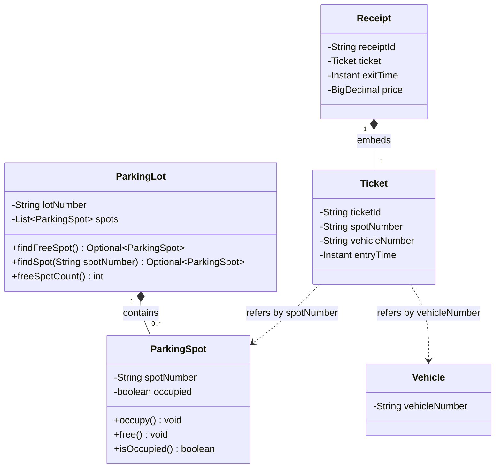

### Flow

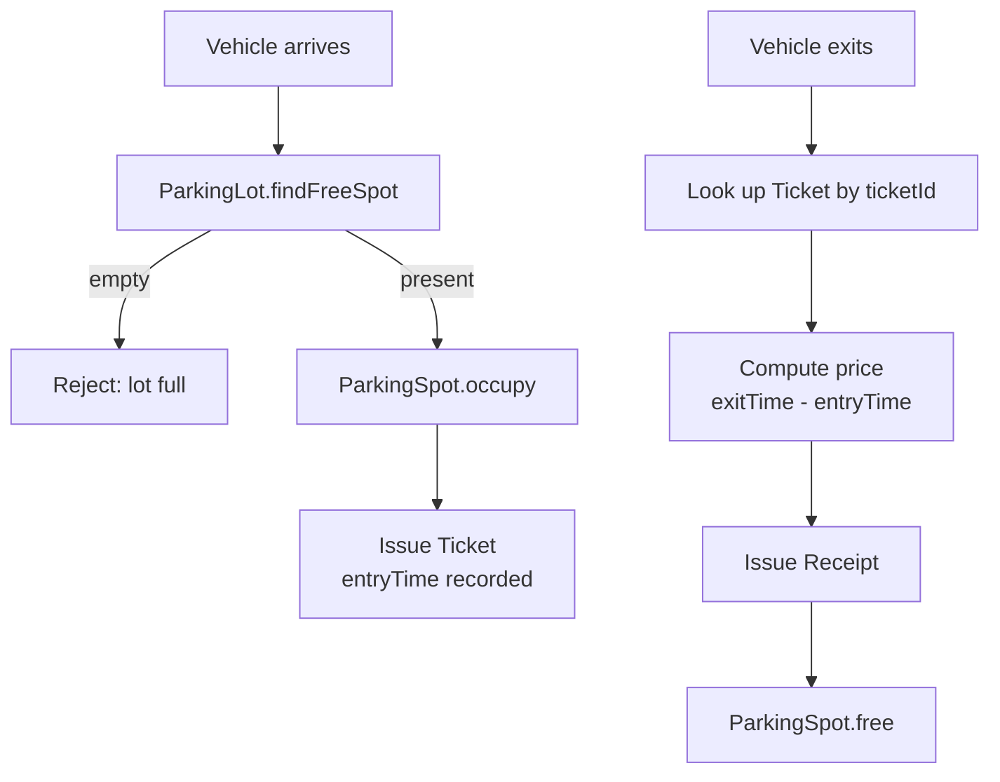

### Design decisions

| Decision | Reason |
| --- | --- |
| `Ticket` and `Receipt` are separate classes | A single `Ticket` holding `exitTime` and `price` leaves both fields null for the entire time the car is parked. Null-for-a-whole-lifecycle-phase means two concepts, not one. |
| `ParkingSpot` owns the `occupied` flag | Only the spot flips its own boolean. `ParkingLot` finds a spot; it does not mutate it. One owner per piece of state. |
| `findFreeSpot()` returns `Optional<ParkingSpot>` | A full lot is a normal outcome, not an exception. The caller is forced to handle it. |
| `Ticket` links to the spot by id, not by object reference | Keeps the record flat and serializable. Revisit if a step needs to navigate from ticket to spot directly. |
| `Receipt` **embeds** the whole `Ticket` rather than a `ticketId` | A receipt has to print the entry time and the spot, so holding only an id means every consumer re-fetches the ticket to render anything. `Ticket` is an immutable record, so embedding it copies a reference and cannot drift. Note this is the opposite trade from the line above, and for a different reason: `Ticket`'s spot reference points at *mutable* state the ticket must not hold onto; `Receipt`'s ticket reference points at a frozen record. |
| `ParkingSpot.occupy()` / `free()` reject the illegal transition | The spot owns the flag, so it owns the invariant. If it only set the boolean, a double-`occupy()` from a caller bug would silently double-book the spot and the error would surface somewhere unrelated. A guard at the owner turns a silent corruption into an immediate, local failure. |
| `ParkingLot.findSpot(spotNumber)` exists for the exit path | `Ticket` holds a spot *number*, and exit needs the spot *object* to free it. Resolving an id against the inventory is the lot's job — the alternative is callers holding `ParkingSpot` references between entry and exit, which stops working the moment entry and exit are different gates. |

### Implementation notes

`Ticket`, `Receipt` and `Vehicle` are Java records: they are immutable values with
no behaviour, which is exactly what a record is for. `ParkingLot` and `ParkingSpot`
are classes — they own mutable state and guard it.

`park` and `unpark` currently live as methods on `Main`. That is deliberate: they
are the use-case sequencing that moves into `ParkingLotService` at Step 3, and
pricing moves into `FeeCalculator` at Step 5.

---

## Step 2 — Vehicle Sizes

**New requirement:** vehicles come in small, medium and large; spots are sized to match.

**Fit rule for now:** exact match — `SMALL → SMALL`, `MEDIUM → MEDIUM`, `LARGE → LARGE`.
The rule must be *expandable* (a small vehicle may later be allowed into bigger
spots), but expandable means **one named place to change**, not an interface.

### Class diagram (delta — `Ticket` and `Receipt` unchanged)

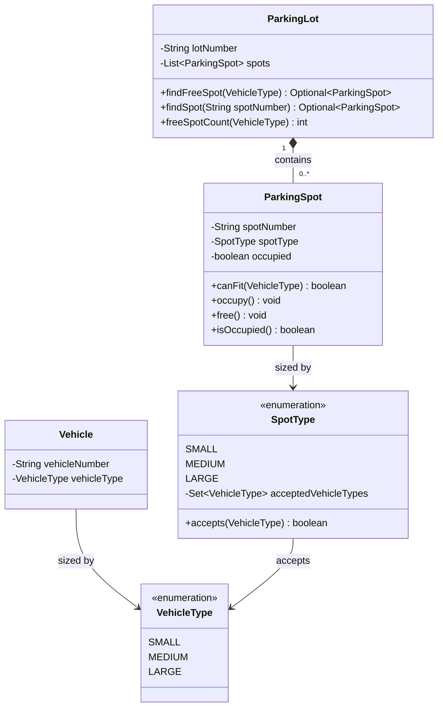

### Design decisions

| Decision | Reason |
| --- | --- |
| `VehicleType` is an enum, not a `SmallVehicle` / `MediumVehicle` / `LargeVehicle` hierarchy | The subclasses would add no field and no method — only the size differs. A subclass that adds nothing is a tax, not a model. |
| `VehicleType` and `SpotType` are **two** enums, not one | One describes the thing driving in, the other describes poured concrete. They are joined by a business rule that changes independently of both. |
| `canFit` lives on `ParkingSpot` | Not because the spot knows its own size — the vehicle knows its size too, so that reason is symmetric and picks no winner. The real reason is **dependency direction**: if `Vehicle` owned `canFit`, `Vehicle` would have to import `SpotType` and would know the parking domain exists. |
| The fit rule is **data on each `SpotType` constant** (`Set<VehicleType> acceptedVehicleTypes`), and `ParkingSpot.canFit` is a one-line delegation to `spotType.accepts(...)` | The rejected alternative was comparing enum names: `spotType.name().equals(vehicleType.name())`. That makes the *spelling* of the constants the business rule — rename `SpotType.MEDIUM` and the rule breaks at runtime with no compile error — and it cannot express the widening the requirement explicitly anticipated, because no string comparison yields "small fits in medium". With the rule as data, widening is `MEDIUM(Set.of(SMALL, MEDIUM))`: one line, no new branch anywhere. Verified by widening it and watching exactly one test fail — `aSpotDoesNotFitASmallerVehicle`, the test that exists to encode the current policy. |
| `canFit` answers only "does this vehicle fit", **not** "is this spot free" | Folding `!occupied` into `canFit` made `findFreeSpot` test occupancy twice, and made it impossible to ask the static question — "how many large spots does this lot have?" — which a display board or capacity report needs. A method named for a physical property must not depend on runtime state. Occupancy filtering belongs to the caller. |
| `freeSpotCount` takes a `VehicleType` | A size-blind count is a misleading number: it can report 3 while a truck has nowhere to go. The no-arg form was removed rather than kept alongside, because callers reach for the convenient one. **These counts are not additive** once the fit rule widens — a medium spot that accepts small vehicles is counted by two different calls — so this method answers "where can *this* vehicle go", not "how full is the lot". The second question would need its own method. |
| Still no `SpotAllocationStrategy` | There is exactly one allocation rule. Extract the interface when a second rule arrives, not before. |
| "Smallest fitting spot first" is hardcoded in `ParkingLot` | Accepted deliberately. It is a policy with a single implementation; `findFreeSpot` is the seam it will move out of later. |

---

## Step 3 — Multiple Entry and Exit Gates

**New requirement:** the lot has several entry gates and several exit gates.

This is the step that forces two new classes, for two different reasons.

**What broke.** A driver enters at gate A and leaves at gate C. Gate C holds only
a `ticketId`. There are 500 `ParkingSpot` objects and no way to pick the right
one from a ticket id, so the system needs a lookup keyed by `ticketId`.

### Class diagram (delta)

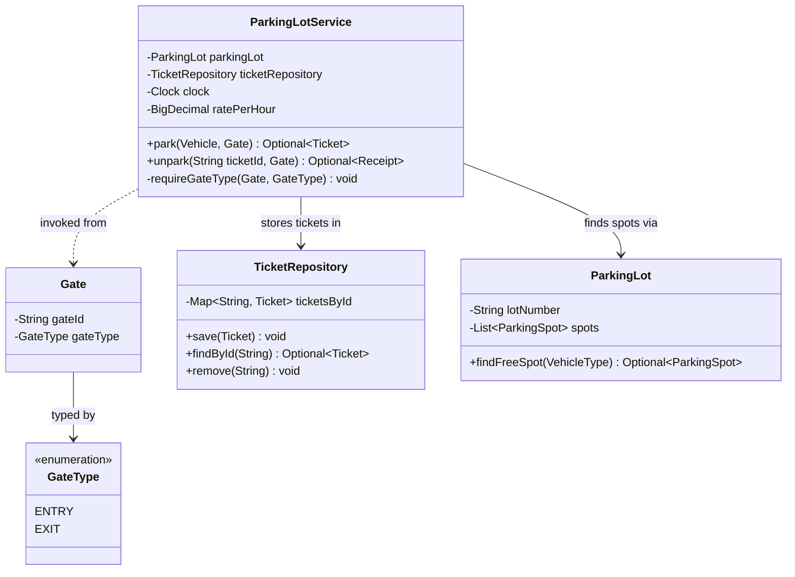

### Flow

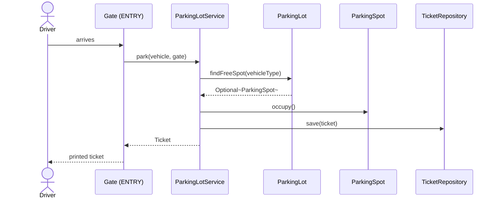

### Design decisions

| Decision | Reason |
| --- | --- |
| One `Gate` class with a `GateType` enum, not `EntryGate` / `ExitGate` subclasses | The two would hold identical state. The difference people reach for is *behavior* — and that behavior turned out not to belong on the gate at all. |
| `TicketRepository` extracted from `ParkingLot` | `ParkingLot` owns the spot inventory. Holding the `ticketId → Ticket` map as well gives it a **second reason to change**. |
| Extracting it now is not premature | The deferred `SpotAllocationStrategy` was speculation about a *future* variation. This is a split of **two responsibilities that both exist today** — those are different justifications, and only the first one has to wait. |
| `ParkingLotService` orchestrates | Entry is three calls across three objects (`findFreeSpot`, `occupy`, `save`). If `Gate` sequenced them, a hardware class would know the whole domain. Sequencing a use case is the service's job. |
| `unpark` takes a **ticket id**, not a `Ticket` | The exit gate holds a piece of paper. A `String` is genuinely all it has, so taking a `Ticket` would mean the caller had already solved the lookup problem this step exists to solve. |
| **Driver-caused outcomes are values; broken invariants are exceptions** | The rule that settles every signalling question here. A full lot and an unknown or already-used ticket are both things a driver can cause on an ordinary day, so both return `Optional.empty()`. A stored ticket pointing at a spot that doesn't exist is something no driver can cause — the repository and the lot disagree about reality — so it stays an `IllegalStateException`. Consistency alone is not the goal; the rule has to discriminate. |
| The gate's **type** is validated, not just its id | Without the check, a car could be admitted through an exit gate. A misconfigured gate is a caller mistake rather than a driver outcome, so by the rule above it throws — `IllegalArgumentException`, naming the gate and both types. |
| The gate check runs **before any mutation** | Verified by moving it one line later, after `occupy()`: `parkingThroughAnExitGateIsRejectedBeforeAnythingChanges` fails with `expected: <1> but was: <0>`. A refused entry would leave the spot occupied forever with no ticket in existence to release it. Validate first, mutate second. |
| `Ticket` records the entry gate, `Receipt` records the exit gate | The pair is what makes "entered at A, left at C" auditable after the fact. Neither is needed to compute anything today, which is the one argument against carrying them — but gate identity is the subject of this requirement, and an id that nothing records cannot be reported on later. |
| Double exit is now caught by the **repository**, not by `ParkingSpot.free()` | The ticket is removed on exit, so a second presentation finds nothing. The spot's own guard did not become redundant — it is now a second line of defence that can only fire if the repository and the lot disagree, which is exactly the invariant-violation case above. |

---

## Step 4 — Multiple Floors

**New requirement:** the lot has multiple floors.

Structurally this is an insertion: `ParkingLot` → `ParkingFloor` → `ParkingSpot`.
The interesting part is what it does to **spot identity** and to **who searches**.

### Class diagram (delta)

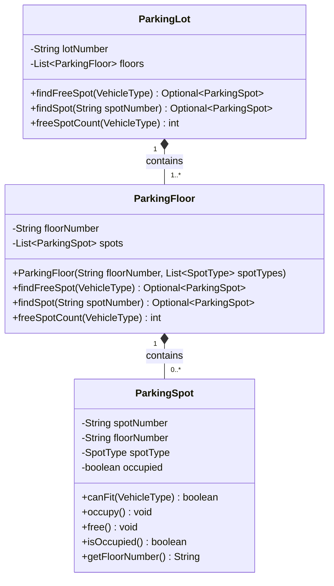

### Design decisions

| Decision | Reason |
| --- | --- |
| `spotNumber` becomes globally unique (`F2-S14`), rather than adding `floorNumber` to `Ticket` | Two ways to fix exit lookup. Adding `floorNumber` to `Ticket` forces a composite key through `Ticket`, `TicketRepository` and every caller. A unique spot id leaves all of them untouched. |
| The id is treated as **opaque** — never parsed | The cost of encoding structure in a string is the temptation to parse it back out. That cost drops to zero if nobody ever does. When the service needs the floor, it asks `spot.getFloorNumber()`. The string is an identifier, not a data structure. |
| `ParkingLot.findFreeSpot` delegates to `floor.findFreeSpot`, rather than looping over `floor.getSpots()` | If the lot loops over the floor's spots, the lot knows the floor's internals and a `getSpots()` accessor leaks the collection. Each floor answers for its own spots; the lot just asks each floor in turn. |
| `freeSpotCount` delegates the same way | Same reason — the sum is the lot's business, the per-floor count is the floor's. |
| Pushing spots behind floors costs **nothing** asymptotically | `findSpot` now asks every floor, and each floor scans its own spots — so the total is still O(total spots), exactly what a flat list cost. The instinct is to apologise for the linear scan; the honest answer is that nothing got worse, and the thing that would make it better (a lot-wide index) collides with the "spot owns its own flag" decision parked in Open Questions. |
| **`ParkingFloor` constructs its own spots**, taking `List<SpotType>` rather than `List<ParkingSpot>` | This one decision closed three separate defects at once: (a) `ParkingFloor` had published `getSpots()`, re-opening the very `floor.getSpots()` loop the delegation decision existed to prevent; (b) nothing enforced global uniqueness of `spotNumber`, so two floors could both hold `"S1"` and `findSpot` would release the wrong car — silently, and only in a multi-floor lot; (c) the floor was recorded twice, in `spotNumber`'s prefix and in `floorNumber`, so `new ParkingSpot("F1-S1", "F2", MEDIUM)` compiled and was a lie. The floor knows its own number and can count, so the only thing it cannot derive is the *sizes* — which is exactly what the constructor now takes. A malformed id became unconstructable rather than merely unlikely. |
| Evidence the model got simpler, not just different | The test helper for building a floor went from seven lines to one. When a design change shortens test setup, that is real evidence of simplification — worth saying out loud in an interview. |
| `ParkingSpot` keeps `floorNumber` even though `spotNumber` encodes it | Not redundant, given the opaque-id rule: the id is never parsed, so the field is the only sanctioned way to answer "which floor is this car on?". The two can no longer disagree now that only the floor writes both. |
| `List<SpotType>` over `Map<SpotType, Integer>` counts | A map ("40 small, 60 medium, 10 large") reads closer to how a real garage is described and avoids a 110-element list, but it discards physical ordering — which starts to matter the moment "nearest the lift" becomes a requirement. |

---

## Step 5 — Two Pricing Schemes

**New requirement:** hourly pricing for regular parking, a flat daily rate for event parking.

This is the step that **earns** the interface deferred in Step 2. Two real
algorithms now exist, so the abstraction describes the present, not a guess.

### Class diagram (delta)

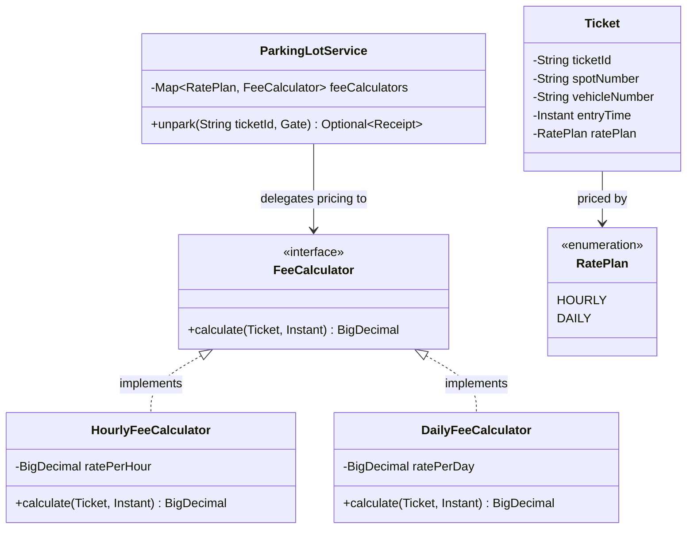

### Design decisions

| Decision | Reason |
| --- | --- |
| `calculate(Ticket, Instant exitTime) → BigDecimal` | Everything the calculation needs arrives as arguments. The calculator holds rates, not state about any particular car, so one instance serves every exit. |
| Pricing is **not** a method on `Ticket` | A ticket is a record of a parking event. Pricing policy changes for commercial reasons that have nothing to do with what a ticket records. |
| `Ticket` records `ratePlan` **at entry** | The deal is struck when the driver takes the ticket. If the scheme were chosen at exit, the price would depend on when you happened to drive out rather than what you agreed to — and the service would need external state (is today an event day?) that it has no business knowing at exit. |
| `Map<RatePlan, FeeCalculator>` rather than `if/else` on the enum | An `if/else` over the enum reintroduces the branch the interface was meant to remove: every new plan edits that method. With a map, a new plan is a new entry in configuration and zero edits to `unpark`. |
| Still only two implementations | Tiered pricing, weekend rates and free-first-15-minutes are not modelled. They are new requirements, not predictions. |
| Each calculator takes its rate **in its constructor** | The first attempt made them `private static final BigDecimal HOURLY_RATE = BigDecimal.valueOf(10)` with an `// Example rate` comment — which is a confession. Before this step the rate was a constructor parameter on the service, so introducing the pricing abstraction had made pricing *less* configurable than it was. Nothing in the application noticed; six tests did, reporting `expected 30 but was 10`. The arithmetic was fine — only the price had silently changed. |
| `ratePerHour` was **deleted** from the service | Once calculators own their rates, that parameter cannot affect any price, yet the constructor still demanded one and both `Main` and the test helper passed a number that did nothing. A parameter whose value cannot change behaviour is worse than dead code: it tells the next person they are configuring something. |
| `Main` owns the rate table | It is the composition root — the same place that already knows how many floors exist and what sizes they are. Prices are deployment configuration, not domain logic. |
| The calculator map is **validated at construction**, and `@RequiredArgsConstructor` was dropped to allow it | Lombok can generate assignment; it cannot express an invariant. The check is `EnumSet.allOf(RatePlan.class)` minus `keySet()` — start from every plan the system can issue, remove the covered ones, reject whatever is left by name. `RatePlan.values()` is the authority, so a new plan cannot be introduced without someone being forced to price it. Verified by adding a `WEEKLY` constant: 23 of 24 service tests failed instantly with `No fee calculator configured for rate plans: [WEEKLY]`. |
| Validate the invariant you rely on, not the conditions that are easy to check | The first validation tested `!= null`, `!isEmpty()`, and no-null-entries. All three felt protective and none prevented the actual exposure — `Map.of(HOURLY, …)` passed, and a `DAILY` ticket still hit an NPE at the exit gate. The null-entry check was redundant twice over: `Map.copyOf` rejects nulls on the next line, and `Map.of` cannot contain them. |
| Because the map is validated, `unpark` needs **no** null check | `feeCalculators.get(plan)` cannot return null once construction guarantees coverage. A guard there as well would defend against a state that has been made unreachable. |
| `DAILY` is a per-day rate, so the class is `DailyFeeCalculator` | It had been named `FlatRateFeeCalculator` while multiplying by days. A flat rate is one amount regardless of duration; per-day multiplies and therefore needs rounding. The name and the arithmetic have to agree, and which one is correct is a product question, not a style one. |

---

## Step 6 — Pluggable Allocation

**New requirement:** different sites assign spots differently. One garage wants the first
free spot it finds; another wants the shortest walk from the entrance.

This earns the `SpotAllocationStrategy` deferred back at Step 2 — a second real policy now
exists, the same test that earned `FeeCalculator`.

### Class diagram (delta)

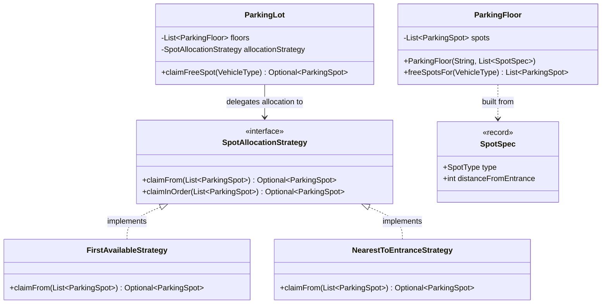

### Design decisions

| Decision | Reason |
| --- | --- |
| A named `SpotAllocationStrategy`, not `Comparator<ParkingSpot>` | `Comparator` was the serious alternative — "nearest first" and "first available" *are* orderings, `comparingInt` writes one for you, and `thenComparing` composes tie-breakers with no new class. The reason it loses is not expandability (a `Comparator` is equally expandable, so that argument picks no winner): ordering is a **subset** of allocation. A comparator must order everything it is handed, sees exactly two spots and nothing else, and can never say *none of these*. A strategy can **exclude** candidates ("never the roof", "reserve ten spots for staff"), **refuse** entirely while free spots exist, and take request context a `(a,b) → int` signature cannot see. Those are ordinary parking requirements, so the bet is judgment rather than speculation. |
| Before defining a single-method interface, check whether the JDK already names the concept | A large share of hand-rolled "strategy" interfaces are `Comparator`, `Predicate`, `Supplier` or `Function` in a domain costume. Reaching for a custom interface that turns out to be `Comparator` with extra steps is a thing interviewers notice. The point is not that custom always loses — it is that the comparison has to be made out loud. |
| The strategy **claims**, it does not merely order | A direct consequence of choosing the interface for its ability to filter and refuse: if `ParkingLot` did the claiming, the strategy could not decline. So `claimFrom` returns a spot that is already occupied. |
| Candidate lists are safe to be stale | The strategy runs `tryOccupy` down its chosen order, so losing a CAS simply advances to the next candidate — **the iteration is the retry**. That is what lets the lot hand over a snapshot without reopening the race the concurrency step closed. |
| `claimInOrder` is a `default` method on the interface, not duplicated in both implementations | Normally five repeated lines beat an early abstraction. This loop is the exception: re-implementing it is exactly where someone adds an `if (!spot.isOccupied() && spot.tryOccupy())` guard and restores the check-then-act. **Extracting the part that is dangerous to get wrong is a different decision from extracting the part that merely repeats.** |
| `ParkingFloor.freeSpotsFor(...)` returns a derived list, not the field | This is what keeps the Step 4 decision intact. `getSpots()` published the **collection**; a filtered result built per call is a **query**. The floor still owns its list — nobody can add or remove spots through the answer. Pinned by a test asserting the returned list rejects `add`. |
| `ParkingFloor` takes `List<SpotSpec>` instead of `List<SpotType>` | The strategy is the easy half of this step; the **data** is the hard half. Distance cannot be derived from position, because "lowest floor, then lowest spot number" computes exactly what `FIRST_AVAILABLE` computes — the two policies would be incapable of disagreeing and every test would pass while proving nothing. Real distance is real data: the lift may be on the third floor, and the closest spots may be mid-row. `SpotSpec(type, distanceFromEntrance)` is the smallest thing that carries it. |
| `ParkingFloor` stopped storing `floorNumber` | It is still a constructor parameter, used to compose spot ids, but nothing reads it afterwards — each spot carries its own. A field nobody reads is deleted. |

### Evidence

| Check | Result |
| --- | --- |
| Policies genuinely differ | `theAllocationPolicyDecidesWhichSpotTheSameLotHandsOut` builds one layout where `F1-S1` is first but `F2-S1` is nearest, and asserts the two lots return **different** spots. If a layout cannot tell the policies apart, the test is theatre. |
| The nearest policy actually sorts | Deleting the `sort` line fails 4 of 6 strategy tests plus the lot-level policy test — and **nothing else**, which is the other half of the proof: the sort affects only what it should. |
| Immutable candidate lists | `anImmutableCandidateListIsAccepted` passes a `List.of(...)`. Sorting it in place would throw `UnsupportedOperationException` at runtime, and only on this strategy — first-available tests would have stayed green. |

---

## Concurrency — two threads, one spot

**New requirement:** several gates admit cars at the same moment, on different threads.

**The race.** `park` was a check-then-act spanning two objects:

```java
Optional<ParkingSpot> freeSpot = parkingLot.findFreeSpot(type);   // A and B both see F1-S1
spot.occupy();                                                     // both proceed
```

Nothing was claimed during the search, so two threads could return the *same* spot. And
`occupy()` was itself a read-check-write on a non-`volatile` boolean, so both could read
`false` and both write `true`. Two tickets, one spot.

The `IllegalStateException` in `occupy()` was never concurrency control — it is a
*sequential* invariant check. It catches a double-call from a bug on one thread; under two
threads it can be stepped straight over.

### Design decisions

| Decision | Reason |
| --- | --- |
| `AtomicBoolean` + `compareAndSet`, not `synchronized` | CAS is one indivisible compare-and-set, so the read-check-write gap closes in hardware. A `synchronized` method on `ParkingFloor` would also be correct and easier to explain — and defensible, since a garage admits roughly one car per second and contention is nil. What is *not* defensible is locking the whole `ParkingLot`, which serialises every gate in the building behind one monitor. |
| **Find-and-claim is one operation** (`claimFreeSpot`), and `findFreeSpot` was deleted from the entry path | This is the structural half of the fix, and the more important half. An atomic `tryOccupy` alone does not help if the decision to use that spot was made in an earlier call — the race lives in the gap between the two. With no read-then-act route into `park`, there is no gap to race in. |
| `tryOccupy()` returns `boolean`; `free()` still throws | The same rule as Step 3, one level down. Losing a race for a spot is normal and expected, so it is a return value. Freeing a spot that was never occupied is a broken invariant — nobody races to release a spot they do not hold — so it stays an exception. |
| `free()` CASes too | A claim guarded on the way in deserves a guard on the way out. A bare `set(false)` would also let anyone release a spot claimed by someone else. |
| `ConcurrentHashMap` in `TicketRepository` | Fixing the spot race while leaving the ticket race just moves the failure. See the evidence below — this one actually fired. |

### Recorded lesson: the CAS return value

The first implementation read:

```java
if (occupied.compareAndSet(true, false)) {        // WRONG
    throw new IllegalStateException("Parking spot is already free");
}
```

`compareAndSet` returns `true` when it **won** — when the spot was occupied and is now free.
So this threw on every *successful* release and stayed silent when the spot really was
already free. **The boolean answers "did I win", not "was it already that value."**

The failure was worse than a crash: in `unpark` the spot was released *and* the exception
propagated, so `ticketRepository.remove` never ran — spot free, ticket still valid, driver
handed a stack trace instead of a receipt, and a second presentation of the same ticket
issued a second receipt for a car that had already left. 15 of 51 tests caught it.

### Evidence

Two stress tests, 200 drivers released simultaneously against 50 spots:

| Test | Result |
| --- | --- |
| `concurrentDriversNeverShareASpot` | Passed every run: exactly 50 admitted, 150 turned away, zero shared spots. CAS holds. |
| `everyIssuedTicketSurvivesConcurrentEntry` | **Failed 2 runs in 3** on `HashMap` — `ticket 3c12d889-… was issued but is not in the repository`. A driver holding a valid printed ticket that the system has no record of: `unpark` returns empty, they cannot leave, and the spot is occupied forever. Green 5/5 after `ConcurrentHashMap`. |

The second row is the point worth remembering: the race that actually bit was not the one
being discussed.

### Two follow-on fixes

| Fix | Reason |
| --- | --- |
| Class-level `@Getter` on `ParkingSpot` replaced with **per-field** `@Getter` | The class-level annotation generated `getOccupied()` returning the `AtomicBoolean` itself, so a caller could `spot.getOccupied().set(false)` and release any spot, bypassing every invariant. Nobody wrote that leak: a field's type changed from `boolean` to `AtomicBoolean` and Lombok silently widened the public API to match. Per-field getters are **opt-in**, so the next field added is private until someone decides otherwise. `@Getter(AccessLevel.NONE)` on the one field would also work, but it is opt-out — it protects today's field and exposes tomorrow's. |
| `claimFreeSpot` rewritten as an explicit loop | It had been claiming inside a stream `filter`, which is correct *only* because sequential streams are lazy and `findFirst` short-circuits. Add `.parallel()`, or let a reader reorder the pipeline, and it claims several spots while returning one — every extra claim leaks a spot that no ticket can ever release. A side effect inside `filter` is a predicate that lies; a loop with `if (canFit && tryOccupy) return` says exactly what it does. |

The spot's public surface is now the whole argument, visible in one command:

```
public boolean canFit(VehicleType)
public boolean tryOccupy()
public boolean isOccupied()
public void free()
public String getSpotNumber()
public String getFloorNumber()
public SpotType getSpotType()
```

No way in to the flag except `tryOccupy` and `free`, which is what "one owner per piece of
state" has meant since Step 1.


### Recorded lesson: the same truncation bug, three times

`DailyFeeCalculator` first read:

```java
long parkedDuration = Duration.between(ticket.entryTime(), exitTime).toDays();
parkedDuration = Math.max(1, parkedDuration);
```

`toDays()` truncates, so a 47-hour stay was charged as one day. `Math.max(1, …)` patched only
the under-24-hour case — exactly as `if (durationHours == 0)` had patched only the
under-one-hour case in the hourly calculator two steps earlier. **The same class of bug, in a
new class, because the new class had no tests.**

The fix has a trap of its own:

```java
Math.max(1, (long) Math.ceil((double) minutesParked / MINUTES_PER_DAY))
```

Without the `(double)` cast the division is long division, which truncates *before*
`Math.ceil` ever runs — so the bug returns in a third form, in a line that visibly contains
`Math.ceil` and therefore looks correct. The hourly calculator escapes this only because
`minutesParked / 60.0` has a double literal. **In any ceiling of a division, check that the
division itself is floating point.** Verified by removing the cast: 4 of 9 daily tests failed.

### Test layering

The six pricing tests originally lived in `ParkingLotServiceTest` and asserted amounts through
`park`/`unpark`. That was right while `priceFor` was private to the service; once pricing became
two classes it was two layers from the thing under test.

| Layer | What it asserts |
| --- | --- |
| `HourlyFeeCalculatorTest` (8), `DailyFeeCalculatorTest` (9) | The arithmetic — boundaries on both sides of every hour and day, the minimum charge, and that the injected rate is the one applied |
| `ParkingLotServiceTest` (2 pricing tests) | Only the **wiring**: a 25-hour stay costs 750 on `HOURLY` and 1000 on `DAILY`, which proves the plan recorded on the ticket selects the calculator |

Deliberately different numbers for the same duration — if both plans priced a 25-hour stay the
same, the wiring test would pass with the calculators swapped.

---

## Final design

The state after all six steps plus concurrency. Split into two diagrams: the domain model
holds state and guards it; the service layer sequences use cases and owns the policies.

### Domain model

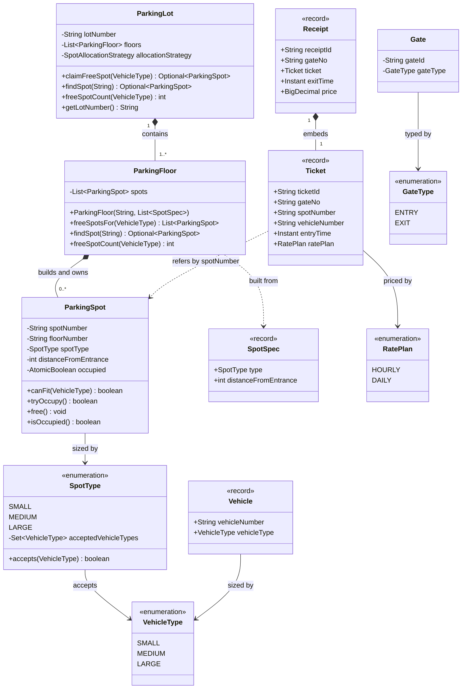

### Service layer and policies

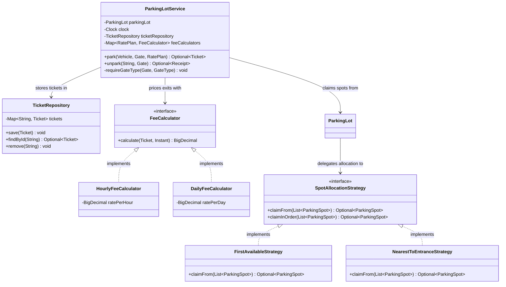

### Entry and exit, as built

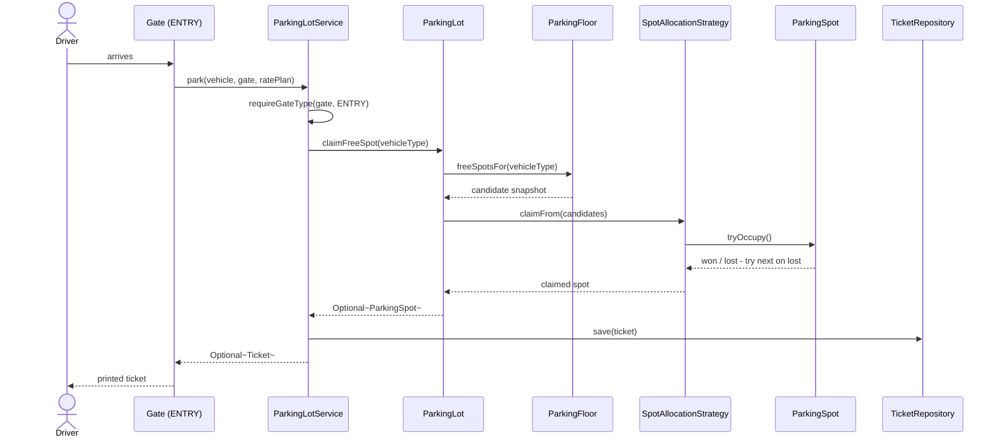

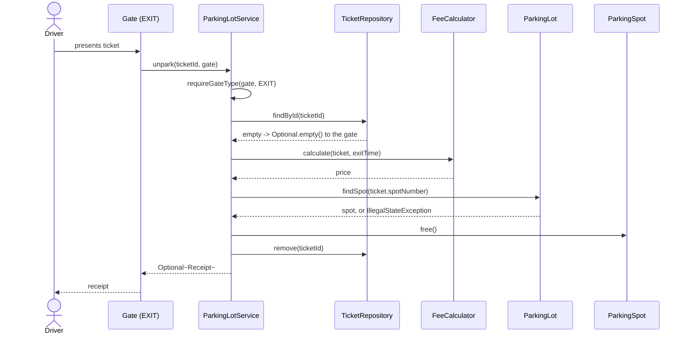

### Where each requirement ended up

| Requirement | Lives in |
| --- | --- |
| Park and unpark | `ParkingLotService` sequences it; `Main` wires it |
| Vehicle sizes and the fit rule | `SpotType.acceptedVehicleTypes`, reached via `ParkingSpot.canFit` |
| Multiple gates | `Gate` + `GateType`, validated in `requireGateType`; `TicketRepository` makes enter-here-leave-there possible |
| Multiple floors | `ParkingFloor`, which also names its own spots |
| Two pricing schemes | `FeeCalculator` impls, selected by the `RatePlan` recorded on the ticket |
| Pluggable allocation | `SpotAllocationStrategy` impls, injected into `ParkingLot` |
| Concurrent gates | `ParkingSpot`'s CAS, claim-inside-allocation, `ConcurrentHashMap` |

**Final tally:** 21 production classes, 424 lines of production code, 884 lines of tests, 82 tests.

---

## Progression summary

| Step | Requirement | What it forced | What it did **not** force |
| --- | --- | --- | --- |
| 1 | Park and unpark | `ParkingLot`, `ParkingSpot`, `Vehicle`, `Ticket`, `Receipt` | Any abstraction at all |
| 2 | Vehicle sizes | Two enums, `canFit` on the spot | A `SpotAllocationStrategy` |
| 3 | Multiple gates | `TicketRepository` (SRP split), `ParkingLotService`, one `Gate` + enum | `EntryGate` / `ExitGate` subclasses |
| 4 | Multiple floors | `ParkingFloor`, globally unique opaque spot id, delegated search | Changes to `Ticket` or `TicketRepository` |
| 5 | Two pricing schemes | `FeeCalculator` interface + 2 impls, `RatePlan` on the ticket | A payment-method hierarchy |
| 6 | Pluggable allocation | `SpotAllocationStrategy` + 2 impls, `SpotSpec` carrying distance, `freeSpotsFor` | A `Comparator`, runtime policy switching, per-driver preferences |
| — | Concurrent gates | Atomic `claimFreeSpot`, CAS on the spot, `ConcurrentHashMap` | Locks on the lot, a queue, or any thread pool of its own |

**Still unbuilt, deliberately:** display boards, reservations, EV charging,
handicapped priority, multiple payment methods, concurrency, persistence,
notifications. Each waits for a requirement.

---

## Open questions

**Indexing the inventory.** `findFreeSpot` and `findSpot` are linear scans. A map
keyed by `spotNumber` makes `findSpot` constant-time, but it does nothing for
`findFreeSpot`, because free-ness is mutable state rather than identity.

Keeping a `Set<ParkingSpot> freeSpots` index would fix that — and it collides head-on
with the Step 1 decision that `ParkingSpot` flips its own `occupied` flag privately.
Something outside the spot would have to learn that the flag changed. Resolving that
means picking one of:

- the spot raises an event and the lot (or floor) maintains the index;
- occupancy changes route through the floor, which updates the index and then tells
  the spot — the spot stops being the sole owner of its own flag;
- no index at all, and the scan stays.

Deferred until a requirement makes the scan actually hurt. Worth noting that this is
a case where a *performance* fix would force a change to an *ownership* decision —
which is why it counts as a design question and not a tuning one.

