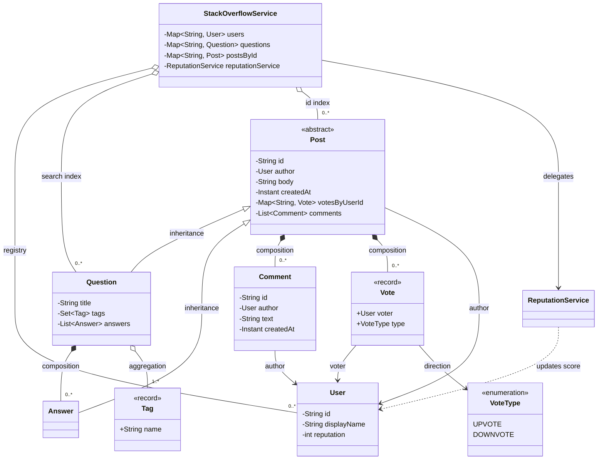
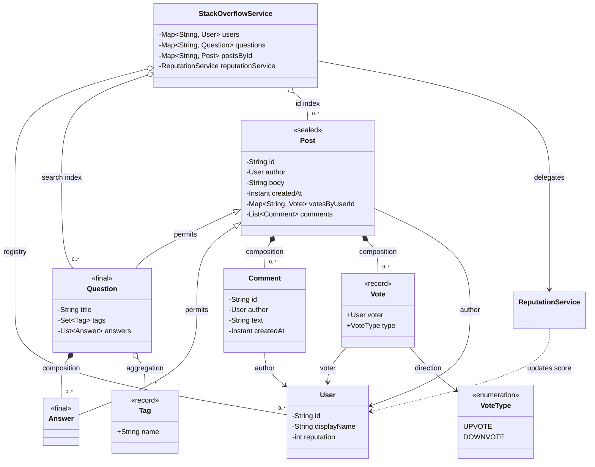

# Stack Overflow — Low Level Design

**Built in order, not final-design-first.** Unlike the vending machine and parking lot
documents, this one is written as the design is made: requirements, then the vocabulary,
then a basic version, then an argument about whether patterns are needed at all, and only
then a pattern-based version. Each section is added when that step is actually done, so
nothing below is a plan for code that does not exist.

Interview scope: one 45–60 minute round. In-memory collections, no persistence, no
framework, no REST layer.

---

## Requirements

**Stated by me (the interviewer), not invented by the design.** Six lines were given:

1. Users can post questions, answer questions, and comment on questions and answers.
2. Users can vote on questions and answers.
3. Questions should have tags associated with them.
4. Users can search for questions based on keywords, tags, or user profiles.
5. The system should assign reputation score to users based on their activity and the
   quality of their contributions.
6. The system should handle concurrent access and ensure data consistency.

Three clarifications were asked and answered, and they changed the design:

- **Reputation uses exact point values**, fixed in the table below — not a vague "quality"
  notion.
- **One vote per user per post.** A cast vote is final; there is no retract and no change.
- **Requirement 6 is an analysis deliverable, not code.** The races are named and the
  invariant at risk is stated; the Java concurrency work is a separate optimization pass
  after this session. This is the single decision that keeps the design interview-sized.

### Confirmed functional requirements

| # | Requirement |
| --- | --- |
| R1 | A registered user can post a question with a title and a body |
| R2 | A registered user can post an answer to an existing question |
| R3 | A registered user can comment on a question or on an answer |
| R4 | A user can upvote or downvote a question or answer **at most once**; a repeat vote by the same user on the same post is rejected |
| R5 | A question carries one or more tags; the same tag can be attached to many questions |
| R6 | A user can search questions by keyword (title and body), by tag name, or by author |
| R7 | Reputation is updated at the moment of the triggering event, using the exact table below |
| R8 | Every point where concurrent access would corrupt state is identified, with the invariant at risk named. No locking code in V1 |

### The reputation table

| Event | Reputation change |
| --- | --- |
| You post a question | +1 (activity) |
| You post an answer | +1 (activity) |
| Your question is upvoted | +5 |
| Your answer is upvoted | +10 |
| Your question or answer is downvoted | −2 |
| You post a comment | 0 |

"Activity" and "quality" in R5 map to two different columns of that table: posting earns
the +1, votes earn the rest.

### Out of scope

Deliberately not built, including the items raised and then cut:

- **Thread-safety implementation** — cut by decision, deferred to a later pass
- Vote retraction or vote change — the one-vote limit was chosen instead
- Accepted answers, bounties, badges, reputation-gated privileges
- Edit history, delete / close / flag / moderate
- Voting on comments — R4 names questions and answers only
- Nested comment threads: comments are flat
- Persistence, database, REST layer, UI, authentication, notifications, duplicate
  detection, markdown rendering, search ranking, pagination

### Assumptions

1. Single process, in-memory collections.
2. Users already exist; there is no signup or login flow. Each has a unique id and a
   display name.
3. A user cannot vote on their own post.
4. Tags are free-form strings, normalized to lowercase, created on demand on first use.
5. Keyword search is a case-insensitive substring match — no stemming, no index, no
   relevance order.
6. A search call filters on one criterion at a time, not a combined query.
7. Comments are plain text, attached to exactly one post, and never move reputation.

### Core use cases

| Actor | Outcome |
| --- | --- |
| Asker | posts a question with tags; it becomes searchable; asker gains +1 |
| Answerer | posts an answer on an existing question; answerer gains +1 |
| Commenter | comments on a question or answer; no reputation moves |
| Voter | votes on a post they do not own; the post's score and the author's reputation both move; a repeat vote is rejected |
| Searcher | searches by keyword, tag or author and receives matching questions |
| Reader | reads a user's current reputation score |

---

## Domain model / names

Nine names and one enum. Two things were deliberately **not** given a name, and the
reasons are recorded below — the cuts are part of the design.

### Entities (identity, lifecycle)

| Class | Responsible for | Explicitly not responsible for |
| --- | --- | --- |
| `User` | its identity (id, display name) and holding its current reputation score | deciding *how much* an event is worth; holding a list of its own posts |
| `Post` | *abstract.* What a question and an answer genuinely share: id, author, body, timestamp, its own comments, its own vote records, and enforcing "one vote per user per post" so that rule lives in one place. Reports its net score | tags, titles, answers; touching the author's reputation |
| `Question` | the title, the tag set, and owning its answers | searching itself; ranking its answers |
| `Answer` | being a post that is *not* a question: it adds no fields of its own. It exists as a distinct type so the reputation table can score it differently (+10 vs +5) and so a question's title and tags can never leak onto it | knowing which question it belongs to; being accepted or scored against siblings |
| `Comment` | a flat plain-text remark with an author and a timestamp | being voted on or earning reputation — which is why it is **not** a `Post` subclass |

`Comment` staying outside the hierarchy is the load-bearing decision there. R4 covers
questions and answers only, so giving `Comment` a vote box would build something nobody
asked for.

### Value objects (immutable, compared by value)

| Class | Responsible for | Explicitly not responsible for |
| --- | --- | --- |
| `Vote` | recording who voted and in which direction. Immutable — R4 made a cast vote final, so there is no mutator and no lifecycle | applying its own reputation consequence |
| `Tag` | a normalized (lowercased, trimmed) name, and being equal to any `Tag` with the same name so it works as a map key | knowing which questions use it — the reverse index belongs to whoever searches |

### Services / orchestrators

| Class | Responsible for | Explicitly not responsible for |
| --- | --- | --- |
| `ReputationService` | the exact point table, applied to the affected `User` when a post is created or voted on. The only place a point value appears | storing reputation (that is `User`); deciding who may vote (that is `Post`) |
| `StackOverflowService` | the entry point for every use case — ask, answer, comment, vote, search, read reputation. Holds the in-memory registries and resolves ids to objects: `users`, `questions` (the search index), and `postsById` (the id index, covering questions and answers alike, so `vote` and `addComment` resolve a post id in one lookup instead of walking every question's answers) | point values (delegates to `ReputationService`); the one-vote rule (delegates to `Post`) |

### Enum

`VoteType` — `UPVOTE`, `DOWNVOTE`.

The only enum needed. A `PostType { QUESTION, ANSWER }` was rejected: the class hierarchy
already carries that distinction, and a type tag alongside subclasses invites
`if (type == QUESTION)` branches.

### Names rejected, and why

| Rejected | Why it would be wrong |
| --- | --- |
| `PostManager` / `ContentManager` | god object. "Manager" forbids nothing, so it grows to hold posting, voting, searching, reputation and validation |
| `QuestionRepository`, `AnswerRepository`, `UserRepository` | three classes wrapping three `HashMap`s. Leaks persistence vocabulary into a system with no persistence; every method is a one-line pass-through |
| `VoteCounter` / `VoteCount` | anemic wrapper around an `int`. `Post` already holds its votes and can report its score; a second object counting the same thing is a consistency bug waiting to happen |
| `Votable` interface | redundant. `Post` already *is* the set of votable things, and there is no third votable type in the requirements |
| A separate `SearchService` | three fixed lookups over one collection do not earn a class yet. Folded into `StackOverflowService`. If search grows a combined query or an index, it earns the name then |

`ReputationService` survived the same test that killed `SearchService`: it is *policy*
applied from three different call sites, not a query. Pulling it out stops the vote method
from knowing point values.

### Class diagram



| Arrow | Name | Means here |
| --- | --- | --- |
| `<\|--` | inheritance | a question and an answer *are* posts: same id, author, body, comments and vote box |
| `*--` | composition | the part cannot live without the whole. Answers, comments and votes die with their post |
| `o--` | aggregation | the part exists on its own. A tag outlives any one question; a user outlives the registry that lists them |
| `-->` | association | "holds a reference to". A post references its author but does not own them |
| `..>` | dependency | "uses, does not hold". `ReputationService` mutates a user's score and keeps no users |

A field and an arrow say different things. `-Set~Tag~ tags` only tells you a reference
exists; the `o--` says the tag is not owned. Java cannot express that difference, which is
why the diagram has to.

### Where each requirement ended up

| Req | Carried by |
| --- | --- |
| R1 | `StackOverflowService.askQuestion` → `Question`, `Tag` |
| R2 | `StackOverflowService.postAnswer` → `Answer`, held by `Question` |
| R3 | `StackOverflowService.addComment` → `Comment`, held by `Post` |
| R4 | `Post` enforces the rule, `Vote` records it, `VoteType` names the direction |
| R5 | `Question` + `Tag` |
| R6 | `StackOverflowService` — three lookups over the question registry |
| R7 | `ReputationService` applies, `User` stores |
| R8 | **No class owner, by design.** An analysis deliverable. The mutable state at risk: a `Post`'s vote map and score, a `User`'s reputation field, a `Question`'s answer list, and the service's three registries — `questions` and `postsById` must agree about what exists |

### Relationships, in words

- `Question` **composes** `Answer` — an answer has no meaning without its question, and
  dies with it. The question holds the list.
- `Post` **composes** `Comment` and `Vote` — neither can outlive the post it sits on. The
  votes are keyed by voter id, so the one-vote rule is a map lookup rather than a scan.
- `Post` → `User` (author), `Comment` → `User` (author), `Vote` → `User` (voter) are all
  plain associations. Deleting a post must not touch a user.
- `Question` **aggregates** `Tag` — tags are shared across questions and exist
  independently of any one of them.
- `StackOverflowService` **aggregates** the `User`, `Question` and `Post` registries and
  **depends on** `ReputationService`. `questions` and `postsById` are two indexes over the
  same objects, not two copies of the data.
- **Deliberately absent: every back-pointer.** No `User` → `Post`, no `Answer` → `Question`,
  no `Comment` → `Post`. Ownership runs one way only: a question holds its answers, a post
  holds its comments and votes, and nothing points back up.

Applying that rule consistently is what makes the model readable. Nothing in R1–R8 ever
needs to walk upwards: reputation reads `post.author`, search returns questions, and a
comment or vote is only ever reached *through* the post that owns it. A child that stores
its parent's id buys nothing here and costs a second field to keep true — if an answer were
ever moved, or a comment copied, the stored id becomes a lie with no compiler to catch it.
Where the code genuinely needs to *find* a post by id, the answer is the `postsById` index
on the service, not a field on the child.

---

## V1 — Basic design

**Skeleton only.** Nine classes and one enum, no patterns. Method bodies are numbered
`// TODO` steps followed by a single `throw new UnsupportedOperationException("TODO")`, so
the project compiles and any unimplemented call fails loudly.

**Status: implemented.** The skeleton below is the design artifact and is kept in skeleton
form on purpose — the working code lives in `src/main/java` and is the single place it
should be read, so the two cannot drift. Two bugs were found reviewing the first pass and
fixed: `ReputationService.onQuestionPosted` / `onAnswerPosted` were passing
`getReputation() + delta` into a method that already does `+=`, which made reputation grow
as `2n + 1` per post; and `searchByAuthor` compared `User` objects with `equals` on a class
that has no `equals`, so it was reference identity that happened to work. Both now pass the
delta and compare ids respectively.

10 production classes, **47 green tests** — `TagTest` (5), `PostTest` (9),
`ReputationServiceTest` (8), `StackOverflowServiceTest` (25). They cover the flow below
plus self-vote rejection, repeat-vote rejection, tag normalization on both the write and
the read path, voting an answer by its own id, and the fact that search never returns an
answer as a question. `ReputationServiceTest.postingAccruesOnePerPostRatherThanDoubling`
exists specifically to pin the first bug down.

### Project layout

Same convention as `vending-machine` and `parking-lot`: the problem folder *is* the Maven
project, with the design document inside it.

```
stack-overflow/
├── pom.xml                                  com.stackoverflow:StackOverflow, Java 21
├── StackOverflow.md                         this document
└── src
    ├── main/java/com/stackoverflow/
    │   ├── User.java  Post.java  Question.java  Answer.java
    │   ├── Comment.java  Vote.java  Tag.java
    │   ├── constants/VoteType.java
    │   └── service/ReputationService.java  StackOverflowService.java
    └── test/java/com/stackoverflow/         empty — tests come with the implementation
```

Two unavoidable real statements: `Question` and `Answer` constructors carry an explicit
`super(id, author, body)` call, because `Post` has no no-argument constructor and Java
requires the super call first. Everything else is TODO comments.

### Deviations from the Phase 2 names

Five things the code needs that the name list did not spell out:

| Deviation | Why |
| --- | --- |
| `Question.matchesKeyword` and `Question.hasTag` | Phase 2 said a question is not responsible for *searching itself*, and it still isn't. These are predicates about its own fields — the question answers "do I match", the service does the iterating and the selecting. The alternative is the service reaching into `title` and `body`, which is worse |
| `Post.castVote` returns `boolean` | R4 needs "rejected" to be an answer, not an exception, because the service must know whether to move reputation |
| `Tag` normalizes in its compact constructor | Assumption 4 says tags are lowercased. Doing it in the constructor means no caller can create an unnormalized `Tag`, so `equals` and `hashCode` are trustworthy as map keys |
| `StackOverflowService.idSequence` plus `nextId` | Questions, answers and comments all need ids and nothing else was going to supply them |
| `requireUser` / `requirePost` / `requireQuestion` | Every public method starts by turning an id into an object or failing. Three private helpers instead of the same two lines nine times |

### User

```java
public class User {

    private final String id;
    private final String displayName;
    private int reputation;

    public User(String id, String displayName) {
        // TODO 1: assign id and displayName
        // TODO 2: start reputation at 0
    }

    public String getId() {
        // TODO 1: return id
    }

    public String getDisplayName() {
        // TODO 1: return displayName
    }

    public int getReputation() {
        // TODO 1: return reputation
    }

    public void addReputation(int delta) {
        // TODO 1: add delta to reputation — delta is negative for a downvote
    }
}
```

### Post

```java
public abstract class Post {

    private final String id;
    private final User author;
    private final String body;
    private final Instant createdAt;
    private final Map<String, Vote> votesByUserId = new HashMap<>();
    private final List<Comment> comments = new ArrayList<>();

    protected Post(String id, User author, String body) {
        // TODO 1: assign id, author and body
        // TODO 2: set createdAt to Instant.now()
    }

    public boolean castVote(User voter, VoteType type) {
        // TODO 1: if voter is the author, return false — nobody votes on their own post
        // TODO 2: if votesByUserId already has the voter's id, return false — one vote per user
        // TODO 3: put a new Vote(voter, type) into votesByUserId under the voter's id
        // TODO 4: return true
    }

    public int score() {
        // TODO 1: count the votes whose type is UPVOTE
        // TODO 2: count the votes whose type is DOWNVOTE
        // TODO 3: return upvotes minus downvotes
    }

    public void addComment(Comment comment) {
        // TODO 1: append comment to comments
    }

    public List<Comment> getComments() {
        // TODO 1: return an unmodifiable view of comments
    }

    public String getId() {
        // TODO 1: return id
    }

    public User getAuthor() {
        // TODO 1: return author
    }

    public String getBody() {
        // TODO 1: return body
    }

    public Instant getCreatedAt() {
        // TODO 1: return createdAt
    }
}
```

### Question

```java
public class Question extends Post {

    private final String title;
    private final Set<Tag> tags;
    private final List<Answer> answers = new ArrayList<>();

    public Question(String id, User author, String title, String body, Set<Tag> tags) {
        // TODO 1: call super with id, author and body
        // TODO 2: assign title
        // TODO 3: copy tags into a new LinkedHashSet so the caller cannot mutate ours later
    }

    public void addAnswer(Answer answer) {
        // TODO 1: append answer to answers
    }

    public boolean hasTag(Tag tag) {
        // TODO 1: return whether tags contains tag
    }

    public boolean matchesKeyword(String keyword) {
        // TODO 1: lowercase the keyword once
        // TODO 2: return true if the lowercased title contains it
        // TODO 3: otherwise return true if the lowercased body contains it
        // TODO 4: otherwise return false
    }

    public String getTitle() {
        // TODO 1: return title
    }

    public Set<Tag> getTags() {
        // TODO 1: return an unmodifiable view of tags
    }

    public List<Answer> getAnswers() {
        // TODO 1: return an unmodifiable view of answers
    }
}
```

### Answer

```java
public class Answer extends Post {

    public Answer(String id, User author, String body) {
        // TODO 1: call super with id, author and body
    }
}
```

No fields of its own — that is deliberate, and it is the whole point of the Phase 3
revision. `Answer` exists so the reputation table can score it at +10 where a question
scores +5, and so `title` and `tags` can never appear on an answer. It does **not** know
which question owns it.

### Comment

```java
public class Comment {

    private final String id;
    private final User author;
    private final String text;
    private final Instant createdAt;

    public Comment(String id, User author, String text) {
        // TODO 1: assign id, author and text
        // TODO 2: set createdAt to Instant.now()
    }

    public String getId() {
        // TODO 1: return id
    }

    public User getAuthor() {
        // TODO 1: return author
    }

    public String getText() {
        // TODO 1: return text
    }

    public Instant getCreatedAt() {
        // TODO 1: return createdAt
    }
}
```

### Vote, Tag, VoteType

```java
public record Vote(User voter, VoteType type) { }
```

```java
public record Tag(String name) {

    public Tag {
        // TODO 1: reject a null or blank name
        // TODO 2: reassign name to its trimmed, lowercased form
    }
}
```

```java
public enum VoteType {
    UPVOTE,
    DOWNVOTE
}
```

`Vote` needs no body at all: the record gives it `equals`, `hashCode` and accessors, and a
cast vote is immutable by requirement.

### ReputationService

```java
public class ReputationService {

    private static final int QUESTION_POSTED = 1;
    private static final int ANSWER_POSTED = 1;
    private static final int QUESTION_UPVOTED = 5;
    private static final int ANSWER_UPVOTED = 10;
    private static final int DOWNVOTED = -2;

    public void onQuestionPosted(User author) {
        // TODO 1: add QUESTION_POSTED to the author's reputation
    }

    public void onAnswerPosted(User author) {
        // TODO 1: add ANSWER_POSTED to the author's reputation
    }

    public void onVoteCast(Post post, VoteType type) {
        // TODO 1: if type is DOWNVOTE, add DOWNVOTED to the post author's reputation and return
        // TODO 2: if the post is a Question, add QUESTION_UPVOTED to its author
        // TODO 3: otherwise it is an Answer — add ANSWER_UPVOTED to its author
    }
}
```

Every number from the requirement table appears exactly once, in this class, and nowhere
else in the system.

### StackOverflowService

```java
public class StackOverflowService {

    private final Map<String, User> users = new HashMap<>();
    private final Map<String, Question> questions = new LinkedHashMap<>();
    private final Map<String, Post> postsById = new HashMap<>();
    private final ReputationService reputationService = new ReputationService();
    private int idSequence = 0;

    public void addUser(User user) {
        // TODO 1: put user into users under its id — seeding only, there is no signup
    }

    public Question askQuestion(String authorId, String title, String body, Set<String> tagNames) {
        // TODO 1: resolve authorId with requireUser
        // TODO 2: turn each raw name in tagNames into a Tag
        // TODO 3: reject an empty tag set — R5 says one or more
        // TODO 4: build a Question with nextId("q")
        // TODO 5: put it into questions and into postsById
        // TODO 6: call reputationService.onQuestionPosted with the author
        // TODO 7: return the question
    }

    public Answer postAnswer(String authorId, String questionId, String body) {
        // TODO 1: resolve authorId with requireUser
        // TODO 2: resolve questionId with requireQuestion
        // TODO 3: build an Answer with nextId("a")
        // TODO 4: add it to the question with addAnswer
        // TODO 5: put it into postsById
        // TODO 6: call reputationService.onAnswerPosted with the author
        // TODO 7: return the answer
    }

    public Comment addComment(String authorId, String postId, String text) {
        // TODO 1: resolve authorId with requireUser
        // TODO 2: resolve postId with requirePost — works for a question or an answer
        // TODO 3: build a Comment with nextId("c")
        // TODO 4: add it to the post with addComment
        // TODO 5: return the comment — the table gives a comment 0 reputation
    }

    public boolean vote(String voterId, String postId, VoteType type) {
        // TODO 1: resolve voterId with requireUser
        // TODO 2: resolve postId with requirePost
        // TODO 3: call post.castVote; if it returns false, return false and move no reputation
        // TODO 4: call reputationService.onVoteCast with the post and the type
        // TODO 5: return true
    }

    public List<Question> searchByKeyword(String keyword) {
        // TODO 1: reject a null or blank keyword
        // TODO 2: keep every question in questions whose matchesKeyword is true
        // TODO 3: return the matches as a list
    }

    public List<Question> searchByTag(String tagName) {
        // TODO 1: build a Tag from tagName so it is normalized the same way
        // TODO 2: keep every question in questions whose hasTag is true
        // TODO 3: return the matches as a list
    }

    public List<Question> searchByAuthor(String authorId) {
        // TODO 1: resolve authorId with requireUser
        // TODO 2: keep every question whose author id equals that id
        // TODO 3: return the matches as a list
    }

    public int reputationOf(String userId) {
        // TODO 1: resolve userId with requireUser
        // TODO 2: return that user's reputation
    }

    private User requireUser(String userId) {
        // TODO 1: look userId up in users
        // TODO 2: throw IllegalArgumentException naming the id if absent
        // TODO 3: return the user
    }

    private Post requirePost(String postId) {
        // TODO 1: look postId up in postsById
        // TODO 2: throw IllegalArgumentException naming the id if absent
        // TODO 3: return the post
    }

    private Question requireQuestion(String questionId) {
        // TODO 1: look questionId up in questions
        // TODO 2: throw IllegalArgumentException naming the id if absent
        // TODO 3: return the question
    }

    private String nextId(String prefix) {
        // TODO 1: increment idSequence
        // TODO 2: return prefix concatenated with the new value
    }
}
```

### Where the five OOP relationships live in the declared structure

There are no bodies to point at, so each one is visible as a field, a type or an `extends`:

| Relationship | Where it is | What it means here |
| --- | --- | --- |
| **Inheritance** | `class Question extends Post`, `class Answer extends Post` | id, author, body, comments and the vote box are declared once in `Post` and inherited. `castVote` is written once and both types get the one-vote rule |
| **Composition** | `Question.answers`, `Post.comments`, `Post.votesByUserId` — all `final`, all initialized inline, never assigned from a parameter | the containers are created by the owner and never handed in, so the parts cannot outlive or be shared outside the whole. `Question`'s constructor copies the incoming tag set for the same reason |
| **Aggregation** | `Question.tags` holds `Tag` objects created elsewhere; `StackOverflowService.users` and `questions` hold objects the service did not create | the parts exist independently. Dropping a question does not destroy a tag; clearing the registry does not destroy a user |
| **Association** | `Post.author`, `Comment.author`, `Vote.voter` — plain `User` references | "holds a reference to, does not own". Note the absence: no field anywhere points from a child back up to its parent |
| **Dependency** | `ReputationService.onVoteCast(Post, VoteType)` takes a `Post` as a parameter and keeps none; `StackOverflowService` calls it | uses, does not hold. `ReputationService` has no fields except the five constants |

The one honest wart: `ReputationService` is created with `new` inside
`StackOverflowService`, which makes it a fixed dependency rather than one the caller gets
any say over. That is listed as a limitation below rather than quietly fixed.

### Flow — one complete example, as a call trace

Alice asks a question, Bob answers it, Carol upvotes the answer and comments on it, then
Carol tries to vote twice.

```
addUser(alice)                                      users = {u1: alice}
addUser(bob)                                        users = {u1, u2}
addUser(carol)                                      users = {u1, u2, u3}

askQuestion("u1", "Why is my HashMap unordered?",
            "Iteration order keeps changing.", {"Java", "collections"})
  requireUser("u1")                              -> alice
  Tag("Java")                                    -> Tag[name=java]        (normalized)
  Tag("collections")                             -> Tag[name=collections]
  nextId("q")                                    -> "q1"
  new Question(...)                              -> q1
  questions["q1"] = q1 ; postsById["q1"] = q1
  reputationService.onQuestionPosted(alice)         alice.reputation 0 -> 1
                                                 -> q1

postAnswer("u2", "q1", "HashMap makes no ordering promise. Use LinkedHashMap.")
  requireUser("u2")                              -> bob
  requireQuestion("q1")                          -> q1
  nextId("a")                                    -> "a2"
  q1.addAnswer(a2)                                  q1.answers = [a2]
  postsById["a2"] = a2
  reputationService.onAnswerPosted(bob)             bob.reputation 0 -> 1
                                                 -> a2

vote("u3", "a2", UPVOTE)
  requireUser("u3")                              -> carol
  requirePost("a2")                              -> a2        (found via the id index)
  a2.castVote(carol, UPVOTE)
      carol is not the author                       pass
      votesByUserId has no "u3"                     pass
      votesByUserId["u3"] = Vote[carol, UPVOTE]
                                                 -> true
  reputationService.onVoteCast(a2, UPVOTE)
      not a DOWNVOTE
      a2 is not a Question, so it is an Answer
      bob.addReputation(10)                         bob.reputation 1 -> 11
                                                 -> true
  a2.score()                                     -> 1

addComment("u3", "a2", "LinkedHashMap fixed it, thanks.")
  requireUser("u3")                              -> carol
  requirePost("a2")                              -> a2
  nextId("c")                                    -> "c3"
  a2.addComment(c3)                                 a2.comments = [c3]
  no reputation call — the table gives a comment 0
                                                 -> c3

vote("u3", "a2", DOWNVOTE)                          the repeat attempt
  a2.castVote(carol, DOWNVOTE)
      votesByUserId already has "u3"             -> false
  reputationService is NOT called
                                                 -> false
  bob.reputation stays 11, a2.score() stays 1

searchByTag("JAVA")
  Tag("JAVA")                                    -> Tag[name=java]        (same normalization)
  q1.hasTag(java)                                -> true
                                                 -> [q1]

searchByAuthor("u1")                             -> [q1]
searchByKeyword("hashmap")
  q1.matchesKeyword("hashmap")                      title contains it
                                                 -> [q1]

reputationOf("u1") -> 1      (asked one question)
reputationOf("u2") -> 11     (answered one, one upvote)
reputationOf("u3") -> 0      (voted and commented — neither earns anything)
```

The last three lines are the test for R7: the table says asking is +1, an answer upvote is
+10, and voting or commenting earns the actor nothing.

### Limitations of V1

Concrete, tied to named methods. Not fixed here.

**1. `ReputationService.onVoteCast` asks what type of post it was given.**
TODO 2 is `if the post is a Question`. The method branches on the runtime type of its own
parameter, which means the `Post` hierarchy and this method have to be changed together. A
third votable post type compiles fine and silently falls into the `Answer` branch.

**2. The reputation rules are compiled into `ReputationService`.**
Five `private static final int` fields. Changing "an answer upvote is +10" means editing
and recompiling that class, and there is no way to run the same system with a different
table — a test cannot ask what the rules are, only observe what they did.

**3. `Post.score()` recounts every vote on every call.**
TODO 1 and 2 walk `votesByUserId` in full. Displaying a question with 10,000 votes walks
10,000 entries each time, and the count is recomputed even though it only changes inside
`castVote`.

**4. All three searches are full scans of `questions`.**
`searchByKeyword`, `searchByTag` and `searchByAuthor` each iterate the whole registry.
Tags are a small closed set and authors are a known key, so two of those three are scans
where a lookup would do.

**5. The three searches cannot be combined.**
Each returns a `List<Question>` built by its own pass. "Java questions by Alice containing
*HashMap*" needs three calls and an intersection at the call site. Assumption 6 is the only
thing making that acceptable.

**6. `questions` and `postsById` must be kept in step by hand.**
`askQuestion` TODO 5 writes both; `postAnswer` TODO 5 writes only `postsById`. Nothing in
the type system enforces that pairing, and a future method that forgets one leaves a post
that exists but cannot be found by id — or a question reachable by search that `vote`
rejects as unknown.

**7. `Post.castVote` returns a bare `boolean`.**
TODO 1 and TODO 2 are two different refusals — "that is your own post" and "you already
voted" — and both become `false`. `vote()` passes that single `false` to its caller, so no
caller can tell a user why their vote was rejected.

**8. `ReputationService` is constructed inside `StackOverflowService`.**
`new ReputationService()` in a field initializer. A test cannot substitute it or count the
calls made to it; verifying R7 means calling `reputationOf` afterwards and inferring.

**9. `nextId` is unique only per service instance.**
`idSequence` starts at 0 in every new `StackOverflowService`, so two instances mint the
same ids. Fine for one process, and it is also the first thing listed in the races below.

**10. Reputation has no floor.**
`User.addReputation` accepts any delta and `DOWNVOTED` is −2, so enough downvotes take a
user negative. The table as given has no floor rule, so the skeleton has none — flagging it
rather than inventing one.

### R8 — where concurrent access would corrupt state

The invariant at risk, per site. No locking in V1, by decision.

| Site | Race | Invariant at risk |
| --- | --- | --- |
| `Post.castVote` TODO 2 → TODO 3 | check-then-act on `votesByUserId`. Two threads both see no entry for the voter, both put. The second overwrites the first | **one vote per user per post** (R4). Worse, the service then calls `onVoteCast` twice, so one user moves reputation twice |
| `User.addReputation` | `reputation += delta` is read, add, write. Two concurrent votes on the same author lose one update | **reputation equals the sum of the events applied to it** (R7) |
| `StackOverflowService.vote` TODO 3 → TODO 4 | recording the vote and applying the reputation are two separate steps with nothing joining them. An interleaving or failure between them leaves a recorded vote that moved no reputation | **every recorded vote has exactly one reputation application** |
| `Question.answers` (`ArrayList`) | concurrent `addAnswer` calls can lose an entry or corrupt the backing array | **every accepted answer is reachable from its question** |
| `questions` and `postsById` (`HashMap`) | concurrent writes can corrupt the table; and `askQuestion` TODO 5 writes the two maps in sequence, so a reader in between sees a question that `requirePost` cannot resolve | **the two indexes agree about what exists** |
| `nextId` | `idSequence++` is not atomic. Two threads can mint `"q7"` twice, and the second `questions.put` silently replaces the first question | **ids are unique** |

Five of those six are read-modify-write on state that `Post`, `User` and
`StackOverflowService` currently expose as plain fields and plain collections.

---


---

## Why patterns?

**Verdict up front: two plain-OOP fixes apply, and no design pattern survives.**

That is not a dodge, and it is not "patterns are bad". It is what happens when every
candidate is tested against the requirements actually given rather than the ones a Stack
Overflow clone *could* have. Nine of the ten V1 limitations are real, but seven of them
only hurt under a requirement that was explicitly cut in Phase 1 — accepted answers,
badges, notifications, combined search, configurable scoring. A pattern bought now to
absorb a requirement that was cut is indirection with no payoff, and it is the single most
common way an interview design goes wrong.

Each pressure below is run through the same four questions: can plain OOP fix it, what is
the smallest pattern that would, what does that pattern cost, and is the extensibility it
buys actually required.

### A. `onVoteCast` branches on the runtime type of its parameter — **apply plain OOP**

**The pressure.** `if type is DOWNVOTE … else if post instanceof Question … else if post
instanceof Answer`. A third votable post type compiles fine and earns nothing, silently.
There is no compiler help and no test that fails.

**Plain OOP?** Two options, and the choice between them is the interesting part.

1. *Replace the conditional with polymorphism* — `Post` declares `abstract int
   upvoteReputation()`, `Question` returns 5, `Answer` returns 10, and `onVoteCast` loses
   its branches entirely.
2. *Make the closed set explicit* — `Post` becomes `sealed … permits Question, Answer` and
   `onVoteCast` switches over it with pattern matching. Java 21 then enforces
   exhaustiveness: adding a third post type is a **compile error**, not a silent zero.

Option 1 is the textbook refactoring and it is the wrong one here. It scatters the
reputation table across the entity classes, so `Question` and `Answer` each hold a point
value and changing "an answer upvote is +10" means editing a domain class. That destroys
the one property `ReputationService` was created to have — every number from R7 appearing
exactly once, in one place.

Option 2 keeps the policy centralized *and* converts the silent-fall-through defect into a
compiler error. It adds no class, no interface and no indirection: one keyword on `Post`,
`final` on the two subclasses, and a switch that reads better aloud than the `if` chain.

**Smallest pattern that would fix it?** Visitor — a `PostVisitor` with
`visit(Question)` / `visit(Answer)`, and an `accept` method on `Post`.

**What it costs.** An interface, two methods per visitor, an `accept` on every post type,
and a double-dispatch flow that nobody reads aloud comfortably. Three new moving parts to
replace one switch.

**Is the extensibility required?** No. R1–R8 name exactly two votable types and the set is
closed by the requirements. Visitor earns its keep when operations over the hierarchy keep
multiplying; here there is exactly one operation, and it is this.

**Strategy instead of Visitor?** It was evaluated in three shapes and none of them fits,
for a reason worth keeping: *Strategy varies behaviour per call, chosen by the caller;
Visitor varies behaviour per type, chosen by the object.* Nowhere in this call chain does a
caller know the type — `vote(voterId, postId, type)` resolves a `Post` out of the id index,
which deliberately holds questions and answers alike. So there is no caller in a position
to select a strategy, and the type has to be *recovered*.

- *Keyed by post type* — a `Map<Class<? extends Post>, ReputationRule>`. This is the
  `instanceof` chain with the compiler switched off: type dispatch moved from compile time
  to a runtime hash lookup. Measured below, it is the only variant **worse** than V1.
- *Rule held on the `Post`* — type-safe, but it is Option 1 with three extra classes
  bolted on and the same downside. Strictly dominated.
- *Strategy over the whole table* — a `ReputationPolicy` interface. This does not touch
  pressure A at all: whoever consumes the policy still has to decide between
  `questionUpvoted()` and `answerUpvoted()`, so the `instanceof` stays. It answers
  pressure B, which is rejected on its own grounds below.

**Measured.** All five variants were built in scratch copies of the project and run against
the 47 tests, then a third post type (`WikiPost extends Post`, constructor only) was added
to each:

| Variant | Classes added | Where R7's numbers live | A third post type | 47 tests |
| --- | --- | --- | --- | --- |
| V1 as written, `instanceof` | 0 | all in the service | **compiles, scores 0 silently** | pass |
| 1. polymorphism | 0 | split into the entities | compile error | pass |
| 2. **sealed + exhaustive switch** | 0 | all in the service | **compile error, at two gates** | pass |
| 3. Visitor | 2 | all in the service | compile error | pass |
| 4. Strategy by `Class` key | 3 | split into rule classes | **compiles, NPE at runtime** | pass |
| 5. Strategy held on `Post` | 3 | split into rule classes | compile error | — |

Option 2's two gates: `class is not allowed to extend sealed class` if the type is not
permitted, and then `the switch expression does not cover all possible input values` once
it is. You cannot add a post type and forget to decide what its upvote earns.

**Decision: plain OOP — seal the hierarchy and switch over it exhaustively. Reject Visitor
and all three Strategy shapes. Confirmed as the chosen approach for V2.**

### B. The reputation point values are compiled into `ReputationService` — **reject**

**The pressure.** Five `private static final int` fields. "Run the same system with a
different table" or "let a community configure its own scoring" means editing source.

**Plain OOP?** Yes, trivially — take the five values as constructor parameters, or one
small `ReputationRules` record. Three lines, no new concept.

**Smallest pattern?** Strategy — a `ReputationPolicy` interface with one implementation per
table.

**What it costs.** An interface plus an implementation plus wiring, so that the system can
express a variability that has exactly one value.

**Is it required?** No. R7 handed over one exact table and nothing says it varies. This is
the clearest case in the whole list of a pattern justified by an imagined requirement.

**Decision: reject.** If a second table ever appears, the answer is still not Strategy —
it is a constructor parameter, and that change is three lines away.

### C. `score()` recounts every vote on every call — **leave it**

**The pressure.** O(votes) per read. A list page showing 50 questions walks every vote on
all 50.

**Plain OOP?** Yes — two `int` counters maintained inside `castVote`, which is the only
mutator, so the invariant is easy to hold.

**Is it required?** No. The requirements say nothing about scale, response time or
collection size, and Assumption 1 is a single in-memory process.

**Decision: leave it — and note the consistency.** Phase 2 rejected a `VoteCounter` name
precisely because a second place holding the count can drift from the votes themselves.
Caching the score now would reintroduce exactly that, to solve a performance problem nobody
has stated. The same reasoning that killed the name kills the optimization.

### D. The three searches are full scans and cannot be combined — **reject**

**The pressure.** "Java questions by Alice mentioning HashMap" needs three calls and an
intersection at the call site. Add a fourth criterion and the combinations grow as 2^n.

**Plain OOP?** Yes, in one line of signature: one `search(Predicate<Question>)` method, and
the three existing methods become callers that pass a predicate. Composition comes free
from `Predicate.and`. No new class at all.

**Smallest pattern?** Specification — a `Specification<Question>` interface with `and` / `or`
combinators and one class per criterion.

**What it costs.** Four to five classes, and a call site that reads
`search(new AndSpec(new TagSpec("java"), new KeywordSpec("hashmap")))` where it used to
read `searchByTag("java")`. Strictly worse to read aloud, which is the test this document
has been applying throughout.

**Is it required?** No — and this one is not a judgment call. **Assumption 6 was confirmed
explicitly in Phase 1: one criterion at a time.** The limitation I wrote in Phase 4 is
pressure from a requirement that was ruled out before any code existed.

**Decision: reject.** If combined search is ever asked for, `Predicate<Question>` absorbs it
with zero new classes, and Specification only becomes worth its weight if the criteria have
to be *stored, serialized or built by a user* — none of which is on the list.

### E. `questions` and `postsById` are written by hand in two places — **apply plain OOP**

**The pressure.** `askQuestion` writes both maps; `postAnswer` writes only `postsById`.
Both are correct today, but nothing says so and nothing enforces it. A new write path that
forgets one leaves a post that exists and cannot be resolved by id — or a question that
search returns and `vote` rejects as unknown. This is the one limitation that is a live
hazard rather than a hypothetical, and it is already covered by a test
(`anAnswerIsVotableByItsOwnIdNotOnlyThroughItsQuestion`) that would not catch the inverse
mistake.

**Plain OOP?** Yes — one private `index(...)` method that is the only writer of either map,
with the question-goes-in-both and answer-goes-in-one rule stated once inside it. This is
literally question 1 of this phase: extract a method.

**Smallest pattern?** Repository — a class owning the two maps and exposing `save` / `findById`.

**What it costs.** The name Phase 2 already rejected, for reasons that still hold: it leaks
persistence vocabulary into a system with no persistence, and every method is a one-line
pass-through to a `HashMap`.

**Is it required?** The *fix* is justified by a defect that exists now. The *pattern* is not.

**Decision: plain OOP — extract the single write path. Reject Repository.**

### F. `castVote` returns a bare `boolean`, collapsing two different refusals — **reject**

**The pressure.** "That is your own post" and "you already voted" both arrive at the caller
as `false`, so no caller can tell a user why.

**Plain OOP?** Yes — return a three-member enum (`ACCEPTED`, `ALREADY_VOTED`, `OWN_POST`)
instead of a boolean. No class, no interface.

**Is it required?** No. R4 says a repeat vote is *rejected*. It does not ask for a reason,
and there is no UI, no API and no message in scope to deliver one to.

**Decision: reject.** Worth saying out loud in an interview, because the instinct is to
reach for a sealed result type here — the vending machine design in this repo has one. The
difference is that there, "declined" and "someone else is mid-purchase" were *legitimate
distinct answers the caller had to act on*. Here nobody acts on the difference.

### G. `ReputationService` is hard-wired with `new` — **reject, and the Phase 4 claim was overstated**

**The pressure.** As written in Phase 4: a test cannot substitute it or count calls to it,
so R7 can only be verified by observing `reputationOf` afterwards.

**Is it required?** No — and the evidence is now in the repo. `ReputationServiceTest`
exercises the point table directly in 8 tests by constructing the service itself, and
`StackOverflowServiceTest` verifies the integration in 25 more. All 47 pass. The
testability problem the limitation predicted did not materialize, because the unit is
testable on its own and the integration is observable through `reputationOf`.

**Decision: reject.** Correcting my own Phase 4 limitation: it described a cost that a
constructor parameter would avoid, but not one that is actually being paid. If a second
reputation table or a call-counting assertion ever appears, the fix is an overloaded
constructor, not a container and not a pattern.

### H. Every write path must remember to call `ReputationService` — **reject**

**The pressure.** `askQuestion`, `postAnswer` and `vote` each have to know the reputation
consequence of what they just did. A fourth write path that forgets leaves reputation
silently wrong. The orchestrator is coupled to the reputation rules by call site.

**Smallest pattern?** Observer — post an event, let `ReputationService` subscribe.

**What it costs.** An event type, a publisher, a registration step, and a flow where the
answer to "where does reputation get applied?" becomes "somewhere, via a listener". For
three call sites inside one class.

**Is it required?** No, and the reason is specific: Observer pays off when *several*
independent things react to the same event. Badges, notifications, activity feeds and
moderation triggers are exactly those things — and **all four were explicitly cut in Phase
1**. An event bus with one subscriber is a long way round to a method call.

**Decision: reject.** This is the pattern that would be most clearly correct if the
requirements were different, and naming that trade-off precisely is a better interview
answer than either building it or ignoring it.

### I. `nextId` is unique only per service instance — **leave it**

Assumption 1 is one in-memory process, so two instances minting the same ids is not a
scenario the requirements contain. The atomicity half of this belongs to the deferred
concurrency pass below. No pattern is involved either way.

### J. Reputation has no floor — **leave it**

R7's table has no floor rule. If one is stated, it is one `Math.max` inside
`User.addReputation`. Nothing about it is a design question, and inventing the rule would
be adding a requirement.

### K. R8 — the concurrency races — **deferred by decision, and no pattern when it lands**

Not a pattern question, and worth saying why. Each race has a mechanism answer, not a
design answer:

| Race | The mechanism, when the pass happens |
| --- | --- |
| `castVote` check-then-act | `votesByUserId` as a `ConcurrentHashMap` and `putIfAbsent` — which makes the check and the write one atomic call, so the one-vote invariant stops depending on two statements |
| `addReputation` lost update | `AtomicInteger` and `addAndGet` |
| `nextId` | `AtomicInteger` and `incrementAndGet` |
| the two registries, `answers` | `ConcurrentHashMap` and a concurrent list |
| vote recorded but reputation not applied | the only genuinely hard one: it needs the two steps joined, and that is a transaction boundary question, not a class-structure question |

Five of the six are a type change. None of them is a pattern. The vending machine in this
repo reached the same conclusion — its concurrency version "added no pattern at all; it
changed *where side effects are allowed to happen*."

### Verdict table

| Pressure | Decision | What goes in |
| --- | --- | --- |
| A. `instanceof` branch in `onVoteCast` | **apply** | plain OOP — `sealed` `Post`, exhaustive switch. *Rejected: Visitor* |
| B. point values compiled in | **reject** | nothing. *Rejected: Strategy* — one table was specified |
| C. `score()` recounts votes | **leave it** | nothing — caching reintroduces the drift that killed `VoteCounter` |
| D. searches scan, cannot combine | **reject** | nothing. *Rejected: Specification* — Assumption 6 confirmed one criterion at a time |
| E. two registries written by hand | **apply** | plain OOP — extract one `index(...)` write path. *Rejected: Repository* |
| F. `boolean` collapses two refusals | **reject** | nothing. *Rejected: result type* — no caller acts on the difference |
| G. `new ReputationService()` hard-wired | **reject** | nothing — 47 passing tests show the predicted cost is not being paid |
| H. every write path calls reputation | **reject** | nothing. *Rejected: Observer* — badges and notifications were cut, so there is one subscriber |
| I. `nextId` per-instance | **leave it** | nothing — single process by assumption |
| J. no reputation floor | **leave it** | nothing — the rule was never stated |
| K. concurrency races | **deferred** | by explicit decision; mechanism, not pattern, when it lands |

**Patterns applied: none. Plain-OOP changes applied: two.**

### What would change each verdict

The rejections are falsifiable, not dogma. One new requirement flips each one:

| Give me this requirement | And this becomes right |
| --- | --- |
| "a third votable thing — comments, or wiki posts" | Visitor starts to earn its place; until then, exhaustiveness checking is enough |
| "each community sets its own point values" | `ReputationRules` as a constructor parameter first; Strategy only if the rules stop being a table of numbers |
| "search by tag and keyword together" | `search(Predicate<Question>)` — still not Specification, unless the criteria must be stored or built by a user |
| "tell the user why their vote was refused" | an enum return from `castVote` |
| "badges" or "notify the author" | Observer, immediately and clearly — two subscribers is the threshold |
| "accepted answers" | a new field and rule on `Question`, plus a sixth row in the reputation table |
| "100k questions, sub-second search" | a tag index and an author index, which is data structure work, not pattern work |

Each row is one requirement away. None of them is in the requirements given.

---


---

## V2 — Pattern-based design

**No patterns were added.** Phase 5 ran eleven pressures and every pattern candidate was
rejected — Visitor, Strategy in three shapes, Specification, Repository, Observer, and a
sealed result type. Two plain-OOP changes survived, both of them fixing a defect that exists
today rather than buying flexibility for a requirement that was cut.

That is the honest outcome of the exercise, and it has precedent in this repo: the vending
machine's concurrency version "added no pattern at all; it changed *where side effects are
allowed to happen*."

### Change 1 — Seal the post hierarchy and switch over it exhaustively

**The problem it solves.** `ReputationService.onVoteCast` branched on `post instanceof
Question`. A third votable post type compiled fine and earned nothing, silently — proven in
Phase 5 by adding a `WikiPost` and watching V1 build successfully and score zero.

**Why this fix fits.** The set of votable types is *closed by the requirements*: R4 names
questions and answers, and nothing in R1–R8 adds a third. `sealed` states that closure in
the language instead of leaving it as a convention, and in exchange the compiler enforces
it at two gates. Of the five variants measured, this is the only one that adds no class and
no method while keeping all five of R7's numbers in one readable place.

**Classes or interfaces introduced.** None. One keyword on `Post`, `final` on two
subclasses, and a switch expression replacing an `if`/`else if` chain.

**How coupling and extensibility measurably improve.** Coupling is unchanged — no new
dependency in either direction. What improves is *enforcement*, and it is measurable rather
than asserted:

| | V1 | V2 |
| --- | --- | --- |
| add a post type without permission | compiles | `class is not allowed to extend sealed class` |
| permit it but forget to score it | compiles, earns 0 | `the switch expression does not cover all possible input values` |
| classes added | — | 0 |
| tests needing a change | — | 0 of 47 |

Extensibility deliberately goes **down**: a fourth post type now requires editing `Post`.
That is the correct trade, because the requirements define a closed set, and an unenforced
open set is how the silent-zero bug gets shipped.

```java
public abstract sealed class Post permits Question, Answer {
```

```java
public final class Question extends Post {
```

```java
public final class Answer extends Post {
```

```java
    public void onVoteCast(Post post, VoteType type) {
        // TODO 1: if type is DOWNVOTE, add DOWNVOTED to the post author's reputation and return
        // TODO 2: switch over post with no default branch, so the compiler checks exhaustiveness
        // TODO 3: a Question case yields QUESTION_UPVOTED, an Answer case yields ANSWER_UPVOTED
        // TODO 4: add the yielded value to the post author's reputation
        throw new UnsupportedOperationException("TODO");
    }
```

The absent `default` is the whole mechanism. Adding one would silence the exhaustiveness
check and give back the V1 behaviour.

### Change 2 — One write path for the two registries

**The problem it solves.** `askQuestion` wrote `questions` and `postsById`; `postAnswer`
wrote only `postsById`. Both correct, neither stated, nothing enforcing either. A new write
path that forgets one leaves a post that exists and cannot be resolved by id — or a question
that search returns and `vote` rejects as unknown. The live hazard in V1, not a hypothetical.

**Why this fix fits.** The rule "a question goes in both indexes, an answer goes in one"
belongs in one place, written down once. Extracting it is the smallest possible change and
the first question Phase 5 asks of every pressure.

**Classes or interfaces introduced.** None. Two private overloads on
`StackOverflowService`.

**Why two overloads rather than one `index(Post)`.** A single method taking `Post` would have
to ask `if (post is a Question)` — reintroducing exactly the runtime type test that Change 1
just removed, in a new place. Overloads resolve at compile time, each one states the rule for
its own type, and a future post type has no applicable overload, which is a compile error
rather than a forgotten map.

```java
    private void index(Question question) {
        // TODO 1: put question into questions under its id
        // TODO 2: put question into postsById under the same id
    }

    private void index(Answer answer) {
        // TODO 1: put answer into postsById under its id - answers are not in the search index
    }
```

`askQuestion` and `postAnswer` each lose their direct `put` calls and gain one `index(...)`
call. `postsById` and `questions` are then written in exactly one place each.

### Updated class diagram



**The diagram is almost identical to V1's, and that is the result, not an oversight.** Three
annotations changed and one arrow label went from `inheritance` to `permits`. Nothing was
added, nothing was deleted, no relationship was re-pointed. A V2 that looks like V1 is what
it looks like when every pattern is correctly rejected — if this diagram had sprouted four
interfaces, something would have been built for a requirement nobody gave.

### V1 → V2 diff

| What | Change |
| --- | --- |
| `Post` | `abstract class` → `abstract sealed class … permits Question, Answer` |
| `Question` | `public class` → `public final class` |
| `Answer` | `public class` → `public final class` |
| `ReputationService.onVoteCast` | the `instanceof` chain → a `switch` with no `default` |
| `StackOverflowService` | gains `index(Question)` and `index(Answer)`; `askQuestion` and `postAnswer` lose their direct `put` calls |
| **Deleted** | the two `instanceof` tests, and four direct `put` calls on the registries |
| **Untouched** | `User`, `Comment`, `Vote`, `Tag`, `VoteType`, every field on every class, every public signature on `StackOverflowService`, all 47 tests |

Four files touched, nothing renamed, no public API changed. Every test passes unedited —
which is the evidence that this is a refactor and not a redesign.

---

## Final interview discussion

### 1. Why V1 was built without patterns

Because the requirements are a closed, fully specified set and V1 was small enough to hold
in your head: nine classes, one enum, no abstraction that isn't a plain field or a plain
method. A pattern is a response to a *pressure*, and before V1 existed there was no
evidence about which pressures were real. Writing V1 first turned ten guesses about where
the design would hurt into ten observations — and seven of those turned out to be pressure
from requirements that had already been cut.

The specific discipline: no pattern was mentioned, not even in passing, until V1's
limitations were written down.

### 2. The surviving patterns, and the rejected ones

**Surviving: none.** Two plain-OOP changes, both fixing defects that exist in V1 today.

| Rejected | Why, in one line |
| --- | --- |
| **Visitor** | one operation over the hierarchy, not many; `sealed` gives the same compile-time safety for zero classes |
| **Strategy** (three shapes) | the table is five integers, and an interface whose every method returns a constant is a data class in disguise. Keyed by `Class`, it is the worst variant measured — type dispatch moved from compile time to a runtime map |
| **Specification** | Assumption 6 confirmed one search criterion at a time; `Predicate<Question>` would absorb combined search with zero classes if that ever changes |
| **Repository** | two `HashMap`s in a system with no persistence; every method a one-line pass-through |
| **Observer** | badges, notifications, feeds and moderation were all cut in Phase 1, leaving exactly one subscriber. An event bus with one subscriber is a long way round to a method call |
| **sealed result type** for `castVote` | R4 asks that a repeat vote be rejected, not explained, and no caller acts on the difference |

The rule that produced every one of those: **reject anything justified only by a requirement
that was not given** — and check that the deferred fix stays cheap. Going from constants to
a `ReputationRules` record later is three lines; shipping a silent `instanceof` and
discovering it in production is not. That asymmetry is why A was applied and B was not.

### 3. SOLID

**SRP.** `ReputationService` holds the point table and nothing else; `Post` holds the
one-vote rule; `Question` owns its answers; `StackOverflowService` resolves ids and
orchestrates. The clearest application is `Comment` *not* being a `Post` subclass — it has
no vote box because R4 never asked for one.

**OCP.** The interesting one, because V2 deliberately *closes* the hierarchy. That is not a
violation: OCP asks for openness where extension is required, and R1–R8 define exactly two
votable post types. Sealing makes a closed set explicit and compiler-checked; pretending a
closed set is open is speculative generality, which is the failure mode OCP gets used to
justify. Where openness *was* required — a new search criterion, a new reputation table —
the escape hatches are a `Predicate` parameter and a constructor parameter, neither of which
needs a pattern.

**LSP.** `Question` and `Answer` both honour `Post`'s contract exactly: `castVote` and
`score` behave identically through a `Post` reference, and `Answer` adds no field and
strengthens no precondition. Nothing anywhere needs to know which subtype it holds — except
`onVoteCast`, which is precisely why that one place is a compiler-checked switch.

**ISP.** No fat interfaces, because there are almost no interfaces at all. Rejecting Visitor
and Strategy is what kept it that way: both would have introduced an interface that exactly
one caller uses.

**DIP.** The principle consciously **declined**. `StackOverflowService` depends on the
concrete `ReputationService` via `new`. Pressure G proposed inverting it and was rejected on
evidence: 8 unit tests on `ReputationService` and 25 integration tests through
`StackOverflowService` all pass without the inversion, so the cost DIP would avoid is not
being paid. Worth saying out loud — "I know this violates DIP, here is the measurement that
says it doesn't matter yet" is a stronger answer than injecting it reflexively.

### 4. Before vs after

| | V1 | V2 |
| --- | --- | --- |
| Production classes | 10 | 10 |
| Interfaces | 0 | 0 |
| Design patterns | 0 | 0 |
| Tests | 47 green | 47 green, unedited |
| `instanceof` tests | 2 | 0 |
| Direct writes to the registries | 4, in 2 methods | 2, in 2 one-line methods |
| New post type without a reputation rule | compiles, scores 0 silently | compile error at two gates |
| Public API changes | — | none |
| R7's five numbers | one place | one place |

The honest summary: V2 deletes two runtime type tests and four scattered map writes, and
adds nothing.

### 5. Likely interviewer follow-ups

1. **"Why isn't `Comment` a `Post`? They both have an author and a body."** Because R4 gives
   voting to questions and answers only. Sharing two fields is not a reason to share a vote
   box, a score and the one-vote rule. If comment voting is ever added, `Comment` becomes a
   permitted subtype of `Post` and the sealed switch immediately tells me every place that
   has to decide what a comment upvote is worth.
2. **"You have no back-pointer from `Answer` to `Question`. How do I find an answer's
   question?"** You can't, and no requirement asks to. Ownership runs one way: a question
   holds its answers, a post holds its comments and votes. The one case that needed a lookup
   — resolving any post id for `vote` and `addComment` — is the `postsById` index on the
   service, not a field on the child.
3. **"Why two indexes over the same objects?"** `questions` is the search index because
   search only ever returns questions; `postsById` is the id index because a vote or a
   comment can land on either type. They hold references to the same objects, not copies.
   V2's `index` overloads are what keep them in step.
4. **"That `instanceof` in `onVoteCast` is a smell — wouldn't Visitor fix it?"** It would,
   and I measured it: Visitor costs an interface, an `accept` on every post type and three
   hops to read one constant. `sealed` plus an exhaustive switch gives the same compile-time
   guarantee for zero new types. Visitor becomes right at the second *operation* over the
   hierarchy, not the second type.
5. **"How would you make reputation rules configurable?"** A `ReputationRules` record passed
   to the constructor — three lines. Not Strategy: five integers are data, and an interface
   whose methods all return constants adds ceremony without behaviour. Strategy earns its
   place when the rules start *computing* — a daily cap, or double for bounty questions.
6. **"Search by tag and keyword together?"** One `search(Predicate<Question>)` method; the
   three existing methods become callers that pass a predicate, and `Predicate.and` composes
   them. Zero new classes. Specification only pays off if the criteria have to be stored,
   serialized, or built by a user.
7. **"A question has 100k votes and `score()` walks all of them. Fix it."** Two counters
   maintained inside `castVote`, which is the only mutator. I left it out on purpose: Phase 2
   rejected a `VoteCounter` because a second place holding the count can drift, and nothing
   in the requirements states a performance target. I'd want the number before adding the
   risk.
8. **"Make it thread-safe."** Four of the five races are a type change:
   `ConcurrentHashMap.putIfAbsent` for the one-vote check — which makes check-and-write one
   atomic call rather than two statements — and `AtomicInteger` for reputation and for id
   generation. The hard one is that `vote` records the vote and applies the reputation in two
   separate steps, so a failure between them leaves a vote that moved no reputation. That is
   a transaction boundary question, not a class structure question, and no pattern fixes it.
9. **"Reputation went negative in your test. Is that right?"** It is what the table I was
   given produces, because it has no floor. Real Stack Overflow floors at 1. I flagged it as
   a limitation rather than inventing the rule — one `Math.max` in `addReputation` the moment
   you state it.
10. **"Where would accepted answers go?"** A field and a method on `Question` (only the
    asker may accept, only one answer at a time), plus a sixth row in the reputation table.
    No new class and no pattern — which is a useful check on the design: a requirement from
    the same family as the existing ones should land without new machinery.

### 6. The spoken version

> Stack Overflow is six requirements, and the shape of the design falls out of two
> observations. First, questions and answers are the same thing wherever voting is
> concerned, so there's an abstract `Post` that owns the body, the author, the comments and
> the vote box, and enforces one-vote-per-user in exactly one place — `Question` adds a
> title, tags and its answers, `Answer` adds nothing but its type. Comments deliberately sit
> outside that hierarchy, because the requirements only let people vote on questions and
> answers, so a comment has no vote box. Second, reputation is policy, not data, so the five
> point values live in one `ReputationService` and appear nowhere else in the system.
>
> Ownership runs one way throughout: a question owns its answers, a post owns its comments
> and votes, and nothing points back up. Where I needed to find a post by id — because a vote
> or a comment can land on a question or an answer — that's an index on the service, not a
> field on the child.
>
> I built it with no patterns first, then listed where it hurt, and then went through each
> one asking whether plain OOP fixed it and whether the requirements actually demanded the
> flexibility a pattern would buy. Two things survived, and neither is a pattern. The real
> defect was that reputation branched on `instanceof`, so a third post type would compile and
> silently earn nothing — I sealed the hierarchy and switched over it, which makes that a
> compile error at two gates for zero new classes. The other was that two indexes were
> written by hand in two methods, so I extracted one write path.
>
> I rejected Visitor, Strategy, Specification, Repository and Observer, and I can tell you
> the requirement that would make each one right. Observer is the closest — it's clearly
> correct the moment badges or notifications exist, because then more than one thing reacts
> to a vote. With exactly one subscriber it's a long way round to a method call. The
> principle I was applying is that deferring a fix is safe when the fix stays cheap: turning
> those constants into a parameter later is three lines, whereas shipping a silent
> `instanceof` costs you a production bug. That asymmetry is why I fixed one and left the
> other alone.

