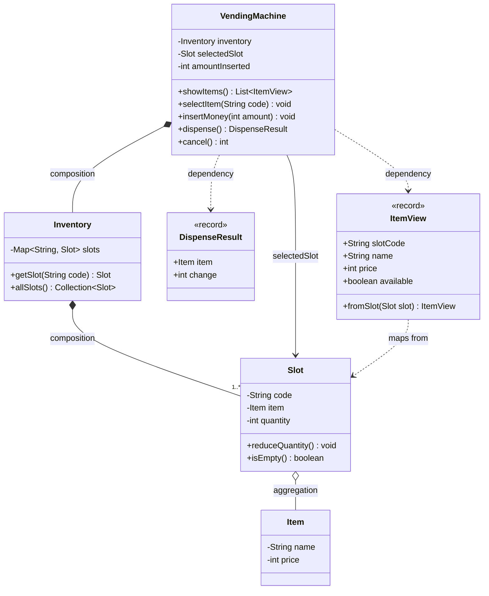
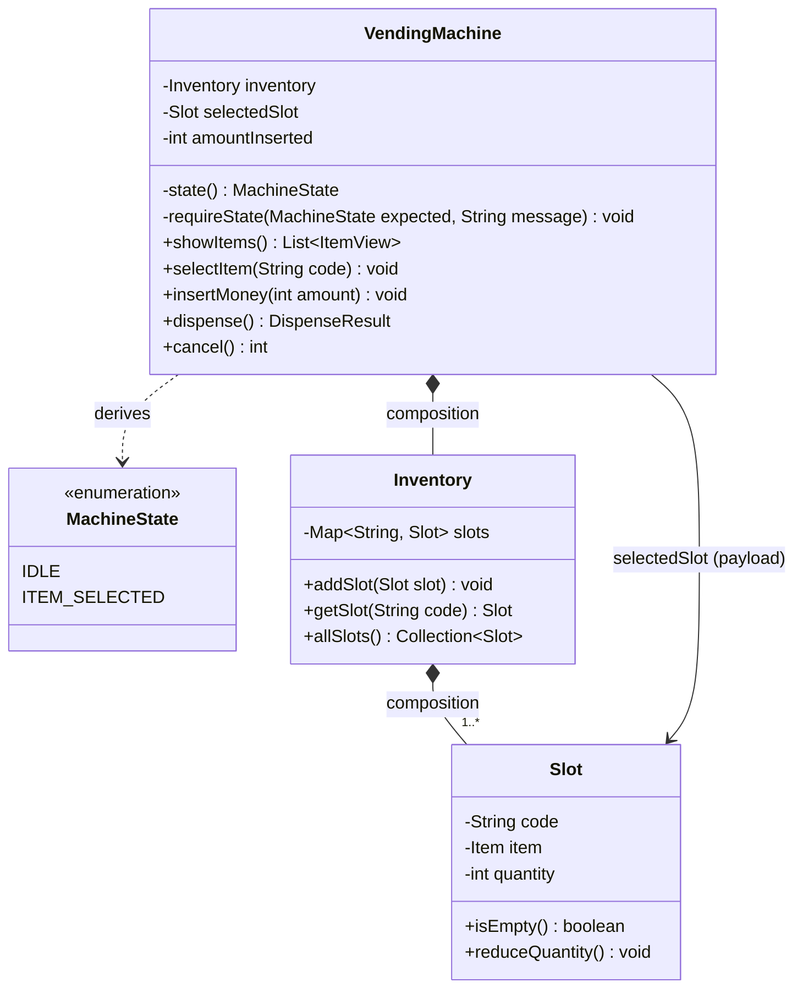
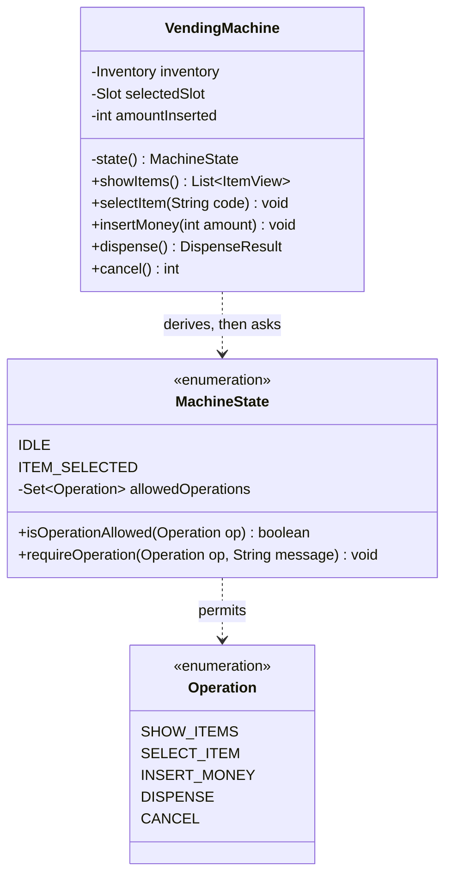
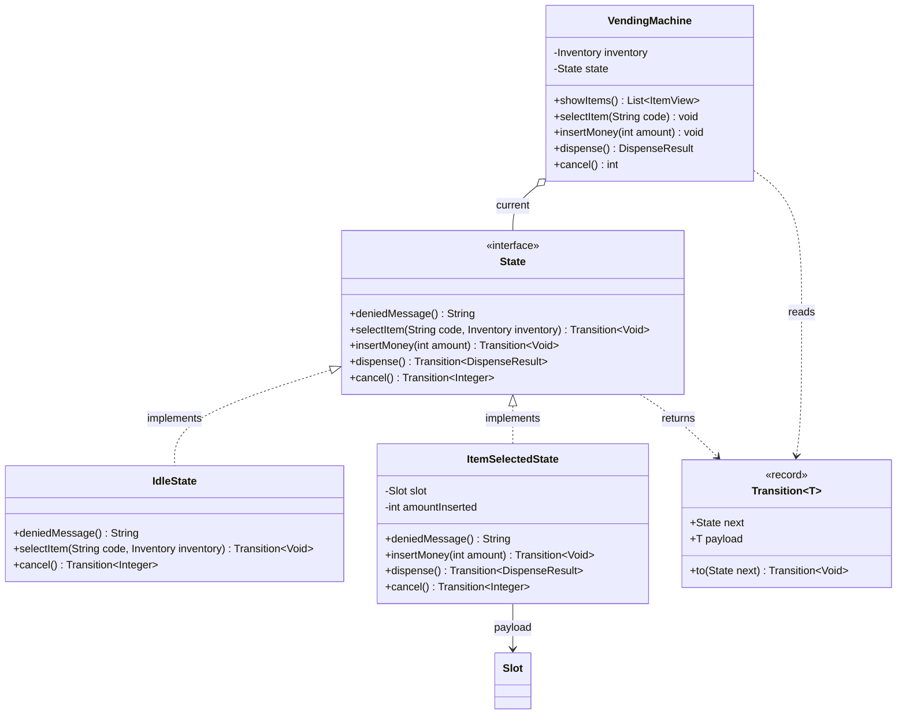
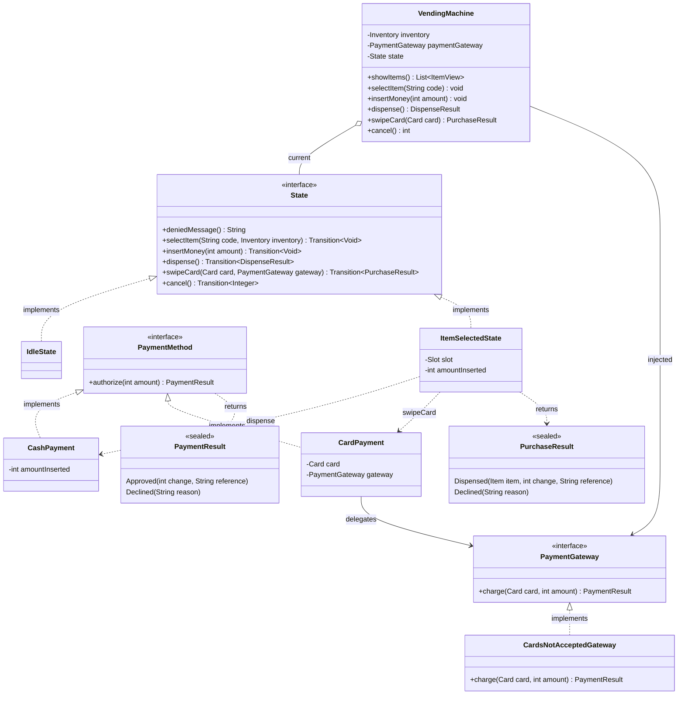

# Vending Machine — Low Level Design

Built evolutionarily: V1 → V5. Each version solves a real problem created by the
previous one. No pattern is introduced before the pain that justifies it.

---

## Behaviour space (full menu, before scoping)

**User:** view items and prices · select by code · insert money (coins / notes /
card) · receive item · receive change · cancel and get refund

**Machine:** track inventory per slot · validate selection and stock · validate
amount · compute change · verify change is physically possible · enforce state
transitions · reject invalid transitions

**Operator:** restock · reprice · collect cash · refill change float · sales reports

**Production:** concurrent users · payment failure after money taken · refunds ·
idempotency · dispense jams · logging and metrics

The two genuinely hard parts of this problem are the **state machine** and
**change-making** (which can legitimately fail even when the user paid enough).

---

## V1 — Basic Design

### Scope

| Behaviour | In V1 |
|---|---|
| Show items | yes — code, name, price, quantity |
| Select item | yes — must exist, must be in stock |
| Insert money | yes — as a plain amount, not denominations |
| Dispense | yes — item out, plus change as an amount |
| Change can fail | **no** |

**Deliberately excluded:** denomination handling, coin float, cancel/refund,
restock, card payment, reports, concurrency.

**Stated assumption:** the coin float is infinite, so change is always possible.
V1 returns change as a number, not as physical coins. Say this out loud in an
interview — it converts a hole into a declared boundary.

**Deleted on purpose:** a `Payment` class. With money as a single integer, it
would hold nothing an `int amountInserted` field does not already hold. It comes
back in V3, when card payments make "how you paid" a real variation.

### Classes

| Class | Responsibility |
|---|---|
| `VendingMachine` | Entry point; holds the in-progress transaction (`selectedSlot`, `amountInserted`) and runs the four operations |
| `Inventory` | Owns all slots; looks up a slot by code |
| `Slot` | A physical position (`A1`) holding one item type and a quantity |
| `Item` | A product definition: name and price |
| `DispenseResult` | The outcome of a purchase: which item, how much change |
| `ItemView` | Read-only display row: slot code, name, price, availability |

`Item` and `Slot` are deliberately separate. `Coke` is a product with a name and
a price; `A1` is a location holding *some number of* Cokes. Collapsing them
breaks as soon as two slots stock the same product.

### Class diagram



Relationship choices worth defending: `Inventory` **composes** its slots (they
do not outlive the machine), while a `Slot` only **aggregates** its `Item` (the
product definition exists independently of any slot).

### Flow

```
showItems()        -> A1 Coke  25  (qty 3)
                      A2 Chips 20  (qty 0)
selectItem("A1")   -> selectedSlot = A1
insertMoney(50)    -> amountInserted = 50
dispense()         -> 50 >= 25 ok -> qty 3 -> 2, change = 25
                   -> selectedSlot = null, amountInserted = 0
```

### Problems with V1

**The disease: no state validation.** V1 accepts illegal call sequences and
produces nonsense:

| Sequence | What V1 does | What it should do |
|---|---|---|
| `insertMoney(50)` then `dispense()` | dispenses nothing meaningful — nothing was selected | reject: no selection |
| `selectItem("A1")` then `dispense()` | dispenses an unpaid item | reject: no payment |
| `selectItem("A1")`, `insertMoney(10)`, `dispense()` | takes 10 for a 25 item | reject: insufficient amount |

**Where the fix is forced to live:** `VendingMachine`, because nothing else
knows the transaction. Every operation grows a guard clause at the top that
infers the current state from two fields — `selectedSlot == null` and
`amountInserted >= price`.

**Tight coupling.** The transition rules are welded into the bodies of the four
operations. There is no object you can point at and say "this is the rule".

**Hard to extend.** Adding `cancel()` is not just a new method — it forces a
re-reading of the guards inside every existing method ("can I cancel from idle?
can I insert money after cancelling?"). Each answer is another `if` in another
place. Guard logic grows with states x operations.

**SOLID violations.**
- **OCP** — every new state or operation requires editing `VendingMachine` and
  re-reasoning guards that already worked.
- **SRP** — `VendingMachine` both orchestrates a purchase *and* is the sole
  authority on legal transitions. Two reasons to change in one class.

**Implicit state is the root cause.** The state is not represented anywhere; it
is *inferred* from field values. Three states can be faked this way. More cannot
— `DISPENSING` and `OUT_OF_SERVICE` cannot be expressed by those two fields at
all, and field combinations start producing states that should be impossible.

**Design note surfaced here:** decrement quantity at **dispense**, not at
selection. If selection decremented, `cancel()` would have to restore stock —
extra state to unwind for no gain.

---

## V2a — Explicit state, derived (enum)

### Problem

V1 is correct but its state is **implicit**: no object or field says where the
machine is. Every operation re-derives the answer inline from
`selectedSlot == null` and `amountInserted`, so seven state checks sit scattered
across four method bodies, each coupled to the field layout.

### First, a modelling decision

The states are `IDLE` and `ITEM_SELECTED`. **Not** `PAID` — "the user has paid
enough" is a *condition*, not a state:

> A state you have to compute is not a state.

To know whether it was in `PAID`, the machine would have to compare
`amountInserted` against the price, and would have to reassign the state on
every `insertMoney` call. Anything derived on demand is a predicate, and a
stored predicate is a cache waiting to go stale. So "paid enough" stays an `if`
inside `dispense()`, deliberately separate from the state guard.

### Why the obvious version of this is a trap

The textbook move is `private MachineState state = IDLE;` beside
`private Slot selectedSlot;`. But those two fields encode the *same fact*:

```
state == IDLE          <->  selectedSlot == null
state == ITEM_SELECTED <->  selectedSlot != null
```

Two sources of truth that can disagree. Forget one assignment and the machine
believes it is idle while holding a selection. Worse, the enum has not removed a
single check — `if (selectedSlot == null)` simply becomes
`if (state != ITEM_SELECTED)`. Still seven. **The enum renames the branches; it
does not remove them.**

### Solution — derive the state, never store it

```
private MachineState state() {
    return selectedSlot == null ? IDLE : ITEM_SELECTED;
}
```

Nothing is ever assigned, so the two cannot disagree: the bug class is
structurally impossible rather than avoided by discipline. `selectedSlot` is
demoted to **payload** — data meaningful only while
`state() == ITEM_SELECTED`.

Every guard then goes through one helper:

```
private void requireState(MachineState expected, String message)
```

The `message` parameter is not decoration. A single generic
"Expected ITEM_SELECTED, Actual IDLE" is better for a stack trace and worse for
the person standing at the machine; passing the message per call site keeps
V1's user-readable errors while the comparison itself lives in one place.

Every method that cares about state must go through `state()` — including
`cancel()`. A method that still reads the field directly is the one that will
not notice when `state()` stops being derived.

### What the enum actually buys

Not fewer branches. Two other things:

1. **A vocabulary.** `ITEM_SELECTED` is a name usable in diagrams, logs and
   messages. `selectedSlot != null` is a fact that must be decoded.
2. **A seam.** Today `state()` derives. When `OUT_OF_SERVICE` arrives — a state
   nothing about `selectedSlot` can express — only `state()` changes, and not
   one guard that calls it. V1 had no such seam.

The price: derived state can only express what the data already implies, so
`OUT_OF_SERVICE` will force a hybrid (stored field plus derivation). V2a is the
right *next* step, not the end state.

### Class diagram



`VendingMachine ..> MachineState` is a **dependency**, not an association —
there is no field of that type. That missing field is the whole point of V2a.

### Flow

```
state() == IDLE
selectItem("A1")   -> requireState(IDLE, "An item is already selected.") ok
                   -> selectedSlot = A1        [state() now ITEM_SELECTED]
insertMoney(10)    -> requireState(ITEM_SELECTED, "No item selected.") ok
                   -> amountInserted = 10
dispense()         -> requireState(ITEM_SELECTED) ok    <- state guard
                   -> 10 < 25 -> "Insufficient funds"    <- condition, separate
cancel()           -> state() != IDLE -> refund 10      [state() now IDLE]
cancel()           -> state() == IDLE -> 0              (no-op, not an error)
```

`cancel()` is the one operation that *branches* on state rather than
*requiring* one — cancelling an idle machine is a no-op, not a user error.

### What changed, and why

| | V1 | V2a |
|---|---|---|
| State | inferred inline, per method | one `state()` method |
| Source of truth | the fields, read everywhere | derived, single definition |
| State comparison | 4 hand-rolled null checks | 1 place (`requireState`) |
| Vocabulary | none | `IDLE`, `ITEM_SELECTED` |
| A new non-derivable state | touches every guard | touches `state()` only |
| User-facing messages | per call site | per call site (preserved) |

Behaviour is unchanged — the demo output is identical to V1's. This version
bought structure, not features.

### Problems with V2a

**The rules are still invisible.** Ask "what operations are legal in
`ITEM_SELECTED`?" and there is no single place to look. The answer is spread
across four method bodies, as the first line of each. The machine's transition
table exists only in the reader's head, after reading all of them.

**Adding a state still edits every method.** `OUT_OF_SERVICE` means revisiting
each guard to decide what it does there. OCP is still violated, just more
tidily.

**`requireState` expresses only one legal state per operation.** As soon as an
operation is legal in two states, it needs a set, and the signature strains.

**Nothing prevents a forgotten guard.** A new sixth operation with no
`requireState` line compiles and runs happily. The guard is a convention, not a
structure.

---

## V2b — The transition table as data

### Problem

V2a named the states but left the **rules** invisible. Ask "what operations are
legal in `ITEM_SELECTED`?" and there is no place to look: you grep for
`requireState(ITEM_SELECTED)` and read what you find.

That grep returns a **wrong** answer, not merely a slow one:

| Operation | Legal in `ITEM_SELECTED`? | Visible to the grep? |
|---|---|---|
| `insertMoney` | yes | yes — `requireState(ITEM_SELECTED)` |
| `dispense` | yes | yes — `requireState(ITEM_SELECTED)` |
| `cancel` | yes | **no** — it *branches* on state instead of requiring one |
| `showItems` | yes | **no** — legal in every state, so it has no guard at all |

Operations legal everywhere, and operations that branch rather than require, are
structurally invisible. The transition table existed only in the reader's head
after reading every method body — and it dropped two of four entries.

### Solution — put legality on the state itself

A table needs two axes, so `Operation` joins `MachineState` as a first-class
type, and each state constant declares what it permits:

```
IDLE(EnumSet.of(SHOW_ITEMS, SELECT_ITEM, CANCEL)),
ITEM_SELECTED(EnumSet.of(SHOW_ITEMS, INSERT_MONEY, DISPENSE, CANCEL));
```

Question 21 is now answered by reading **one line**, in the type named after the
concept.

Why on the enum rather than a `Map` field in `VendingMachine`:

- a map inside `VendingMachine` would give that class both the purchase flow and
  the rulebook — the SRP complaint from V1, returning
- it is the stepping stone to V2c, where the state object owns *behaviour*. With
  legality already **on** the state, V2c replaces an `EnumSet` with real
  methods; with a map, V2c starts by dismantling the map
- a dedicated `TransitionRules` class is right only once rules come from
  configuration or vary per machine model (V5). Today it would wrap one map, so
  it does not earn its place — the same rule that deleted `Payment` in V1

The cost: `MachineState` now depends on `Operation`. Acceptable — they are two
halves of one concept, and the coupling is acyclic since `Operation` knows
nothing of states.

### What stays out of the table

Only rules decidable from the **state alone** belong in it. Anything that must
inspect **data** stays a condition in the method that owns the data:

| Rule | Knowable from state alone? | Lives in |
|---|---|---|
| cannot insert money before selecting | yes | the table |
| cannot select twice | yes | the table |
| item is sold out | no — reads `slot.quantity` | the method |
| insufficient funds | no — compares amount to price | the method |

So `selectItem` keeps two checks for two different reasons: a table lookup (may
I select at all?) and a data condition (is *this* slot stocked?). This is the
same state-vs-condition split that kept `PAID` out of the enum in V2a.

### Why the table cannot store `nextState`

A classic transition table maps `(state, operation) -> nextState`. This one maps
`state -> Set<Operation>` and deliberately answers only "is this move legal?".

`state()` is **derived from the data**, so the next state is a *consequence* of
what the operation does to `selectedSlot` — not something a table can dictate.
A table declaring `nextState` would re-create two authorities on state (the
table's claim and the data's reality), which is precisely the bug V2a was built
to make impossible.

### Class diagram



### Flow

```
state() == IDLE
selectItem("A1")   -> state().requireOperation(SELECT_ITEM) -> IDLE permits ok
                   -> slot.isEmpty()? no                     <- data condition
                   -> selectedSlot = A1       [state() now ITEM_SELECTED]
selectItem("B1")   -> state().requireOperation(SELECT_ITEM)
                   -> ITEM_SELECTED does not permit -> "An item is already selected."
insertMoney(25)    -> ITEM_SELECTED permits INSERT_MONEY ok
dispense()         -> ITEM_SELECTED permits DISPENSE ok
                   -> 25 >= 25 ok                            <- data condition
                   -> result, stock--, reset  [state() now IDLE]
```

### Two bugs this version shipped, and what they teach

**The guard asked a constant, not the machine.**
`MachineState.ITEM_SELECTED.requireOperation(INSERT_MONEY, ...)` reads
plausibly and is a tautology: a hardcoded constant always permits its own
operations. Every guard in the machine silently became a no-op, and the demo
sold a Water to someone who asked for a Coke. **A lookup table is only useful
when looked up with the state you are actually in** — `state()` from V2a is not
replaced by the table, it is what makes the table work.

**The wrong operation constant was passed.** `selectItem` asked about
`SHOW_ITEMS`, which every state permits, so selecting twice stayed legal even
after the receiver was fixed. Two independent bugs stacking in one guard line.

Both compiled, ran, and printed "ALLOWED (no error)" with exit code 0.

### Tests arrive here, not later

Those two regressions shipped in consecutive rounds, each a guard that compiled
and silently permitted an illegal sequence. `Main` *displays* breakage; it does
not *fail* on it. 43 JUnit tests now cover:

- the four `@Nested` groups in `VendingMachineTest` — happy path, illegal
  sequences, cancel, menu
- `MachineStateTest`, which asserts the **table itself**, without going through
  `VendingMachine`. When V2c replaces the table with state objects, these tests
  say whether the *rules* changed or only their implementation
- `SlotTest` and `InventoryTest` for stock invariants and lookup behaviour

Several assert more than "it throws", because these bugs were never about
whether an exception appeared:

- *"underpaying is rejected and the money is still held"* — then tops up and
  completes, so a guard that silently zeroed the balance would still fail
- *"selecting twice is rejected and the first selection survives"* — then buys
  the original item, so a guard that throws but overwrites the selection fails
- *"a rejected dispense does not consume stock"* — failure paths must not
  decrement
- *"every operation is permitted by at least one state"* — a table-level
  invariant, catching an `Operation` added to the enum but to no state's set

Reverting the one-token `SELECT_ITEM` fix turns the suite red on exactly the
right test. That is the property worth buying before V4 adds threads.

### What changed, and why

| | V2a | V2b |
|---|---|---|
| Legality rules | first line of each method | one line per state on the enum |
| "What is legal in X?" | read every method, miss two | read one line |
| Operations legal in all states | invisible (no guard) | explicit in the table |
| An operation legal in two states | needs a second `requireState` | already a `Set` |
| Rules mutable at runtime | n/a | no — unmodifiable `EnumSet` copy |
| Safety net | a demo that prints ALLOWED | 43 failing-on-regression tests |

### Problems with V2b

**A forgotten guard still compiles.** A new sixth operation with no
`requireOperation` line runs unguarded. The table is consulted by convention,
not by structure — `showItems` went unguarded for a round, and its table entries
were simply dead data.

**The operation constant can disagree with the method it guards.** Nothing ties
`SELECT_ITEM` to `selectItem()`; passing `SHOW_ITEMS` there compiled and
disabled the guard. The table knows *about* the operations but does not *own*
them.

**Behaviour is still centralised.** The table says what is *legal*; every method
still contains the behaviour for all states. `OUT_OF_SERVICE` means a new enum
constant *and* an edit to each method that must behave differently there. OCP is
narrower than in V2a but not satisfied.

**A state cannot carry its own data.** `ITEM_SELECTED` is a label with a
permission set. It cannot hold *which* slot is selected or *how much* has been
inserted — that payload still lives in `VendingMachine`, so state and its data
remain apart. This is the limitation V2c removes.

---

## V2c — State objects (the State pattern)

### Problem

V2b's table said what was *legal*; every method still contained the behaviour
for every state. Four limitations remained:

- a new operation with no `requireOperation` line ran unguarded — the table was
  consulted by convention, not by structure
- nothing tied the constant `SELECT_ITEM` to the method `selectItem()`, so
  passing the wrong constant compiled and silently disabled the guard
- `OUT_OF_SERVICE` would mean a new constant *and* an edit to every method that
  must behave differently there
- **a state could not carry its own data.** `ITEM_SELECTED` was a label with a
  permission set; *which* slot and *how much* money still lived in
  `VendingMachine`, so a state and its data stayed apart

### The insight that unlocks it

An enum constant is a singleton — one `ITEM_SELECTED` for the whole JVM. A state
*object* can be instantiated per transition, so it can hold the payload of that
transition.

This also resolves V2a's rule. V2a insisted state be **derived**, because a
stored `state` field plus `selectedSlot` were two sources of truth for one fact.
Once the state object *is* where the payload lives, there is nothing to keep in
sync, so storing it is correct:

> Deriving was right while the data lived elsewhere. Once the state owns its
> data, storing it is right.

### Solution

`interface State` with every operation a `default` method that throws. A state
permits exactly what it overrides, so **deny-by-default** replaces the guard
convention — a forgotten guard is no longer unlikely, it is unrepresentable.
And because the compiler ties a method name to its operation, V2b's
wrong-constant bug cannot be written.

`IdleState` holds nothing. `ItemSelectedState` holds `Slot` and
`int amountInserted`, both final.

**States are immutable.** `insertMoney` returns
`new ItemSelectedState(slot, amountInserted + amount)` rather than mutating. Two
payoffs: a fresh transaction is a fresh object, so money leaking between
purchases is not a bug to avoid but a state that cannot be expressed; and a
transition becomes a **single reference swap**, which is what makes V4's atomic
compare-and-set possible. A mutable state would have to be locked while it
changes; an immutable one never changes.

**How a transition happens** — `record Transition<T>(State next, T payload)`.
Three options were considered:

| | Mechanism | Cost |
|---|---|---|
| context callback (GoF) | state holds the machine, calls `setState(...)` | a state can call *any* public method on the machine; transitions become reentrant and hard to trace |
| return the next state | `state = state.dispense()` | no way to also return `DispenseResult` to the caller |
| **return both** | `Transition(next, payload)` | `Transition<Void>` for operations with nothing to return |

Returning both keeps states unable to do anything except *describe* what the
machine should become. Read it **once** and use both halves — calling the
operation twice to fetch `next()` and then `payload()` executes it twice.

**How a state reaches the `Inventory`** — passed as a method parameter, for now.
A field on each state would make every transition thread collaborators into the
next constructor; a `MachineContext` record would stop signatures churning but
today would wrap a single field, the same unearned indirection that deleted
`Payment` in V1 and rejected `TransitionRules` in V2b. The parameter stays until
V3 adds a payment processor and the churn is real.

**`showItems` is not on `State`.** It is legal in every state and identical in
all of them, so putting it there adds a dispatch that always lands in the same
place — in V2b it was an entry in every set, which is what decorative data looks
like. It stays on `VendingMachine`.

### Class diagram



`VendingMachine o-- State` is an **aggregation**: the machine holds a state but
states are swapped, not owned for life. `ItemSelectedState --> Slot` is the
payload that used to sit on `VendingMachine`.

### Flow

```
state = IdleState
selectItem("A1")   -> IdleState.selectItem: lookup, not empty       <- data condition
                   -> Transition.to(new ItemSelectedState(A1, 0))
                   -> state = ItemSelectedState(A1, 0)
insertMoney(10)    -> new ItemSelectedState(A1, 10)                  (old instance discarded)
insertMoney(20)    -> new ItemSelectedState(A1, 30)
dispense()         -> 30 >= 25 ok                                    <- data condition
                   -> stock--, Transition(new IdleState(), result(Coke, 5))
                   -> state = IdleState, caller gets the result
dispense()         -> IdleState does not override dispense
                   -> State.dispense() default throws "No item selected."
```

The last line is the pattern working: no guard was written anywhere, and the
interface default refused the operation.

### Two bugs this version shipped

**Every operation ran twice.** `state = state.dispense().next();` followed by
`return state.dispense().payload();` calls the operation a second time, on the
*new* state. A successful purchase decremented stock, built the result, threw the
result away and then threw an exception — money gone, item gone, error returned.
`cancel()` failed differently: `IdleState` returned a `null` payload, so
unboxing to `int` threw NPE. A `Transition` is one value describing one
transition; fetch it once.

**`IdleState.cancel()` returned a `null` payload.** Cancelling an idle machine
refunds **zero**, not *nothing*. `Transition.to(...)` is for operations with
genuinely nothing to return; `cancel` always has a number.

17 of 36 tests caught both. `Main` would have printed its way past the second.

### Deleting the old design

`MachineState`, `Operation`, the V2a/V2b `VendingMachine` and `MachineStateTest`
are gone. Until that deletion, V2c was dead code — `Main` and the tests still
used the old class.

Those 7 deleted tests asserted *an implementation*: a table that no longer
exists. The behaviour they protected ("you cannot insert money before
selecting") is still asserted in `VendingMachineTest`, through the public API —
which is why that suite survived a total rewrite of the state machine untouched.
Testing a contract outlives the design; testing a design dies with it.

What was genuinely lost: `MachineStateTest` could assert "every operation is
permitted by at least one state". In V2c there is no single place that question
can even be asked.

### Design trade-off, stated honestly

V2c did not strictly beat V2b — it traded one weakness for another.

| Question | V2b (table) | V2c (objects) |
|---|---|---|
| What is legal in `ITEM_SELECTED`? | one line on the enum | one file, the overrides are the answer |
| Which states allow `CANCEL`? | one line | open every state class |
| Draw the full transition graph | read the table | read all N states; nothing lists them |
| Can a state carry data? | **no** | yes |
| Can a guard be forgotten? | yes | no |

> The enum table makes the **rules** explicit and the **behaviour** centralised.
> State objects make the **behaviour** cohesive and the **rules** implicit.

Pick on which question you ask more often — and on whether states must carry
data. Here the payload settles it: `ItemSelectedState` owning the slot and the
amount is what made money-leaking unrepresentable rather than merely tested for.

### Problems with V2c

**Shared behaviour will duplicate.** `cancel` already exists in both states and
will exist in nearly all future ones. More states means an abstract base class
or repeated code.

**The state graph is diffuse.** No file lists the states or the transitions
between them; both are emergent from N classes.

**Class count grows per state.** Two states, two files - fine. Six states is six
files plus a base class, for a machine whose rules fit in a small table.

**The collaborator parameter will churn.** `selectItem(String, Inventory)` works
with one collaborator. V3 adds a payment processor and V5 a coin float, and
every signature on the interface changes with each addition - the pressure that
makes `MachineContext` worth introducing *then*.

---

## V3 — Card payments (Strategy)

### New requirement

The machine accepts cards as well as cash. This sounds like "add a method" and
is not: it breaks an assumption carried since V1.

With cash, by the time `dispense()` runs the payment has already *physically*
happened - the coins are inside the machine. `amountInserted` is not a promise,
it is a fact, so `dispense()` was a local operation over local data.

A card charge is **a call to someone else**:

| | Cash | Card |
|---|---|---|
| Interactions | many `insertMoney` calls | one authorization |
| Can it fail? | no | yes - declined, network, timeout |
| Duration | instant | hundreds of ms, or hangs |
| Overpayment | normal, needs change | impossible - charge the exact price |
| Outcome always known? | yes | **no** - a timeout means you do not know |

So dispensing becomes **two steps that can fail independently**: take the money,
release the item. Any outcome where exactly one succeeds is a real incident - a
charged customer with no Coke, or a free Coke.

### Charge first, and own the consequence

Charge-then-dispense means a dispense failure leaves money taken for nothing, so
the machine owes a refund. Dispense-then-charge means a declined card has
already given away stock. **Charge first**: owing a refund is recoverable, a
vanished item is not.

### The state that was not added

The obvious next move is a `PAYMENT_PENDING` state while the network answers.
Applying V2a's own rule - *a state is somewhere the machine rests* - it has not
earned its place yet. With a synchronous `authorize()` call, no caller can ever
observe it:

```
swipeCard(card)
  -> state = PaymentPendingState    // for the duration of one blocking call
  -> gateway.charge(...)            // single-threaded: nobody can call anything
  -> state = IdleState
```

It earns its place when authorization becomes asynchronous, or when concurrent
callers make the in-flight window observable and dangerous. That is V4. Adding
it now would be a state with no reachable entry point, needing `cancel()` and
`showItems()` defined for a situation no user can be in.

Likewise `DISPENSE_COMPLETED` and `DISPENSE_REFUND` are not states: nothing is
awaited in either, so they are an **outcome** and an **action** on the way back
to `IDLE`, already expressible as a `Transition`'s payload. Refunding becomes a
real state only when the refund itself can fail and needs retrying - V5.

> Name a state for what the machine is *doing now*, not for what it hopes to do
> next. And if the machine never rests there, it is not a state.

### Solution — one pipeline, two tenders

`PaymentMethod` is the Strategy; `PaymentResult` is the outcome. The trap to
avoid is branching on tender inside the state machine:

```
if (method is card) -> authorize   else -> dispense directly     // two machines
```

Instead **cash is the degenerate case**: every payment is authorized, and cash's
authorization is a local comparison that returns immediately. `dispense()` now
runs `new CashPayment(amountInserted).authorize(price)`, so both tenders share
one pipeline and nothing downstream of `authorize` knows which tender it got.

Before this, `CashPayment` existed but nothing constructed it, and the
insufficient-funds rule lived in two places with two different messages - one
rule, two codepaths, guaranteed to diverge. Now the message lives only in
`CashPayment`.

### Two entry points, one pipeline

Cash declares itself by physically arriving (`insertMoney`); a card user inserts
nothing, so there must be a second entry point. `swipeCard` forks only at
**method construction** - both converge on `authorize`:

```
insertMoney(10), insertMoney(20)  ->  accumulate in ItemSelectedState
dispense()                        ->  CashPayment(30).authorize(25)
swipeCard(card)                   ->  CardPayment(card, gateway).authorize(25)
```

If the fork reaches any further - a second dispense path, a conditional on
tender inside a state - you have built two machines.

### Exceptions or results

> Exceptions for "you cannot do that" and "the system is broken".
> Results for "we tried, and the answer is no."

| Situation | Mechanism | Why |
|---|---|---|
| swipe with nothing selected | `IllegalStateException` | illegal sequence |
| insufficient cash | `IllegalStateException` | precondition: you have not paid yet |
| card declined | `PurchaseResult.Declined` | an ordinary business outcome |
| no card reader | `PurchaseResult.Declined` | a known answer, not a failure |
| gateway timeout / unreachable | `PaymentGatewayException` | the outcome is *unknown* |

`DispenseResult(Item, int change)` can only describe success, so the card path
returns a **sealed** `PurchaseResult` of `Dispensed | Declined`. Sealed rather
than a success flag with nullable fields: a flag lets a caller read `item()` on
a decline and get `null`, while a sealed interface makes the compiler demand
both branches in a `switch`. Same deny-by-default thinking as `State`.

Sealing only pays off if the `switch` is used. An `instanceof` chain with an
`else { throw new IllegalStateException("unknown type") }` throws away the
guarantee: that branch is unreachable, and when a third permitted type arrives
the chain silently takes it at runtime where an exhaustive switch would **fail
to compile**.

A declined card keeps the machine in `ItemSelectedState`, so the user can try
another card - or pay cash - instead of re-selecting their item.

### The gateway is a boundary

`PaymentGateway` is declared by the domain and implemented at the edge
(dependency inversion). No real implementation exists here, deliberately: a real
one brings network, secrets and retries while teaching nothing about design, and
cannot be told to decline on demand.

- `CardsNotAcceptedGateway` - null object for a machine with no card reader.
  Declining is honest: "no card reader" is a known answer.
- `FakePaymentGateway` (test only) - scripted APPROVE / DECLINE / FAIL, and it
  **records what it was asked**. The properties worth asserting are "charged
  exactly once" and "charged exactly the price", and no return value shows
  those. V4 will assert `chargeCount() == 1` after a duplicated request.
- `Card` holds a gateway **token**, never a PAN: a design that cannot hold a
  card number cannot leak one.

A machine is constructible without a gateway - cash-only hardware is real - and
that convenience constructor supplies the null object, so `swipeCard` declines
instead of throwing `NullPointerException`.

### Class diagram



### Flow

```
cash, unchanged since V1
  selectItem("A1"); insertMoney(10); insertMoney(20)
  dispense() -> CashPayment(30).authorize(25) -> Approved(change 5, "CASH")
             -> stock--, DispenseResult(Coke, 5), state = IdleState

card approved
  selectItem("B1"); swipeCard(token)
             -> CardPayment.authorize(15) -> gateway -> Approved(0, "AUTH-1")
             -> stock--, Dispensed(Water, 0, "AUTH-1"), state = IdleState

card declined
  selectItem("A1"); swipeCard(token)
             -> Declined("Card declined by issuer.")
             -> no stock change, state stays ItemSelectedState
  insertMoney(25); dispense()      -> the cash path still completes the sale

no card reader
  swipeCard(token) -> Declined("Card payments are not available.")

gateway failure
  swipeCard(token) -> PaymentGatewayException propagates
                   -> state never reassigned, selection and cash survive
                   -> but the charge is UNRECONCILED: the customer may have paid
```

### Tests

59 green. The card path arrived with its own suite, because V2b's lesson was
that `Main` displays breakage rather than failing on it - and this time the
exposure is money.

`CardPurchaseTest` asserts, per outcome: the reference and zero change on
approval; charged **exactly once, exactly the price**; stock reduced; machine
returned to idle. On decline: reason returned not thrown, stock untouched,
selection kept, a second card chargeable, and cash still able to finish the
sale. On gateway failure: propagates, nothing dispensed, state unchanged, and
inserted cash still refundable. Plus "a refused swipe never reaches the
gateway" - asserting `chargeCount() == 0`, which only an interrogable fake can
show.

`PaymentMethodTest` exercises the strategies with no machine at all, including a
gateway that wrongly claims change, proving `CardPayment` normalises it to zero.

### What changed, and why

| | V2c | V3 |
|---|---|---|
| Tenders | cash only | cash and card, one authorization pipeline |
| Payment rule location | inline in `dispense()` | `CashPayment` / `CardPayment` |
| Failure representable? | no - success or exception | yes, `PurchaseResult.Declined` |
| Unknown outcome | n/a | `PaymentGatewayException`, state unchanged |
| External dependency | none | `PaymentGateway`, injected, stubbable |
| New states | - | **none** - deliberately |

### Problems with V3

**The signatures are churning, exactly as predicted.**
`selectItem(String, Inventory)` and `swipeCard(Card, PaymentGateway)`. Two
collaborators threaded through an interface that V5 will hand a coin float and a
transaction log. Every addition changes `State` and every implementor. This is
when `MachineContext` earns the place it had not earned in V2c.

**The charge is unreconciled on failure.** The machine knows it may have taken
money and records nothing, so nobody can reconcile later. There is no
transaction log, and `PaymentResult.Approved.reference()` is read once and
discarded.

**No idempotency.** A retried `swipeCard` charges again -
`FakePaymentGateway.chargeCount()` goes to 2 - and the design has no way to say
"this is the same purchase attempt as before".

**The in-flight window is now real but unmodelled.** `authorize()` is a
synchronous call that can take hundreds of milliseconds. With one thread that is
merely slow; with two, a second caller can enter `dispense()` or `swipeCard()`
on a state whose charge is still in flight, and both can pass the stock check
before either decrements. That is V4.

---
