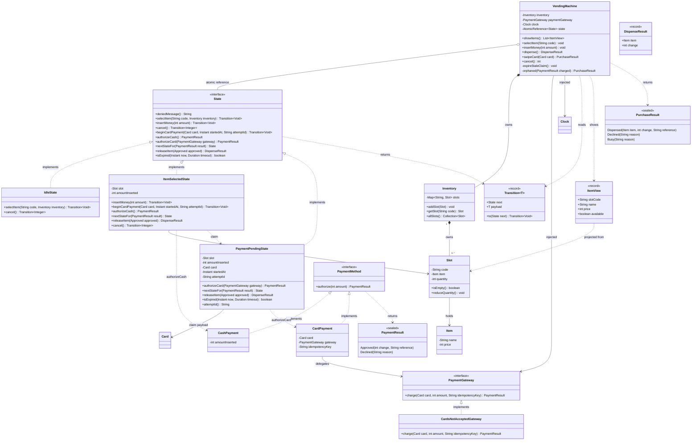
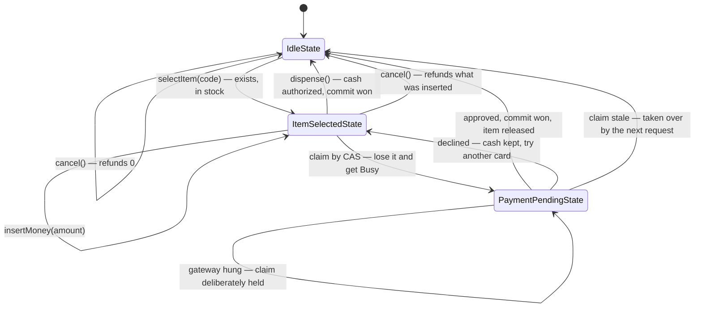
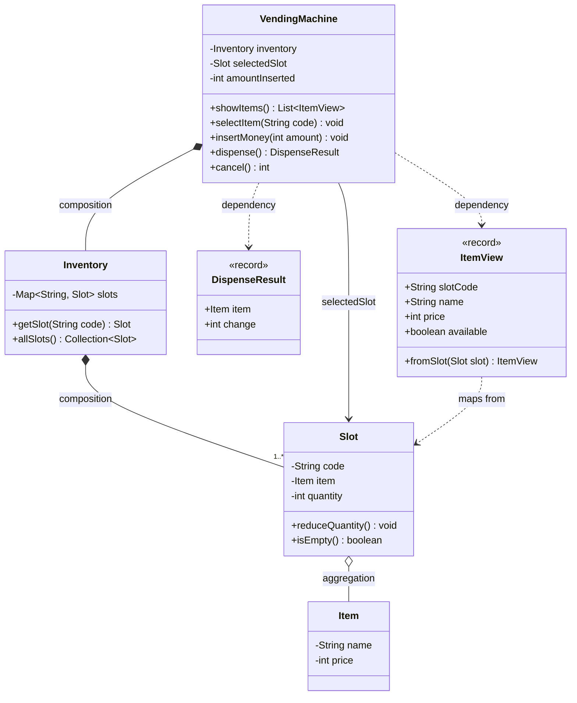
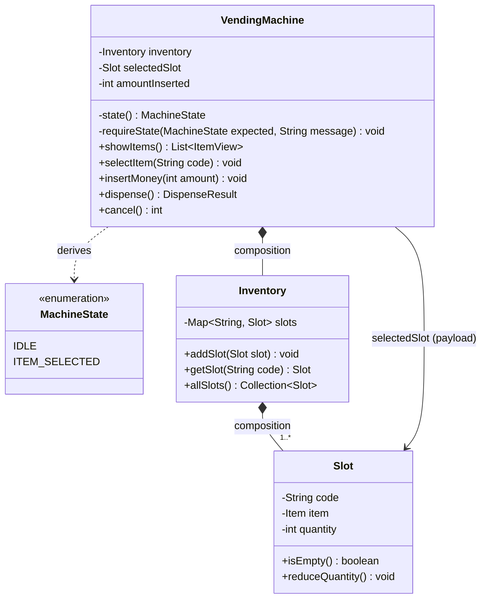
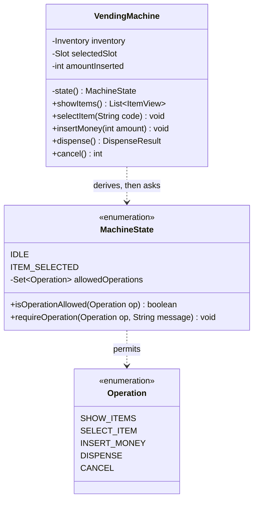
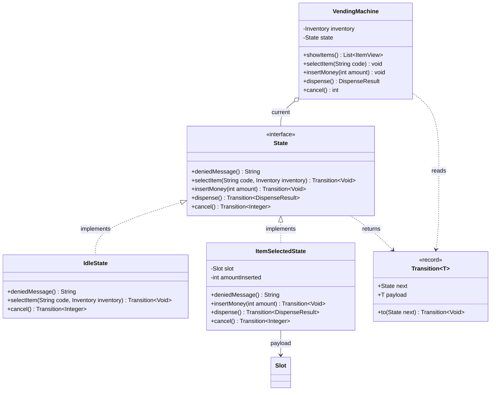
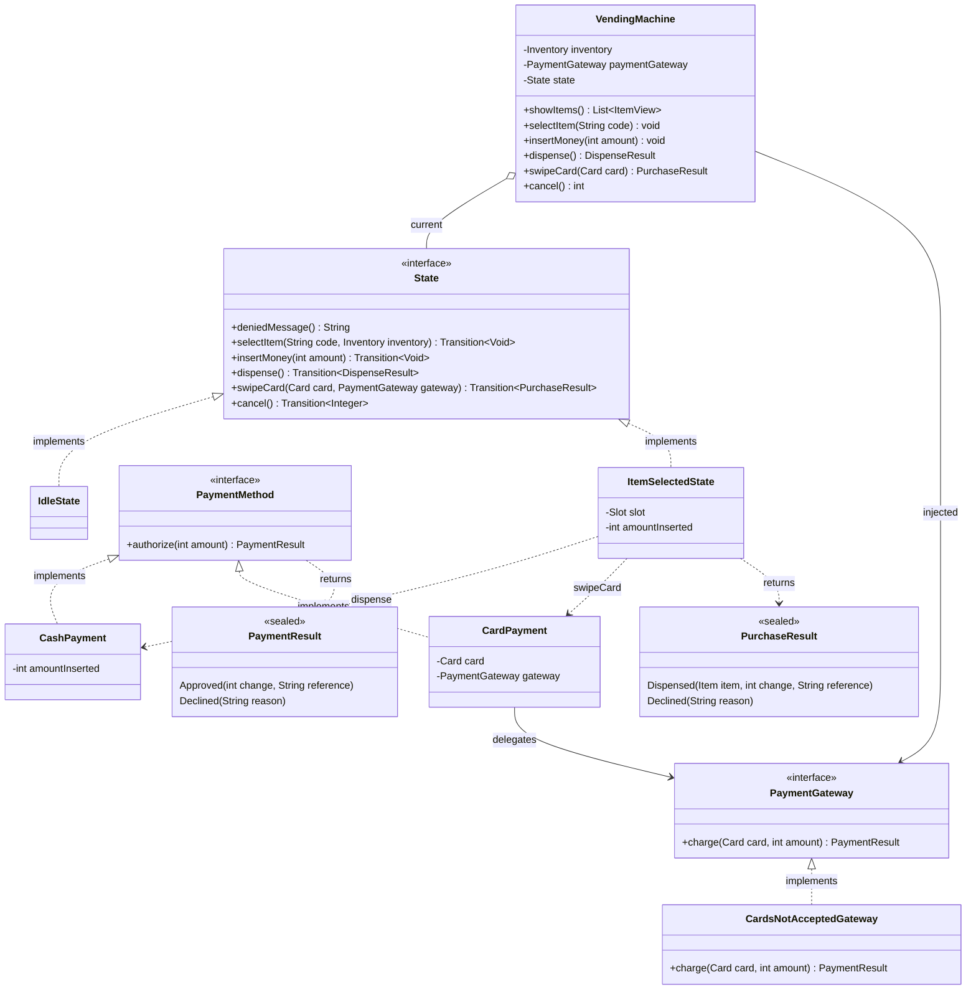
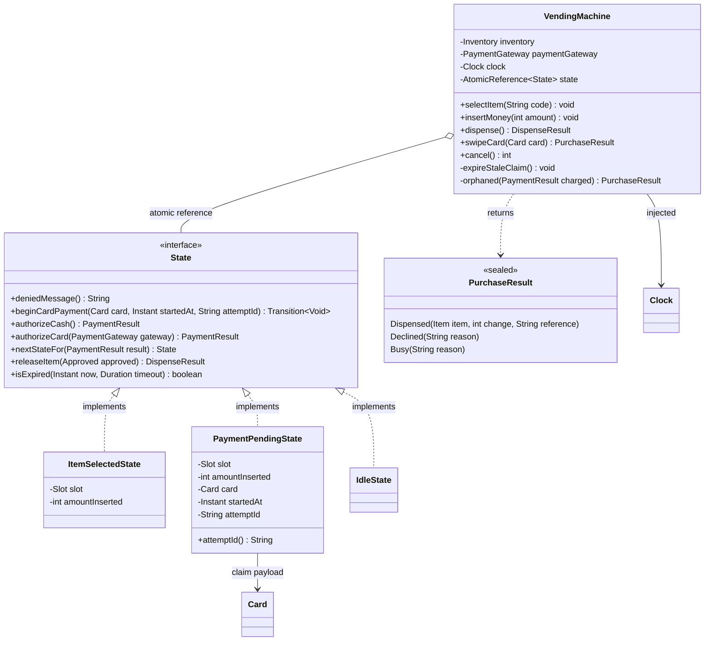
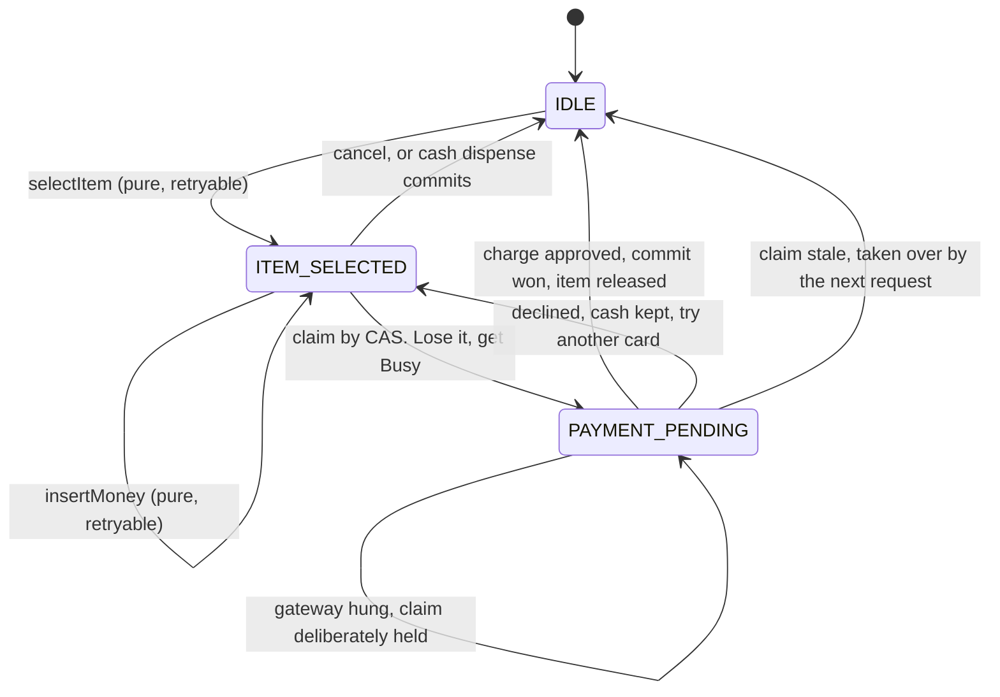

# Vending Machine — Low Level Design

**Final design first, then how we got there.** The finished design opens the document,
followed by a summary of the build order. Everything after that replays the build itself:
each version fixes one named problem the previous version caused, and introduces an
abstraction only when that problem forces it.

Five versions, each one a commit: V1 naive, V2a/V2b/V2c three different answers to the
same defect, V3 card payments, V4 two users at once. V5 is not built.

---

## Final design

Cash and card payments, three states, one authorization pipeline, and safe for two people
at once. 20 production classes, 67 green tests. Two patterns are in it — **State** and
**Strategy** — and each arrived only after a version without it had actually hurt. V4
added no pattern at all; it changed *where side effects are allowed to happen*.

### Domain model

| Class | Responsibility |
| --- | --- |
| `Item` | a product: name and price |
| `Slot` | one physical position (`A1`): one kind of item and a count |
| `Inventory` | owns the slots; resolves one by its code; hands out an unmodifiable view |
| `ItemView` | *record.* The read model the display gets — facts, no power to change stock |
| `DispenseResult` | *record.* `(item, change)` — what releasing an item produces |
| `PurchaseResult` | *sealed.* `Dispensed` / `Declined` / `Busy` — the card path, where failure and "someone else is mid-purchase" are both legitimate answers |

`Item` and `Slot` are separate because the same drink can sit in two slots. The test for
"one class or two" is whether one can exist without the other, or in a different quantity.

### States

| Class | Responsibility |
| --- | --- |
| `State` | *interface.* Declares every operation with a **default that refuses it**; each state overrides only what it allows. Split by *phase* as well as by operation |
| `IdleState` | nothing selected: allows `selectItem` and `cancel` (refunding zero) |
| `ItemSelectedState` | a slot is chosen; carries the payload `slot` + `amountInserted`; allows `insertMoney`, `cancel`, cash authorization, and claiming a card payment |
| `PaymentPendingState` | **the claim**: a card charge is in flight. Carries the payload plus `startedAt` and `attemptId`. Refuses everything except the card phases |
| `Transition<T>` | *record.* What a state returns for a pure step: the next state, plus this caller's payload |

### Payment layer and policies

| Class | Responsibility |
| --- | --- |
| `PaymentMethod` | *interface.* `authorize(amount)` — the Strategy seam |
| `CashPayment` | authorizes by comparing against the coins already inside; cannot fail outwardly |
| `CardPayment` | authorizes by calling the gateway, carrying the attempt's idempotency key; may decline, may hang |
| `PaymentResult` | *sealed.* `Approved(change, reference)` or `Declined(reason)` |
| `PaymentGateway` | *interface.* The boundary to somebody else's computer; declared by the domain, implemented outside it |
| `CardsNotAcceptedGateway` | *null object* for a machine with no card reader — declines politely instead of throwing |
| `Card` | holds a gateway **token**, never a card number |
| `PaymentGatewayException` | thrown when the outcome is genuinely **unknown** (timeout, unreachable) |

### Service

| Class | Responsibility |
| --- | --- |
| `VendingMachine` | the entry point; holds the current state in an `AtomicReference`, plus the injected `PaymentGateway` and `Clock`; runs each operation as claim → act → commit |

### Class diagram



### The state machine



Every operation not drawn here is **refused by the interface's own default**, with no
check written anywhere. `insertMoney` in `IdleState`, cash with nothing selected,
`swipeCard` before selecting, and anything at all while a charge is in flight: all land on
`State`'s default and throw `IllegalStateException(deniedMessage())`.

### Both payment paths, as built

Cash and card fork **only** at the point of choosing a method. Everything downstream of
`authorize` is identical and knows nothing about how the customer paid. Since V4 every
purchase runs in three phases, and only the pure ones are ever retried.

```
cash
  selectItem("A1"); insertMoney(10); insertMoney(20)
  dispense()   -> CashPayment(30).authorize(25) -> Approved(change 5, "CASH")
               -> commit CAS -> IdleState, then releaseItem: stock 3 -> 2
               -> DispenseResult(Coke, 5)

card approved
  selectItem("B1"); swipeCard(token)
               -> claim: CAS ITEM_SELECTED -> PAYMENT_PENDING
               -> authorizeCard -> gateway(key = attemptId) -> Approved(0, "AUTH-1")
               -> commit CAS -> IdleState, then releaseItem
               -> Dispensed(Water, 0, "AUTH-1")

card declined
  swipeCard(token) -> Declined("Card declined by issuer.")
               -> commit returns to ItemSelectedState with the cash intact
               -> a second card, or cash, can still finish the sale

two customers, one Coke, both swipe
  A claims, B's CAS fails -> Busy("Another purchase is in progress.")
               -> B was never charged, so there is nothing to undo

no card reader
  swipeCard(token) -> Declined("Card payments are not available.")

gateway failure
  swipeCard(token) -> PaymentGatewayException thrown upwards
               -> the claim is KEPT on purpose: nobody else may buy an item we may
                  already have been paid for. cancel() and selectItem() are refused
                  until the 30s timeout lets the next request take over

the charge returns too late
  A's commit CAS fails, because the claim was expired and taken over
               -> orphaned(): money moved, no item, a refund is owed
               -> and there is nowhere yet to write that down
```

Three rules hold that together:

> **Exceptions** for "you cannot do that" and "the system is broken".
> **Return values** for "we tried, and the answer is no."

> Charge first, dispense second. Owing a refund is recoverable; an item that has
> physically dropped into the tray is not.

> A compare-and-set retry loop is only safe when the step it recomputes is **pure**.
> A retried charge is a second charge.

### Where each requirement ended up

| Requirement | Lives in |
| --- | --- |
| Show what is for sale | `VendingMachine.showItems` → `ItemView.fromSlot` |
| Pick an item by code | `IdleState.selectItem`, validated against `Inventory` |
| Put money in | `ItemSelectedState.insertMoney`, accumulated in the state's own payload |
| Rules about order | `State`'s refusing defaults — deny by default, nothing to forget |
| Pay by cash or card | `PaymentMethod` + `CashPayment` / `CardPayment` |
| A payment that can fail | `PaymentResult` / `PurchaseResult`, sealed so the compiler demands every branch |
| An outcome nobody knows | `PaymentGatewayException`, thrown with the claim left in place |
| A machine with no card reader | `CardsNotAcceptedGateway` |
| Talking to a bank | `PaymentGateway` — declared here, implemented outside |
| Two people at once | `AtomicReference<State>` plus claim → act → commit; losing the claim returns `Busy` |
| A charge in flight | `PaymentPendingState`, which is the claim itself |
| A retried charge | the `attemptId` idempotency key, carried by `CardPayment` |
| Stock that cannot be oversold | only the commit winner reaches `releaseItem`, so `quantity` needs no lock |
| Time | an injected `Clock`, so the expiry test moves a clock instead of sleeping |

---

## Progression summary

| Version | Requirement | What it forced | What it did **not** force |
| --- | --- | --- | --- |
| **V1** | Show, select, pay, dispense | `VendingMachine`, `Inventory`, `Slot`, `Item`, plus `DispenseResult` and `ItemView` once returns needed more than one fact | Any abstraction at all — and not a `Payment` class, which would have held one integer |
| **V2a** | Stop accepting nonsense | `MachineState`, **worked out** from the data rather than stored, and one `requireState` helper | Fewer branches. The enum renamed the checks; it did not remove them |
| **V2b** | Make the rules readable | `Operation`, and the allowed operations written **as data** on each state; 43 tests | A `TransitionRules` class, which would have wrapped one map |
| **V2c** | A state must own the data that only means something in it | the **State pattern**: `State` with refusing defaults, `IdleState`, `ItemSelectedState`, `Transition`, immutable states | A context callback, which would have let a state call back into the machine; a `MachineContext` for one dependency |
| **V3** | More than one way to pay | the **Strategy pattern**: `PaymentMethod`, the `PaymentGateway` boundary, sealed results, a null-object gateway | `PaymentPendingState` — with a blocking call, no caller could observe it |
| **V4** | Two people at once | `AtomicReference<State>`, claim → act → commit, `PaymentPendingState`, `Busy`, an idempotency key, an injected `Clock` | A lock around the machine, an `AtomicInteger` on the stock, or any pattern at all |

**Still unbuilt, deliberately:** the coin float and real change-making that can fail;
refills, price changes, cash collection and sales reports; a transaction log for the two
debts V4 cannot record; a background sweeper so monitoring can see a stuck claim; a
configurable timeout; persistence; metrics. Each waits for a requirement.

---

## Requirements

Everything a vending machine could do, listed before anything was designed — because you
cannot decide what to leave out until you know what exists.

**The customer:** see what is for sale and what it costs · pick an item by its code · put
money in (coins, notes, card) · receive the item · receive change · change their mind and
get their money back.

**The machine:** track how many of each item remain · check the code exists and is in
stock · check enough was paid · work out the change · check it *has* the coins for that
change · refuse actions that make no sense.

**The owner:** refill · reprice · collect the cash and refill the change float · read
sales reports.

**Production:** two people at once · a card payment that fails after the money moved · a
jammed motor · logging and monitoring.

Two parts of that list are genuinely hard, and they are what make this a good interview
question. **The rules about order**, because the machine behaves differently depending on
where the customer is in the process — that is a state machine, and most of this document
is about it. And **making change**, which can legitimately fail even when the customer
paid enough, because the machine may have no coins left.

---

## V1 — Core domain

**Scope:** show the items, select one, insert money as a single number, dispense with
change as a single number. Deliberately excluded: coin denominations, the machine's own
float, cancel, refills, card payments, reports, and anything to do with two users.

**Stated assumption:** the float is infinite, so change is always possible. Saying this
out loud turns a hole into a declared boundary — an unstated gap looks like something you
missed.

### Class diagram



| Arrow | Name | Means |
| --- | --- | --- |
| `*--` | composition | the part cannot live without the whole. Slots die with the machine |
| `o--` | aggregation | the part exists on its own. A product definition exists whether or not a slot stocks it |
| `-->` | association | "has a reference to". The machine holds the slot the customer picked |
| `..>` | dependency | "uses, but does not hold". The machine builds an `ItemView`; it does not keep one |

A field and an arrow say different things. `-Item item` tells you a reference exists; only
the arrow says whether it is composition or aggregation. Java cannot express that
difference, which is exactly why interviewers ask about it.

### Flow

```
showItems()        -> A1 Coke  25  (3 left)
                      A2 Chips 20  (SOLD OUT)
selectItem("A1")   -> selectedSlot = A1
insertMoney(50)    -> amountInserted = 50
dispense()         -> 50 >= 25, so: 3 left becomes 2, change = 25
                   -> selectedSlot = null, amountInserted = 0
```

### Design decisions

| Decision | Reason |
| --- | --- |
| `Item` and `Slot` are separate classes | `Item` is *what a Coke is*; `Slot` is *a place in the machine*. Merge them and the design breaks the moment the same drink sits in two slots — the price then exists twice, and one day the two will disagree. |
| **No** `Payment` class | Money is one whole number, so the class would hold one integer and add one subtraction. `amountInserted` already does that. It comes back in V3, when there is more than one *way* to pay. A class should exist because it holds a responsibility, not because its name sounds like part of the problem. |
| `dispense()` returns `DispenseResult`, not a sentence | A formatted string put the English wording, the currency symbol and the word order inside the machine. The first version of it also hardcoded `"Coke"`, so buying a Water announced a Coke. Returning the facts and letting the caller phrase them made that bug impossible. |
| `showItems()` returns `List<ItemView>`, not `List<Slot>` | `Slot` has `reduceQuantity()` on it, so handing slots to the display gives the display the power to change stock. `ItemView` carries facts, not abilities. |
| `ItemView` keeps the **slot code** and an availability flag | The first version mapped `Slot::getItem` and threw the code away, so the display showed `Coke 25` with no way to know which button to press — and hid sold-out items while still answering "sold out" for their codes. |
| Stock is reduced at **dispense**, not at selection | If selecting reduced the stock, cancelling would have to put it back. Do the irreversible thing as late as possible. |
| `Inventory.getSlot` throws on an unknown code | A bad code fails at the lookup rather than as a `NullPointerException` three frames away. |
| `Inventory.allSlots()` is unmodifiable | `slots.values()` is a live view, so a caller could `clear()` it and empty the machine. Note the wrapper is shallow: the `Slot` objects inside are still mutable, which is the argument for `ItemView`. |

### Implementation notes

`@RequiredArgsConstructor` on `Slot` generated a constructor for *final fields only*, so
`quantity` silently defaulted to zero and every slot was born sold out. Lombok hid a
missing parameter behind an annotation; a hand-written constructor would have caught it.

`.toList()` rather than `Collectors.toList()` — shorter, and it returns an unmodifiable
list, so the display list cannot be mutated by whoever receives it.

### Problems with V1

The machine accepts nonsense: insert money with nothing selected, dispense having paid
nothing, select twice. The fix has nowhere to live but `VendingMachine`, as a check at the
top of each operation that works out "where are we?" from `selectedSlot` and
`amountInserted` — **seven checks across four methods**, with the rules written nowhere.

| Violation | Where |
| --- | --- |
| **OCP** | every new state or operation means editing `VendingMachine` and re-checking guards that already worked |
| **SRP** | `VendingMachine` both runs a purchase *and* is the sole authority on which actions are legal |

The root cause is that the state is never written down. It is *worked out* from field
values. Two fields can fake three states; they cannot express `DISPENSING` or
`OUT_OF_SERVICE` at all.

---

## V2a — Explicit state, derived

**Scope:** name the states and stop inferring them in seven places. Deliberately
excluded: the rules themselves, which stay as checks inside the methods.

The states are `IDLE` and `ITEM_SELECTED`. **Not** `PAID`:

> If you have to calculate it, it is not a state.

Knowing whether the machine is "in `PAID`" means comparing `amountInserted` against the
price — a calculation over data, not a position in the process, and one that would have to
be recomputed and reassigned on every coin. "Paid enough" stays a **condition** inside
`dispense()`, deliberately separate from the **state** check.

### Class diagram (delta — `Inventory`, `Slot`, `Item` unchanged)



`VendingMachine ..> MachineState` is a **dependency**, not an association: there is no
field of that type anywhere. That *missing field* is the whole idea of V2a.

### Flow

```
state() is IDLE
selectItem("A1")   -> requireState(IDLE, "An item is already selected.") passes
                   -> selectedSlot = A1        [state() is now ITEM_SELECTED]
insertMoney(10)    -> requireState(ITEM_SELECTED, "No item selected.") passes
dispense()         -> requireState(ITEM_SELECTED) passes      <- state check
                   -> 10 < 25, so "Insufficient funds"        <- condition check
cancel()           -> not IDLE, so refund 10    [state() is now IDLE]
cancel()           -> already IDLE, so return 0  (a no-op, not an error)
```

### Design decisions

| Decision | Reason |
| --- | --- |
| The state is **derived**, never stored | A stored `state` field beside `selectedSlot` encodes the same fact twice, and two sources of truth can disagree — forget one assignment and the machine believes it is idle while holding a selection. Deriving makes that bug impossible to write rather than merely avoided by discipline. |
| `selectedSlot` is demoted to **payload** | It is no longer "the state"; it is data that only means something while `state() == ITEM_SELECTED`. |
| `requireState` takes the **message** | One shared "Expected ITEM_SELECTED, Actual IDLE" is better for a stack trace and worse for the person at the machine. Passing the message per call site keeps V1's wording while the comparison exists in one place. |
| `cancel()` *branches* on state rather than requiring one | Pressing coin-return on an idle machine should quietly do nothing. A no-op, not a user error. |
| Every state-aware method goes through `state()` | One method read the field directly during development, and that single exception quietly undid the point of the change. A seam only works if everything goes through it. |

### What the enum actually bought

Not fewer branches — `if (selectedSlot == null)` simply became
`if (state != ITEM_SELECTED)`, and there were still seven. Two other things:

1. **A name.** `ITEM_SELECTED` can go in a diagram, a log line and a message.
2. **A seam.** Today `state()` calculates. When `OUT_OF_SERVICE` arrives — a state nothing
   about `selectedSlot` can express — only `state()` changes, and not one of its callers.

### Recorded lesson: the enum renames the checks

The textbook move is to add a `state` field and assign it in every operation. It adds a
second source of truth and removes no branches. **Both halves of that are worth saying
before an interviewer points them out**, because the enum is usually presented as *the*
fix.

### Problems with V2a

The rules are still invisible: "what is legal in `ITEM_SELECTED`?" means reading four
method bodies. Adding a state still touches every method. `requireState` can name only one
legal state, so an operation legal in two states strains it. And nothing forces you to
write a check at all — a new operation with no `requireState` line runs unguarded.

---

## V2b — The rules as data

**Scope:** make the transition table something a human can read. Deliberately excluded:
moving any behaviour — every method still holds the code for every state.

### The problem, measured

Answering "what is legal in `ITEM_SELECTED`?" meant searching for
`requireState(ITEM_SELECTED)`. That search returns a **wrong** answer, not just a slow
one:

| Operation | Legal in `ITEM_SELECTED`? | Found by the search? |
| --- | --- | --- |
| `insertMoney` | yes | yes |
| `dispense` | yes | yes |
| `cancel` | yes | **no** — it *branches* on state instead of requiring one |
| `showItems` | yes | **no** — legal everywhere, so it has no check at all |

Asked that question during the session, the answer given was two operations. The real
answer is four.

### Class diagram (delta)



### Flow

```
selectItem("A1")   -> state().requireOperation(SELECT_ITEM) -> IDLE allows it
                   -> slot not empty?                            <- data condition
                   -> selectedSlot = A1       [state() is now ITEM_SELECTED]
selectItem("B1")   -> ITEM_SELECTED does not allow SELECT_ITEM
                   -> "An item is already selected."
dispense()         -> ITEM_SELECTED allows DISPENSE
                   -> 25 >= 25                                   <- data condition
```

### Design decisions

| Decision | Reason |
| --- | --- |
| The table lives **on the state enum**, not in a `Map` field | A map inside `VendingMachine` gives that class both the purchase flow and the rulebook — V1's SRP complaint returning. It is also the stepping stone to V2c, where the state owns *behaviour*: with permissions already on the state, V2c replaces a set with methods instead of dismantling a map. |
| **No** `TransitionRules` class | It would wrap one map. Right later, when rules come from configuration or vary per machine model — the same judgement that deleted `Payment` in V1. |
| `EnumMap` / `EnumSet`, not `HashMap` / `HashSet` | Array- and bitset-backed for enum keys, so no hashing and no boxing, and iteration follows declaration order — a printed table reads `IDLE` then `ITEM_SELECTED` rather than at random. |
| The permission set is an **unmodifiable copy** | `EnumSet.of(...)` returns a mutable set, and keeping the caller's instance lets someone add a permission at runtime. Rules that can be edited while the program runs are not rules. |
| Data conditions stay **out** of the table | Only rules decidable from the state alone belong in it. "Sold out" reads `slot.quantity` and "not enough money" compares against the price, so both stay in the method that owns the data. Same state-versus-condition split that kept `PAID` out of V2a. |
| The table does **not** store the next state | `state()` is derived, so where you land is a *consequence* of what the operation does to the data. A table claiming otherwise would recreate the two-authorities bug V2a removed. |

### Recorded lesson: the guard asked a constant

```java
MachineState.ITEM_SELECTED.requireOperation(INSERT_MONEY, "No item selected.");   // WRONG
```

That reads plausibly and is a tautology: a hardcoded constant always permits its own
operations, so **every check in the machine silently became a no-op** and the demo sold a
Water to someone who had asked for a Coke. The receiver has to be the *current* state,
`state().requireOperation(...)`.

**A lookup table is only useful when you look it up with the state you are actually in.**
V2a's `state()` is not replaced by the table; it is what makes the table work.

A second bug stacked on it: `selectItem` asked about `SHOW_ITEMS`, which every state
allows, so selecting twice stayed legal even after the receiver was fixed. Nothing
connects the constant `SELECT_ITEM` to the method `selectItem()` — you simply have to type
the right one.

### Evidence

Both bugs compiled, ran, and exited 0. `Main` printed `ALLOWED (no error)` beside each
illegal sequence and carried on. So 43 JUnit tests arrive here, and several assert more
than "it threw":

| Test | Why it is shaped that way |
| --- | --- |
| underpaying is rejected **and the money is still held** | it then tops up and completes, so a check that threw but zeroed the balance fails |
| selecting twice is rejected **and the first selection survives** | it then buys the *original* item, so a check that throws but overwrites the selection fails |
| a rejected dispense does not consume stock | failure paths must change nothing |
| every operation is allowed by at least one state | a table-level invariant: catches an `Operation` added to the enum but to no state's set |

`MachineStateTest` asserts the **table itself**, without going through `VendingMachine`.
Putting back the wrong-constant bug turns the suite red on exactly the right test.

### Problems with V2b

You can still forget a check — the table is consulted by habit, not enforced by the
language, and `showItems` went unchecked for a whole round, which made its table entries
decoration. The constant can disagree with the method it guards. Behaviour is still all in
one class. And **a state still cannot hold data**: `ITEM_SELECTED` is a label with a
permission set, so *which* slot and *how much* money still live on `VendingMachine`.

---

## V2c — State objects

**Scope:** give each state its own class, so it can own both its behaviour and the data
that only means something in it. Deliberately excluded: anything about payment; the cash
path is unchanged.

### The insight

An enum constant is a **singleton** — one `ITEM_SELECTED` for the whole program — so it
cannot hold "the slot this customer picked". A state *object* is created per transition, so
it can.

That also settles V2a's rule rather than contradicting it:

> Calculating the state was right while the data lived somewhere else. Once the state owns
> its data, storing it is right.

### Class diagram (delta — the enum and `Operation` are deleted)



### Flow

```
state = IdleState
selectItem("A1")   -> IdleState.selectItem: look up, not sold out   <- data condition
                   -> become ItemSelectedState(A1, 0)
insertMoney(10)    -> become ItemSelectedState(A1, 10)   (old object discarded)
insertMoney(20)    -> become ItemSelectedState(A1, 30)
dispense()         -> 30 >= 25, stock reduced, become IdleState
dispense()         -> IdleState does not override dispense
                   -> the interface's default throws "No item selected."
```

That last line is the pattern working: **no check was written anywhere**, and the
interface's default refused the operation on its own.

### Design decisions

| Decision | Reason |
| --- | --- |
| Every operation is a `default` method that **throws** | A state permits exactly what it overrides, so forgetting now means *refusing* — the safe direction. Deny by default. |
| Method names replace operation constants | The compiler ties `insertMoney` to inserting money, so V2b's wrong-constant bug cannot be written. |
| States are **immutable** | `insertMoney` returns a new `ItemSelectedState`. A fresh transaction is a fresh object, so money leaking between purchases is not a bug to avoid but a state that cannot be expressed. And a transition becomes a single reference swap, which is what makes V4's atomic compare-and-set possible. |
| `Transition<T>(next, payload)` rather than a context callback | A state holding the machine could call *any* public method on it — `machine.cancel()` from inside `dispense()` — so transitions become reentrant and hard to follow. Returning both means a state can only *describe* what should happen. |
| `Inventory` is a **method parameter**, not a field or a context object | With one dependency a `MachineContext` would wrap a single field: the same unearned indirection that deleted `Payment` in V1. The parameter stays until V3 adds a second dependency and the churn is real. |
| `showItems` stays **off** `State` | Legal in every state and identical in all of them, so putting it there adds a dispatch that always lands in the same place. In V2b it was an entry in every set, which is what decorative data looks like. |

### Recorded lesson: a transition is one value, fetched once

```java
state = state.dispense().next();      // runs dispense, moves to IdleState
return state.dispense().payload();    // runs dispense AGAIN, now on IdleState
```

The second call lands on the *new* state, which refuses it. So a successful purchase
reduced the stock, built the result, threw the result away, and *then* threw an exception:
money gone, Coke gone from inventory, error returned — worse than any bug in V1.

`cancel()` failed differently. `IdleState` returned a `null` payload, which throws
`NullPointerException` when Java unboxes it to `int`. **Cancelling an idle machine refunds
zero, not nothing** — `null` also claims there is no meaningful amount, which is false.

### Evidence

17 of 36 tests caught those two. The demo would have printed its way past the second.

Deleting the old design mattered too: until `MachineState`, `Operation` and the previous
`VendingMachine` were removed, **V2c was dead code** — the demo and the tests still used
the old class, so none of the new code had ever run.

`MachineStateTest`'s 7 tests went with the enum. They asserted an *implementation*. The
behaviour they protected is still asserted in `VendingMachineTest`, through the public
methods — which is why that suite survived a complete rewrite of the state machine without
a single change.

> Tests written against the contract outlive the design. Tests written against the design
> die with it.

What was genuinely lost: "every operation is allowed by at least one state" can no longer
be asked anywhere.

### Design trade-off, stated honestly

V2c is **not** simply better than V2b.

| Question | V2b (table) | V2c (objects) |
| --- | --- | --- |
| What is legal in `ITEM_SELECTED`? | one line on the enum | one file — the overrides *are* the answer |
| Which states allow `CANCEL`? | one line | open every state class |
| Draw the whole state diagram | read the table | read all N classes; nothing lists them |
| Can a state hold data? | **no** | yes |
| Can you forget a check? | yes | no |

> The enum table makes the **rules** obvious and keeps the **behaviour** in one class.
> State objects keep each state's **behaviour** together and make the **rules** implicit.

The payload settles it here: `ItemSelectedState` owning the slot and the amount is what
made money-leaking inexpressible rather than merely tested for.

### Problems with V2c

Shared behaviour will duplicate — `cancel` already exists in both states. The state graph
is scattered across N files. And the dependency parameter will churn:
`selectItem(String, Inventory)` works with one collaborator, and every addition changes
the interface and every implementor.

---

## V3 — Card payments

**New requirement:** the machine accepts cards as well as cash.

**Scope:** a second way to pay, behind one interface, with failure as a first-class
outcome. Deliberately excluded: a `PAYMENT_PENDING` state, idempotency, and anything about
two users — see the reasoning below and in **Concurrency**.

### What a card breaks

With cash, payment has already *physically* happened by the time `dispense()` runs — the
coins are inside the machine, so `amountInserted` is a fact, not a promise. A card charge
is a call to somebody else's computer:

| | Cash | Card |
| --- | --- | --- |
| Interactions | many `insertMoney` calls | one authorization |
| Can it fail? | no | yes — declined, network down, timeout |
| Duration | instant | hundreds of milliseconds, or it hangs |
| Overpaying | normal; needs change | impossible — charge the exact price |
| Outcome always known? | yes | **no** — a timeout tells you nothing |

So dispensing becomes **two steps that can fail independently**. Any outcome where exactly
one succeeded is a real incident: a customer charged with no Coke, or a free Coke.

### Class diagram (delta — the states keep everything from V2c)



### Flow

```
cash, unchanged
  dispense() -> CashPayment(30).authorize(25) -> Approved(change 5, "CASH")

card approved
  swipeCard(token) -> CardPayment.authorize(15) -> gateway -> Approved(0, "AUTH-1")
                   -> stock reduced, Dispensed(Water, 0, "AUTH-1")

card declined
  swipeCard(token) -> Declined("Card declined by issuer.")
                   -> stock unchanged, state stays ItemSelectedState
  insertMoney(25); dispense()      -> the cash path still completes the sale

no card reader
  swipeCard(token) -> Declined("Card payments are not available.")

gateway failure
  swipeCard(token) -> PaymentGatewayException propagates
                   -> state never changed, so the selection and cash survive
                   -> but the charge is UNRECONCILED: the customer may have paid
```

### Design decisions

| Decision | Reason |
| --- | --- |
| **Charge first**, dispense second | A dispense failure after charging leaves money taken for nothing, so a refund is owed — recoverable. Dispense-first means a declined card has already given away stock, which is not. |
| Cash is the **degenerate case**, not a special case | Every payment is authorized; cash's authorization is a local comparison that returns at once. One pipeline, so nothing downstream of `authorize` knows which tender it got. The alternative — `if (method is card)` inside the state machine — is the coupling the Strategy was meant to remove, and it returns the day UPI arrives. |
| Two entry points, one pipeline | Cash announces itself by physically arriving, so a card needs `swipeCard`. The fork is only at *method construction*; if it reaches a second dispense path or a check on tender inside a state, you have built two machines. |
| A declined card is a **return value**, not an exception | Exceptions for "you cannot do that" and "the system is broken"; return values for "we tried, and the answer is no". A decline is the most common outcome after success. |
| A gateway failure **is** an exception | The outcome is genuinely unknown, which is exceptional. It propagates, and the state is left untouched. |
| `PurchaseResult` is **sealed** | A `(boolean success, Item item, String reason)` record lets a caller read `item()` on a decline and get `null`. Sealed makes the compiler demand both branches — but only if you `switch`: an `instanceof` chain ending in `else { throw "unknown type" }` throws the guarantee away, and the first version had exactly that, in two places. |
| A decline keeps the machine in `ItemSelectedState` | The customer can try a second card, or pay cash, instead of re-selecting their drink after their bank hiccuped. |
| `PaymentGateway` is declared by the **domain** | Dependency inversion: `CardPayment` depends on the interface, not a bank SDK. A real gateway brings network, secrets and retries, and cannot be told to decline on demand — so no real implementation exists here on purpose. |
| `CardsNotAcceptedGateway` is a **null object** | Cash-only hardware is real. Declining is honest — "no card reader" is a known answer — and it means a machine built without a gateway declines politely instead of throwing `NullPointerException`. |
| `Card` holds a **token** | A design that cannot hold a card number cannot leak one. |
| **No** `PaymentPendingState` yet | With a synchronous `authorize()` call, no caller can observe it: it exists for microseconds inside one method, with no reachable entry point. It would also need `cancel()` and `showItems()` defined for a situation no user can be in. |

> Name a state for what the machine is *doing now*, not for what it hopes to do next.
> And if the machine never rests there, it is not a state.

`DISPENSE_COMPLETED` and `DISPENSE_REFUND` were proposed and rejected by the same rule:
nothing is awaited in either, so one is an *outcome* and the other an *action* on the way
back to `IDLE`, both already expressible as a `Transition`'s payload. Refunding becomes a
real state only once the refund itself can fail and needs retrying.

### Implementation notes

`CashPayment` existed for a round without anything constructing it, and the
insufficient-funds rule lived in **two** places with two different messages — one rule,
two code paths, guaranteed to drift. Routing `dispense()` through
`CashPayment.authorize(price)` left the message in one place.

The gateway has no production implementation, and three others for three reasons: the null
object above; `FakePaymentGateway` in `src/test`, scripted to APPROVE / DECLINE / FAIL and
**recording what it was asked**, because "charged exactly once" and "charged exactly the
price" cannot be seen in a return value; and a real one you would write at work, in an
infrastructure package.

### Evidence

59 tests. `CardPurchaseTest` asserts, per outcome: the reference and zero change on
approval, charged **exactly once, exactly the price**, stock reduced, machine returned to
idle; on decline, a reason returned rather than thrown, stock untouched, the selection
kept, a second card chargeable and cash still able to finish the sale; on gateway failure,
propagation with nothing dispensed and the state unmoved. Plus "a refused swipe never
reaches the gateway" — `chargeCount() == 0`, which only an interrogable fake can show.

`PaymentMethodTest` exercises the strategies with no machine and no states involved,
including a gateway that wrongly claims change, proving `CardPayment` normalises it to
zero.

### Problems with V3

| Problem | Why it matters |
| --- | --- |
| Signatures are churning | `selectItem(String, Inventory)` and now `swipeCard(Card, PaymentGateway)`. Every new dependency changes `State` and every implementor. This is when a context object finally earns the place it had not earned in V2c |
| A failed charge is unreconciled | The machine may have taken money and records nothing. `Approved.reference()` is read once and thrown away |
| No idempotency | A retried swipe charges again — `chargeCount()` goes to 2 |
| The in-flight window is real but unmodelled | `authorize()` takes hundreds of milliseconds. With one thread that is merely slow; with two, both callers can pass the stock check before either decrements |

---

## Concurrency — two threads, one can

**New requirement:** two requests arrive together — a networked machine with two request
threads, two tablets hitting one service, or simply a double-pressed button.

There are **two separate races**, and the second is worse.

### Race one: the stock

```java
public void reduceQuantity() {
    if (quantity <= 0) { throw ...; }
    quantity--;
}
```

Both threads read `quantity = 1`, both pass the guard, both decrement. And `quantity--` is
read-subtract-write, so the two can interleave *inside the write* and both store `0` — a
**lost update**.

`0` is more dangerous than `-1`. A negative count is visibly impossible, so whoever reads
it knows something broke. `0` looks normal: two customers got a can, the machine believes
it sold one, and the only evidence is a missing can at refill time.

The guard does not help. `if (quantity <= 0) throw` is a *sequential* invariant check — it
catches one thread calling `reduceQuantity()` once too often. Under two threads both pass
it before either writes. (The parking lot write-up makes exactly this point about
`occupy()`'s `IllegalStateException`.)

### Race two: the machine's own state

Both threads read the same `state` reference, so both hold the **same
`ItemSelectedState`** — the one carrying `(slot = A1, amountInserted = 25)`. Both authorize
against the *same* money, both dispense, and both assign `state = new IdleState()`.

- **Lost update:** `state = state.dispense().next()` is read-compute-write, so the second
  assignment wins and the first customer's transaction disappears.
- **Visibility:** without an atomic there is no guarantee thread B ever *sees* A's write.
  B can keep operating on a stale state indefinitely — no exception, no symptom.

> V2c's immutability made an atomic transition *possible*. It did not perform one.

### Class diagram (delta)



### The states, and the phases between them



### Flow

```
two customers, one Coke, both swipe
  A: beginCardPayment -> CAS ITEM_SELECTED -> PAYMENT_PENDING   won
  B: beginCardPayment -> CAS fails                              Busy, nothing charged
  A: authorizeCard -> Approved -> CAS PENDING -> IDLE           won
  A: releaseItem -> stock 1 -> 0                                one can, one charge

the gateway hangs
  A: claim won, authorizeCard throws PaymentGatewayException
     the exception propagates and the claim STAYS
  B: anything -> "A payment is already in progress."
  ...30 seconds...
  B: expireStaleClaim -> CAS PENDING -> IDLE, B proceeds
     TODO(V5): the abandoned attempt is recorded nowhere

the charge comes back too late
  A: claim won, charge in flight
  B: expires A's claim and buys the can
  A: charge returns Approved -> commit CAS FAILS
     -> orphaned(): money moved, no item, refund owed, nowhere to write it down
```

### Design decisions

| Decision | Reason |
| --- | --- |
| `AtomicReference<State>`, not `volatile` and not `synchronized` on the machine | It closes the lost update *and* the visibility gap in one move. A lock would also be correct, and for a physical machine serving one person at a time it would be defensible — but it cannot be held across the gateway call, and a lock released before that call protects nothing. |
| **Never** a CAS retry loop on the card path | The textbook loop recomputes the step and the step charges a card, so going round again charges the customer twice. A retry loop is only safe when the step it recomputes is **pure**. |
| Three phases: **claim** (pure CAS) → **act** → **commit** (pure CAS) | Lose the claim and nothing happened, so there is nothing to undo. The act holds no lock, so one hung gateway cannot freeze the machine. |
| `PaymentPendingState` is the **claim** | V3 refused it because nobody could observe it; now it marks "someone has won the right to charge, and the charge is in flight". It overrides only the card phases, so deny-by-default refuses selection, cash and cancellation — correct, because none of those can be answered until the gateway replies. |
| The stock needs **no lock** | Only the claim holder reaches `releaseItem`, so `quantity--` has no competitor. Same move as the parking lot's `claimFreeSpot`: remove the gap rather than guard it. |
| Stock moves **after** the commit, not after the charge | If the claim expired mid-charge, another customer may already have taken that can, so reducing stock before knowing the claim still holds can take one can twice. This is why the pending state has three methods rather than one. |
| `Busy` is a **third sealed case**, not a kind of `Declined` | A declined card should not be retried with the same card; busy should be retried in two seconds. Same type, opposite advice. Adding the case makes every `switch` fail to compile until it is handled — the sealed-interface payoff built in V3 and collected here. |
| Losing the claim **returns**; it never throws and never retries | Nothing was charged, so it is an outcome, not a failure. |
| A gateway failure **keeps** the claim | Releasing it would let a second customer buy an item we may already have been paid for. |
| **Lazy expiry**, not a background sweeper | The next request notices the stale claim and takes over. The cost is that a stuck machine stays stuck until somebody arrives — fine for a physical machine, since nobody is inconvenienced by a machine nobody is using. A sweeper is still worth adding so monitoring can *see* it. |
| `Clock` is injected | The same reason as the parking lot: the expiry test advances a fake clock instead of sleeping for thirty seconds. |
| The idempotency key is the **attempt id**, held by `CardPayment` | It identifies the attempt, not the card, so `PaymentMethod.authorize(int)` is unchanged and cash is untouched. |
| Charge-first survives | A hang now leaves stock untouched and money possibly taken, so the takeover has nothing to repair, only a note to write. Reverse the order and it must restore stock *as well*, on the path that is already least tested. |

### Recorded lesson: a retry loop is only safe for a pure step

The idiomatic compare-and-set shape is a loop: read, compute, CAS, go round again if you
lost. It is correct for an atomic counter and catastrophic here, because `current.dispense()`
charges a card and reduces stock **before** the CAS is attempted.

The fix is not "CAS harder" — it is to split the operation so that only a pure step is ever
recomputed. That is the whole shape of V4, and it is why `PaymentPendingState` exists.

### Recorded lesson: no pattern was added

V4 introduced no design pattern. What changed is *where side effects are allowed to
happen*. Worth saying in an interview, because the instinct under "make it thread-safe" is
to reach for a pattern or wrap everything in `synchronized`.

### Evidence

67 tests, four of them new, each releasing 16 threads from one latch so they genuinely
overlap:

| Test | Property |
| --- | --- |
| `onlyOneThreadCanBuyTheLastItemByCard` | exactly 1 `Dispensed`, 15 `Busy`, `chargeCount() == 1`, stock 0 and never negative |
| `concurrentCashDispensesHandOverOneItem` | a double-pressed button dispenses once |
| `noCoinIsLostWhenInsertingConcurrently` | 16 inserts of 10 all survive the retry loop — a lost update here quietly keeps the customer's money |
| `sellsExactlyItsStock` | threads buy in a loop until sold out; every can sold exactly once |

Reverting `dispense()` to V3's plain assignment:

```
concurrentCashDispensesHandOverOneItem:94
  a double-pressed button must not dispense twice ==> expected: <1> but was: <2>
```

Two expiry tests move an injected clock rather than sleeping. One of them is named
`expiryCurrentlyForgetsInsertedCash`, and it **documents a gap rather than hiding it**.

### Two behaviour changes this version forces

`cancel()` is refused while a charge is unresolved — the claim is held, so the customer
cannot take their cash back until the timeout clears it. Harsh, and correct: until the
gateway answers, nobody knows whether their card was charged.

And a decline moves no money, so a test counting declines must count *calls*, not charges.

---

## Open questions

**The transaction log.** Both of V4's `TODO(V5)` markers are the same missing thing. An
orphaned charge means a refund is owed; expiring a claim also discards the record of cash
the customer physically inserted. The machine knows it may owe money and has nowhere to
write it down. This is the next thing to build, and it probably wants a repository the way
the parking lot has one for tickets.

**The coin float.** V1's stated assumption — change is a number and the float is infinite
— has survived four versions. Real change-making can fail even when the customer paid
enough, which makes "can I make change?" a precondition of selling at all, not a step
after it. That is a bigger change than it sounds.

**`State` is accreting phase methods.** Ten of them now, several implemented by exactly
one state. Interface Segregation says this wants splitting — perhaps a `Claimable` or
`Authorizing` interface that only the relevant states implement.

**The timeout is a constant.** 30 seconds, in code, the same for every machine on every
network.

**Nothing can see a stuck machine.** Lazy expiry cannot raise an alarm while nobody is
using the machine, so a claim stuck overnight goes unnoticed. A sweeper would fix the
observability, not the correctness.

**Money is `int`.** The parking lot uses `BigDecimal` for `Receipt.price`. Two projects,
two answers; worth deciding deliberately rather than by habit.

**No operator at all.** Refills, price changes, cash collection and sales reports have
never existed. `Slot.addQuantity` was written in V1 and deleted the same round for being
dead code — it comes back when restocking is a real requirement.

---

## Glossary

Terms used above, in plain words.

**State machine** — a design where an object behaves differently depending on
which named situation ("state") it is currently in, and where only certain moves
between situations are allowed.

**State vs condition** — a *state* is where you are in a process (`IDLE`).
A *condition* is a yes/no question about data ("is there enough money?"). If you
have to calculate it from data, it is a condition, not a state.

**Payload** — data that only makes sense in one particular state, like "which
slot was selected".

**Seam** — a single place in the code where a future change can be absorbed
without touching everything else. `state()` is a seam.

**Immutable** — an object whose fields never change after construction. To
"change" it you create a new one.

**Deny by default** — the safe arrangement where forgetting to allow something
results in it being refused, rather than being allowed.

**Idempotent** — an operation that has the same effect whether you do it once or
five times. Crucial for payments: a retried charge must not take money twice.

**Compare-and-set (CAS)** — "change this value to B, but only if it is still A."
One indivisible machine instruction, so no other thread can slip in between the
check and the change. It returns whether it *won*, not whether the value was
already B.

**Lost update** — two threads read the same value, both compute from it, and
both write. The second write erases the first, and nothing reports an error.

**Visibility** — whether one thread can see another thread's writes at all.
Without `volatile` or an atomic, it is not guaranteed, so a thread can keep
reading a stale value indefinitely.

**Claim** — a state that marks "this thread has won the right to do the
irreversible thing". `PaymentPendingState` is one. Taking the claim is cheap and
reversible; what follows it is not.

**Lazy expiry** — noticing a stale claim on the *next* request rather than with a
background timer. Simpler and testable, but it cannot raise an alarm while
nobody is using the machine.

### SOLID, briefly

**S — Single Responsibility (SRP)** — a class should have one reason to change.
V1's `VendingMachine` had two: how a purchase runs, and which actions are legal.

**O — Open/Closed (OCP)** — you should be able to add behaviour without editing
existing working code. V1 broke this: every new state meant reopening and
re-checking every method.

**L — Liskov Substitution** — any implementation of an interface must be usable
wherever that interface is expected, without the caller checking which one it
got. Why `CashPayment` and `CardPayment` both just `authorize`, and nothing asks
which it has.

**I — Interface Segregation** — do not force a class to implement methods it
does not need. Related to why `showItems` stayed off `State`.

**D — Dependency Inversion (DIP)** — depend on an interface you define, not on a
concrete external thing. `CardPayment` depends on `PaymentGateway`, not on a
bank's SDK.

### Patterns used, and the problem each solved

| Pattern | Where | The problem it solved |
|---|---|---|
| **State** | V2c | each state needed its own behaviour *and its own data*, which an enum constant cannot have |
| **Strategy** | V3 | two ways to pay, chosen at runtime, without the machine branching on type |
| **Null Object** | V3 | a machine with no card reader, without null checks or crashes |
| **Value Object / record** | V1, V3 | returning several facts at once (`DispenseResult`, `ItemView`, `Transition`, `PaymentResult`) |
| **Read model / DTO** | V1 | the display needed facts without the power to change stock (`ItemView`) |
| **(no pattern)** | V4 | thread safety needed no pattern - it needed side effects moved out of the retryable step, which is why the claim is pure and the charge is not |

Patterns **considered and rejected**, which matters just as much:

- a `Payment` class in V1 — would have held one integer
- a `TransitionRules` class in V2b — would have wrapped one map
- a context callback in V2c — would have let a state call back into the machine
- a `MachineContext` in V2c — would have wrapped a single dependency
- a `PaymentPendingState` in V3 — no caller could have observed it yet

### The one-paragraph version

Start with four classes and no rules about ordering. Discover that the machine
accepts nonsense, and that the fix is seven scattered `if`s. Give the state a
name, and calculate it rather than storing it, so it cannot contradict the data.
Write the rules down as data on the state, so a human can read them. Then turn
each state into a class, so a state can own its behaviour *and* its data — which
makes forgotten checks impossible and money-leaking inexpressible. Then add
a second way to pay behind one interface, treat cash as the boring case of the
general rule, and separate "the answer is no" (a return value) from "something
is broken" (an exception). Finally, let two people use it at once: hold the state
in an atomic reference, split each purchase into a pure claim, an irreversible
act and a pure commit, and never retry the middle one - because a retried charge
is a second charge. At every step, the next pattern was only allowed in once the
previous version had actually hurt; V4 needed no pattern at all.
