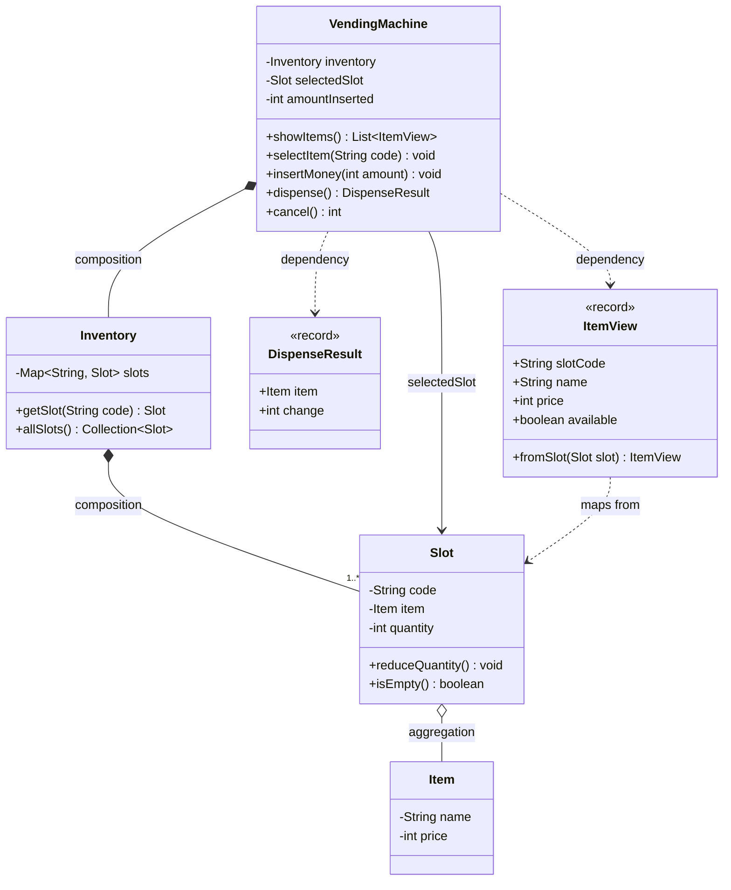
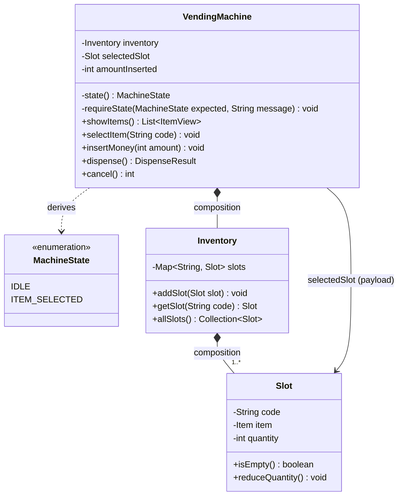
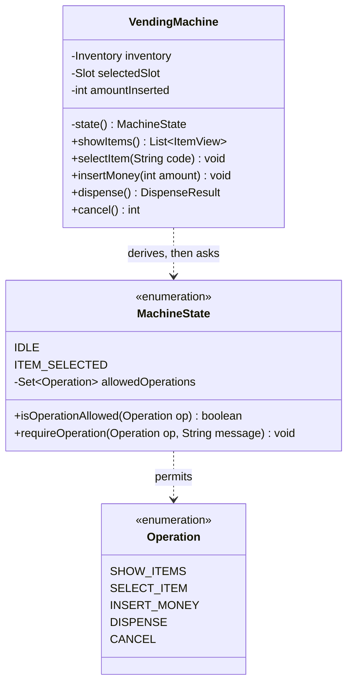
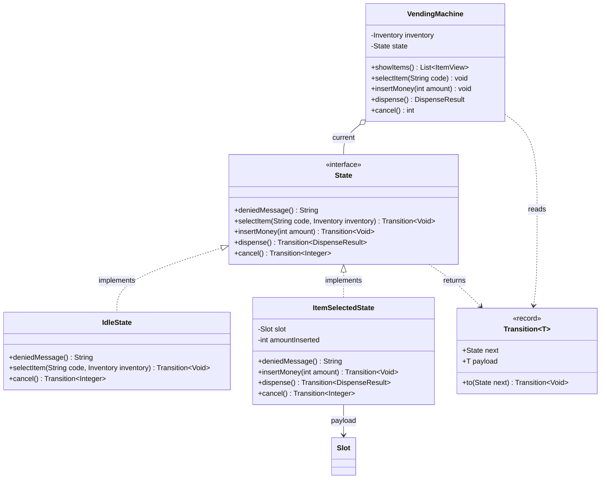
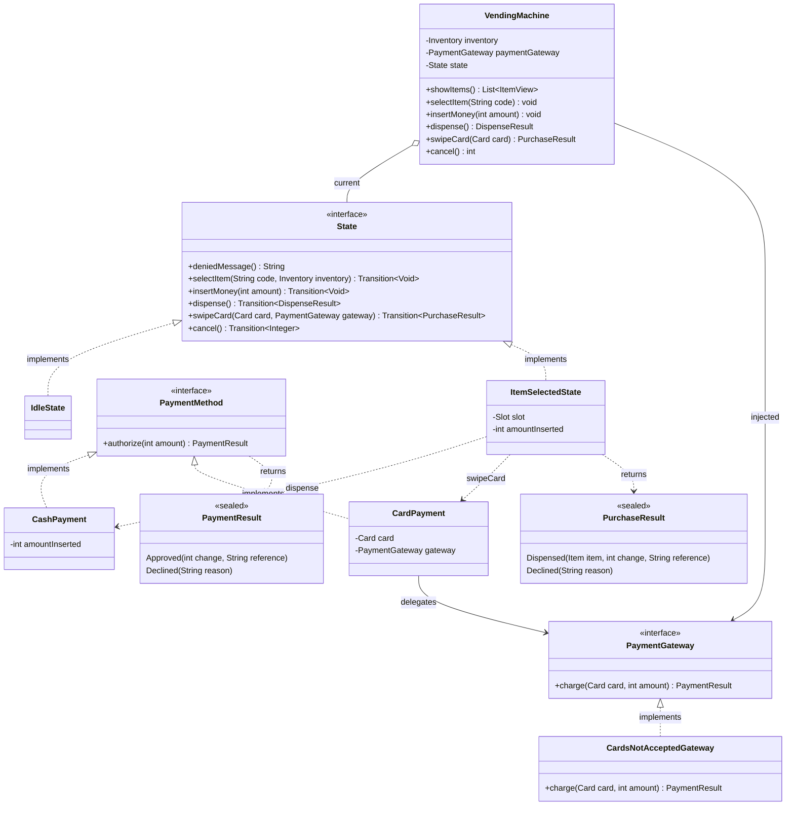

# Vending Machine — Low Level Design, Step by Step

A learning document. It designs a vending machine **five times**, each version a
little better than the last.

The point is not the final design. The point is *why* each change was needed.
Every version below starts with a problem the previous version caused, and ends
with the new problem it created. That is how real design works — you rarely get
it right first time, and "better" only means anything compared to something
worse.

## How to read this

Read the versions in order. If you skip to the end, the final design will look
like a pile of patterns with no reason behind them.

For each version, ask yourself three questions before reading the solution:

1. What exactly is broken here?
2. What is the smallest change that fixes it?
3. What will that change make harder?

There is a **glossary at the bottom** for terms like SRP, OCP, Strategy and
sealed interface. If a word is unfamiliar, look there first.

One rule followed throughout: **no design pattern is used until the pain that
justifies it has actually been felt.** Patterns are not points you score. Each
one adds indirection, and indirection has to earn its place.

The code lives beside this document in `src/main/java/com/vendingmachine`, with
tests in `src/test/java`. Run them with `mvn test` from the `vending-machine`
folder.

---

## What can a vending machine do?

Before designing anything, list everything the machine *could* do. You cannot
decide what to leave out until you know what exists.

**Things the user does**
- look at what is for sale and what it costs
- pick an item by its code, like `A1`
- put in money (coins, notes, or a card)
- receive the item
- receive change
- change their mind and get their money back

**Things the machine does inside itself**
- keep track of how many of each item are left
- check that the chosen code exists and is not sold out
- check that enough money has been paid
- work out the change
- check it actually *has* the coins to give that change
- refuse actions that make no sense (you cannot get an item before paying)

**Things the owner does**
- refill items
- change prices
- collect the cash, refill the coins used for change
- read sales reports

**Things that matter in the real world**
- two people using the machine at the same time
- a card payment that fails *after* the money was taken
- the motor jamming so the item never drops
- logging, monitoring, alerting

Two parts of this list are genuinely hard, and they are what make this a good
interview question:

1. **The rules about order.** The machine behaves differently depending on
   where the user is in the process. Asking for an item before paying must be
   refused. This is a *state machine*, and most of this document is about it.
2. **Making change.** It is easy to get wrong, and it can legitimately fail
   even when the customer paid enough — if the machine has no coins left, it
   cannot give change.

---

## V1 — The simplest thing that works

### What V1 promises to do

| Behaviour | In V1? |
|---|---|
| Show the items | yes — code, name, price, how many left |
| Pick an item | yes — must exist, must be in stock |
| Put money in | yes — as a single number, not individual coins |
| Give out the item | yes — plus change, as a single number |
| Change can fail | **no** |

**Left out on purpose:** individual coin denominations, the machine's own coin
float, cancel/refund, refilling, card payments, reports, and anything to do with
two users at once.

**An assumption we are making out loud:** the machine can always make change.
We pretend it has unlimited coins. Change comes back as a *number* ("here is
25"), not as actual coins ("here is one 20 and one 5").

Saying this yourself in an interview is important. An unstated gap looks like
something you missed. A stated one looks like a decision you made.

**A class we deliberately did not create:** `Payment`. It is tempting, because
money is involved. But in V1 money is a single whole number, so a `Payment`
class would hold one integer and add one subtraction. A field called
`amountInserted` already does that. `Payment` comes back in V3, when there is
more than one *way* to pay — and that is when it starts to earn its keep.

> A class should exist because it holds a responsibility, not because its name
> sounds like part of the problem.

### The four classes

| Class | What it is responsible for |
|---|---|
| `VendingMachine` | the entry point; remembers the purchase in progress and runs the four operations |
| `Inventory` | owns all the slots; finds a slot from its code |
| `Slot` | one physical position, like `A1`, holding one kind of item and a count |
| `Item` | a product: a name and a price |
| `DispenseResult` | the outcome of a purchase: which item, how much change |
| `ItemView` | one row of the display: slot code, name, price, in stock or not |

**Why `Item` and `Slot` are separate classes.** This is the modelling decision
most beginners get wrong, so it is worth being slow about.

- `Item` is *what a Coke is*: it is called "Coke" and costs 25.
- `Slot` is *a place in the machine*: position `A1` currently holds 3 of
  something.

If you merge them into one class, you break the moment the same drink sits in
two slots — `A1` and `B3` both stocking Coke. Now the price exists in two
places, and one day they will disagree.

A good test for "should these be one class or two?": **can one exist without
the other, or in a different quantity?** A Coke exists as a product even if no
slot stocks it. One product can be in many slots. Two classes.

**Why `DispenseResult` and `ItemView` exist.** Both appeared while reviewing V1,
and both for the same reason: a method needed to return *several facts at once*.

`dispense()` has to say two things — which item came out, and how much change.
Returning a formatted sentence like `"Here is your Coke and ₹25"` seems easier,
but then the machine itself owns the English wording, the currency symbol, and
the word order. Change the language of the display and you edit the machine.
Worse, the first version of that code had the word "Coke" hardcoded, so buying
a Water said *"Here is your Coke"*. Returning the plain facts and letting the
caller phrase them made that bug impossible.

`ItemView` is the same idea for the display. The obvious choice is to return the
`List<Slot>` the machine already has. But `Slot` has `reduceQuantity()` on it,
so handing slots to the screen gives the screen the power to change your stock.
`ItemView` is a read-only copy. **It carries facts, not abilities.**

It also fixes something the first attempt got wrong: the display showed
`Coke 25` with no slot code, so the user had no idea which button to press. And
it hid sold-out items completely, while still answering "sold out" if you typed
their code. A real machine shows everything and marks what is unavailable.

### Class diagram



**Reading the arrows** — interviewers ask about these, and they are easy marks:

| Arrow | Name | Means |
|---|---|---|
| `*--` | composition | the part cannot live without the whole. Slots die with the machine. |
| `o--` | aggregation | the part exists on its own. A product definition exists whether or not a slot stocks it. |
| `-->` | association | "has a reference to". The machine holds the slot the user picked. |
| `..>` | dependency | "uses, but does not hold". The machine creates an `ItemView`; it does not keep one. |

Note that a field and an arrow say different things. `-Item item` tells you a
reference exists. Only the arrow tells you whether it is composition or
aggregation. Java code cannot express that difference; a diagram can. That is
exactly why the question gets asked.

### Example flow

```
showItems()        -> A1 Coke  25  (3 left)
                      A2 Chips 20  (SOLD OUT)
selectItem("A1")   -> selectedSlot = A1
insertMoney(50)    -> amountInserted = 50
dispense()         -> 50 >= 25, so: 3 left becomes 2, change = 25
                   -> selectedSlot = null, amountInserted = 0
```

One small decision hides in that last line: **stock is reduced when the item is
dispensed, not when it is selected.** If selecting reduced the stock, then
cancelling would have to put it back — extra work to undo, for no benefit. Do
the irreversible thing as late as possible.

### Problems with V1

V1 works. It is also already at its limit, and here is why.

**The machine accepts nonsense.** Nothing stops a user calling the operations in
a silly order:

| What the user does | What V1 does | What it should do |
|---|---|---|
| put money in, then press dispense, having picked nothing | nonsense | refuse: nothing is selected |
| pick an item, press dispense, having paid nothing | gives a free item | refuse: nothing paid |
| pick a 25 item, pay 10, press dispense | takes 10 for a 25 item | refuse: not enough money |

**The fix has nowhere to go but `VendingMachine`.** Each operation grows a check
at the top. Each check works out "where are we?" by looking at the fields:
is `selectedSlot` null, and is `amountInserted` big enough?

**That is seven checks, spread over four methods.** And they are not written
anywhere as *rules* — they are buried in the first lines of method bodies. There
is no single thing you can point at and say "these are the machine's rules".

**Adding one operation means revisiting all the others.** Add `cancel()` and you
must go back and re-ask the question in every existing method: can I cancel when
idle? can I put money in after cancelling? Every answer is another `if` in
another place. The work grows as *states × operations*.

**Two SOLID principles are already broken** (see the glossary if these are new):

- **Open/Closed (OCP)** — every new state or operation means editing
  `VendingMachine` and re-checking guards that already worked.
- **Single Responsibility (SRP)** — `VendingMachine` does two unrelated jobs: it
  runs a purchase *and* it is the only authority on which actions are legal.

**The root cause: the state is invisible.** The machine's state is never written
down anywhere. It is *worked out* from field values each time. Two fields can
fake three states. They cannot express `DISPENSING` or `OUT_OF_SERVICE` at all,
and some combinations of those fields describe situations that should be
impossible.

That is what V2 fixes.

---

## V2a — Give the state a name

### The problem we are fixing

In V1 the state is invisible. Every method works out "where are we?" by looking
at `selectedSlot` and `amountInserted`. Seven checks, four methods, no single
place that describes the rules.

### First: what *are* the states?

Two: `IDLE` (nothing picked) and `ITEM_SELECTED` (something picked).

Beginners usually add a third, `PAID`. It is wrong, and the reason is worth
learning:

> **If you have to calculate it, it is not a state.**

To know whether the machine is "in `PAID`", you would have to compare
`amountInserted` against the price. That is a *calculation over data*, not a
position in the process. You would also have to recalculate and reassign it
every single time money went in — a stored answer that goes stale the moment the
data changes.

So "has the user paid enough?" stays as a plain `if` inside `dispense()`. We
will keep calling that kind of check a **condition**, as opposed to a **state**.
The difference matters again in V2b and V3.

### The trap: the obvious version makes nothing better

The textbook move is to add a field:

```java
private MachineState state = IDLE;     // next to...
private Slot selectedSlot;             // ...this
```

Look closely at what those two fields are saying:

```
state == IDLE           means the same as    selectedSlot == null
state == ITEM_SELECTED  means the same as    selectedSlot != null
```

**The same fact, stored twice.** If one line of code updates one and forgets the
other, the machine now believes it is idle while holding a selection. Nothing in
the compiler will catch that. This is the classic *two sources of truth* bug.

And count the checks: `if (selectedSlot == null)` has simply become
`if (state != ITEM_SELECTED)`. Still seven.

> **The enum renames the checks. It does not remove them.**

### The fix: work the state out, never store it

```java
private MachineState state() {
    return selectedSlot == null ? IDLE : ITEM_SELECTED;
}
```

Nothing is ever assigned, so the two can never disagree. The bug is not
*avoided by being careful* — it is impossible to write. That is always the
better kind of fix.

`selectedSlot` is now demoted in meaning. It is no longer "the state"; it is
**data that only means anything while the state is `ITEM_SELECTED`**. We will
call that kind of data the state's *payload*.

Every check then goes through one small helper:

```java
private void requireState(MachineState expected, String message)
```

The `message` parameter is not decoration. A single shared message like
*"Expected ITEM_SELECTED, Actual IDLE"* is helpful for a developer reading a
stack trace and useless to a person standing in front of the machine. Passing
the message in at each call site keeps V1's human wording — *"No item
selected."* — while the comparison itself exists in exactly one place.

**Every method that cares about the state must go through `state()`.** During
development one method still read the field directly, and that single exception
quietly undid the whole point of the change. More on why in the next section.

### So what did the enum actually buy?

Not fewer checks. Two other things:

**1. A name.** `ITEM_SELECTED` is a word you can put in a diagram, a log line,
and an error message. `selectedSlot != null` is a fact the reader has to
decode.

**2. A seam.** A *seam* is a single place where a future change can be absorbed.
Right now `state()` calculates the answer. One day the machine will need
`OUT_OF_SERVICE` — a state that nothing about `selectedSlot` can express. When
that happens, `state()` starts reading a stored field instead, and **not one of
the methods that call it has to change.**

That is why the one method that bypassed `state()` was a real bug and not a
style issue: a seam only works if everything goes through it.

The cost, stated honestly: a calculated state can only describe what the data
already implies. The day `OUT_OF_SERVICE` arrives, V2a turns into a mixture of
stored and calculated state. V2a is the right *next* step, not the finished
answer.

### Class diagram



Notice that `VendingMachine ..> MachineState` is a **dependency** (dotted), not
an association. There is no field of that type anywhere. That *missing field* is
the entire idea of V2a.

### Example flow

```
state() is IDLE
selectItem("A1")   -> requireState(IDLE, "An item is already selected.") passes
                   -> selectedSlot = A1        [state() is now ITEM_SELECTED]
insertMoney(10)    -> requireState(ITEM_SELECTED, "No item selected.") passes
                   -> amountInserted = 10
dispense()         -> requireState(ITEM_SELECTED) passes      <- state check
                   -> 10 < 25, so "Insufficient funds"        <- condition check
cancel()           -> not IDLE, so refund 10    [state() is now IDLE]
cancel()           -> already IDLE, so return 0  (does nothing, and that is fine)
```

`cancel()` is the odd one out: it does not *demand* a state, it *looks at* the
state and behaves differently. Cancelling an idle machine should quietly do
nothing, not throw an error — pressing coin-return on a machine you have not
used is not a mistake.

### What changed, and why

| | V1 | V2a |
|---|---|---|
| State | worked out inline, in every method | one `state()` method |
| Source of truth | the fields, read everywhere | calculated in one place |
| State comparison | 4 hand-written null checks | 1 place (`requireState`) |
| Vocabulary | none | `IDLE`, `ITEM_SELECTED` |
| Adding a state that cannot be calculated | touches every check | touches `state()` only |
| Messages shown to the user | per call site | per call site (kept) |

Behaviour did not change at all — the demo program prints exactly what it
printed in V1. **This version bought structure, not features**, and that is a
perfectly good reason to make a change.

### Problems with V2a

**The rules are still invisible.** Ask "which operations are legal in
`ITEM_SELECTED`?" and there is nowhere to look. The answer is scattered across
four method bodies, one line in each. The full rulebook only exists in your head
after you have read all of them.

**Adding a state still touches every method.** `OUT_OF_SERVICE` means visiting
each operation to decide what it does there. OCP is still broken, just more
neatly.

**`requireState` can only name one legal state.** As soon as an operation is
allowed in two different states, the helper needs a *set* of states, and its
shape starts to strain.

**Nothing forces you to write a check at all.** Add a sixth operation, forget
the `requireState` line, and it compiles and runs completely unguarded. The
check is a habit, not a structure — and habits fail.

---

## V2b — Write the rules down as data

### The problem we are fixing

V2a named the states but left the **rules** invisible. To answer "what is legal
in `ITEM_SELECTED`?" you search the code for `requireState(ITEM_SELECTED)` and
read whatever you find.

That search gives you a **wrong** answer, not just a slow one:

| Operation | Legal in `ITEM_SELECTED`? | Would the search find it? |
|---|---|---|
| `insertMoney` | yes | yes |
| `dispense` | yes | yes |
| `cancel` | yes | **no** — it *looks at* the state instead of demanding one |
| `showItems` | yes | **no** — it is legal everywhere, so it has no check at all |

Operations that are legal everywhere, and operations that branch instead of
demanding, are invisible to the search. When this question was actually asked
during the session, the answer given was two operations. The real answer is
four.

That is the strongest possible argument for writing the rules down somewhere a
human can read them.

### The fix: let each state declare what it allows

A table of rules needs two things: the states, and the operations. So
`Operation` becomes a real type alongside `MachineState`, and each state says
what it permits:

```java
IDLE(EnumSet.of(SHOW_ITEMS, SELECT_ITEM, CANCEL)),
ITEM_SELECTED(EnumSet.of(SHOW_ITEMS, INSERT_MONEY, DISPENSE, CANCEL));
```

Now "what is legal in `ITEM_SELECTED`?" is answered by **reading one line**, in
the type named after the concept.

**Why put the table on the enum rather than in a `Map` inside
`VendingMachine`?**

- A map inside `VendingMachine` would give that class two jobs again: running
  purchases *and* holding the rulebook. That is the SRP complaint from V1,
  returning.
- It leads naturally into V2c, where each state will own its *behaviour*. With
  the permissions already attached to the state, V2c just replaces a set with
  real methods. With a map, V2c would start by dismantling the map.
- A separate `TransitionRules` class would be right *later*, when the rules come
  from a config file or differ per machine model. Today it would be a class
  wrapping one map — unearned indirection, the same reason `Payment` was deleted
  in V1.

The cost: `MachineState` now depends on `Operation`. That is fine. They are two
halves of one idea, and the dependency goes one way only — `Operation` knows
nothing about states.

**Two small implementation details worth copying:**

- Use `EnumMap` / `EnumSet` rather than `HashMap` / `HashSet` when the keys are
  enums. They are backed by arrays and bitsets, so there is no hashing and no
  boxing, and iteration comes out in declaration order — which means a printed
  table reads `IDLE` then `ITEM_SELECTED` rather than in random order.
- Store the set as an **unmodifiable copy**. `EnumSet.of(...)` returns a
  *mutable* set, and keeping the caller's instance means someone could add a
  permission at runtime. Rules that can be edited while the program runs are not
  rules.

### What does *not* go in the table

Only rules you can decide **from the state alone**. Anything that has to look at
*data* stays as a condition in the method that owns that data:

| Rule | Can you answer it knowing only the state? | Lives in |
|---|---|---|
| cannot insert money before selecting | yes | the table |
| cannot select twice | yes | the table |
| the item is sold out | no — must read `slot.quantity` | the method |
| not enough money | no — must compare amount to price | the method |

So `selectItem` keeps **two** checks for two different reasons: a table lookup
("am I allowed to select at all?") and a data condition ("is this particular
slot stocked?").

This is the same state-versus-condition split that kept `PAID` out of the enum
in V2a. It keeps coming back, which is a sign it is a real principle rather than
a one-off.

### Why the table does not store "the next state"

A classic transition table maps `(state, operation) -> next state`. Ours maps
`state -> set of operations`, which only answers "is this allowed?".

That is on purpose. `state()` is *calculated from the data*, so where you end up
is a **consequence** of what the operation does to `selectedSlot` — not
something a table can declare. If the table also claimed the next state, you
would have two authorities on state again (what the table says, and what the
data says), which is exactly the bug V2a was built to make impossible.

### Class diagram



### Example flow

```
state() is IDLE
selectItem("A1")   -> state().requireOperation(SELECT_ITEM) -> IDLE allows it
                   -> slot not empty?                            <- data condition
                   -> selectedSlot = A1       [state() is now ITEM_SELECTED]
selectItem("B1")   -> state().requireOperation(SELECT_ITEM)
                   -> ITEM_SELECTED does not allow it
                   -> "An item is already selected."
insertMoney(25)    -> ITEM_SELECTED allows INSERT_MONEY
dispense()         -> ITEM_SELECTED allows DISPENSE
                   -> 25 >= 25                                   <- data condition
                   -> stock reduced, state() is IDLE again
```

### Two bugs this version shipped, and what they teach

These were real mistakes made while writing V2b. They are kept here because
both are extremely easy to make and neither is obvious on reading.

**Bug 1: the check asked a constant instead of the machine.**

```java
MachineState.ITEM_SELECTED.requireOperation(INSERT_MONEY, "No item selected.");
```

That reads perfectly plausibly. It is also meaningless: it asks *"does the
`ITEM_SELECTED` state allow money?"* — and the answer is yes, always, forever,
regardless of what the machine is actually doing. Every check in the machine
silently became a no-op. The demo sold a Water to someone who had asked for a
Coke.

The receiver has to be the *current* state:

```java
state().requireOperation(INSERT_MONEY, "No item selected.");
```

The lesson: **a lookup table is only useful when you look it up with the state
you are actually in.** V2a's `state()` is not replaced by the table; it is what
makes the table work at all.

**Bug 2: the wrong operation constant was passed.** `selectItem` asked about
`SHOW_ITEMS`, which every state allows, so selecting twice stayed legal even
after bug 1 was fixed. Nothing connects the constant `SELECT_ITEM` to the method
`selectItem()` — you simply have to type the right one.

Both bugs compiled, ran, and exited successfully.

### Why the tests appear here

Those two bugs shipped in consecutive rounds. Both times, a check compiled, ran,
and silently allowed something illegal. The demo program *printed* the breakage
and carried on, exit code 0.

A demo shows you problems. A test **fails** on them. So V2b is where 43 JUnit
tests arrive:

- `VendingMachineTest`, in four groups — the normal path, illegal sequences,
  cancelling, and the display
- `MachineStateTest`, which checks the **table itself**, without going through
  `VendingMachine` at all
- `SlotTest` and `InventoryTest` for stock rules and lookups

Several tests deliberately assert more than "an exception was thrown", because
these bugs were never about whether an error appeared:

- *"underpaying is rejected and the money is still held"* — it then tops up and
  completes the purchase. A check that threw an error but silently zeroed the
  balance would pass a naive test and fail this one.
- *"selecting twice is rejected and the first selection survives"* — it then
  buys the **original** item. A check that throws but overwrites the selection
  still fails.
- *"a rejected dispense does not consume stock"* — failure paths must not change
  anything.
- *"every operation is allowed by at least one state"* — a rule about the table
  itself. It catches an `Operation` added to the enum but to no state's set,
  which would be unreachable code rather than a visible bug.

Proof that they work: putting bug 2 back turns the suite red on exactly the
right test.

### What changed, and why

| | V2a | V2b |
|---|---|---|
| Where the rules live | first line of each method | one line per state, on the enum |
| "What is legal in X?" | read every method, miss two | read one line |
| Operations legal everywhere | invisible (no check) | explicit in the table |
| An operation legal in two states | needs a second check | already a set |
| Can the rules change at runtime? | n/a | no — unmodifiable copy |
| Safety net | a demo that prints problems | 43 tests that fail on them |

### Problems with V2b

**You can still forget a check.** A new operation with no `requireOperation`
line runs completely unguarded. The table is consulted *by habit*, not enforced
by the language. `showItems` went unchecked for a whole round, which made its
entries in the table pure decoration.

**The constant can disagree with the method.** As bug 2 showed, nothing ties
`SELECT_ITEM` to `selectItem()`. The table knows *about* the operations; it does
not *own* them.

**Behaviour is still all in one class.** The table says what is allowed, but
every method still contains the code for every state. `OUT_OF_SERVICE` means a
new enum constant *and* an edit to each method that should behave differently.

**A state still cannot hold data.** `ITEM_SELECTED` is a label with a set of
permissions. It cannot hold *which* slot was chosen or *how much* money is in —
that data still lives on `VendingMachine`, so a state and its data are kept
apart. This is the limitation V2c removes.

---

## V2c — Turn each state into a class (the State pattern)

### The problem we are fixing

V2b's table says what is *allowed*. It does not hold any *behaviour*, and a
state cannot hold any *data*. All four problems listed above come from those two
facts.

### The insight that makes it possible

An enum constant is a **singleton** — there is exactly one `ITEM_SELECTED` in
the whole program, forever. So it cannot hold "the slot this user picked",
because there is only one of it to go around.

A state **object** can be created fresh for each transition. So it can hold that
transition's data.

This also settles a tension from V2a. Back then we insisted the state must be
*calculated*, because storing it alongside `selectedSlot` meant two sources of
truth. Once the state object *is* the place the data lives, there is nothing to
keep in sync, so storing it becomes correct:

> Calculating the state was right while the data lived somewhere else. Once the
> state owns its data, storing it is right.

Rules that reverse like this are not contradictions. The reasoning behind the
rule ("never have two sources of truth") held the whole time; only the situation
changed.

### The fix

`State` becomes an interface where **every operation is a `default` method that
throws**. A state therefore allows exactly what it chooses to override.

Two things follow from that, and both fix V2b problems for free:

- **You cannot forget a check.** A state that does not override `dispense()`
  automatically refuses it. "Forgetting" now means "refusing", which is the safe
  direction. This idea is often called *deny by default*.
- **You cannot name the wrong operation.** The method is called `insertMoney`,
  so the compiler connects the name to the behaviour. V2b's bug 2 is no longer
  possible to write.

Then: `IdleState` holds nothing. `ItemSelectedState` holds the `Slot` and the
`int amountInserted` — the two fields that have sat on `VendingMachine` since V1
and only ever meant anything in one particular state.

### States are immutable, and that matters later

`insertMoney` does **not** change its own field. It returns a *new*
`ItemSelectedState` with the larger amount:

```java
return Transition.to(new ItemSelectedState(slot, amountInserted + amount));
```

Two payoffs:

**1. A new purchase cannot inherit the last one's money.** In V1 you had to
remember to write `amountInserted = 0` on every exit path, and forgetting it was
a real risk — there is a test called *"money does not leak between
transactions"* precisely because of that. Now each purchase starts as a brand
new object, so leaking is not a bug you avoid; it is a situation you cannot
express.

**2. A transition becomes a single reference swap.** Nothing is ever half
updated. In V4, when two threads exist, that is what lets the whole transition
become one atomic operation. A *mutable* state would have to be locked while it
changed; an immutable one never changes at all.

### How does a transition actually happen?

A state object needs to tell the machine "become this other state" — and
`dispense()` must *also* return a result to the caller. Three ways to do that
were considered:

| Approach | How | Why it was or was not chosen |
|---|---|---|
| Context callback (the classic GoF form) | each state holds a reference to the machine and calls `machine.setState(...)` | rejected: a state holding the machine can call *any* public method on it, e.g. `machine.cancel()` from inside `dispense()`. Transitions become circular and hard to follow. |
| Return the next state | `state = state.dispense()` | rejected: no way to also hand a `DispenseResult` back to the caller. |
| **Return both** | `record Transition<T>(State next, T payload)` | **chosen.** A state can only *describe* what should happen; it has no power to do anything to the machine. |

The machine then does three lines per operation: ask the state, store
`transition.next()`, return `transition.payload()`.

**Read the transition once.** Calling the operation twice to get `next()` and
then `payload()` runs the operation *twice* — see the bugs below.

### How does a state reach the `Inventory`?

`IdleState.selectItem("A1")` has to look up a slot, but `Inventory` belongs to
the machine. Three options:

- **Method parameter** — `selectItem(String code, Inventory inventory)`. States
  hold no dependencies. But the interface signature changes every time a new
  dependency appears.
- **Field on each state** — clean signatures, but every transition must now pass
  all dependencies into the next state's constructor, everywhere.
- **A context object** — one record holding everything shared, passed as a
  single parameter. Signatures stop changing. But today it would be a record
  wrapping a single field.

**The method parameter was chosen for now.** With one dependency, a context
object would be unearned indirection — the same judgement that deleted `Payment`
in V1 and rejected `TransitionRules` in V2b. V3 adds a second dependency, V5 a
third, and the pain becomes real. Then it gets introduced.

This is a deliberate teaching choice. Introducing the context object early looks
smarter and teaches nothing, because you never feel why it exists.

### Why `showItems` is not on `State`

It is legal in every state and behaves identically in all of them. Putting it on
the interface would add a dispatch that always lands in the same place. In V2b
it was an entry in every single set, which is what useless data looks like. It
stays on `VendingMachine`.

### Class diagram



`VendingMachine o-- State` is **aggregation**: the machine holds a state, but
states get swapped out rather than owned for life. `ItemSelectedState --> Slot`
is the payload that used to sit on `VendingMachine`.

### Example flow

```
state = IdleState
selectItem("A1")   -> IdleState.selectItem: look up, not sold out   <- data condition
                   -> become ItemSelectedState(A1, 0)
insertMoney(10)    -> become ItemSelectedState(A1, 10)   (old object thrown away)
insertMoney(20)    -> become ItemSelectedState(A1, 30)
dispense()         -> 30 >= 25                                      <- data condition
                   -> stock reduced, become IdleState
                   -> caller receives DispenseResult(Coke, 5)
dispense()         -> IdleState does not override dispense
                   -> the interface's default throws "No item selected."
```

That last line is the pattern working. **No check was written anywhere** — the
interface's default refused the operation on its own.

### Two bugs this version shipped

**Bug 1: every operation ran twice.**

```java
state = state.dispense().next();      // runs dispense, moves to IdleState
return state.dispense().payload();    // runs dispense AGAIN, now on IdleState
```

The second call lands on the *new* state, which refuses it. So a successful
purchase reduced the stock, built the result, threw the result away, and *then*
threw an exception. The customer's money is gone, the Coke is gone from
inventory, and they get an error — worse than any bug in V1.

`cancel()` failed differently: `IdleState` returned a `null` payload, which
throws `NullPointerException` when Java unboxes it to an `int`.

The fix is to fetch the transition once:

```java
Transition<DispenseResult> transition = state.dispense();
state = transition.next();
return transition.payload();
```

**Bug 2: `IdleState.cancel()` returned `null` instead of `0`.** Cancelling an
idle machine refunds **zero**, not *nothing*. `null` also makes a false claim:
there *is* a meaningful amount here, and it is zero.

17 of the 36 tests caught these. The demo program would have printed its way
past the second one.

### Deleting the old design

`MachineState`, `Operation`, the old `VendingMachine` and `MachineStateTest` were
all deleted. Until that deletion, **V2c was dead code** — the demo and the tests
were still using the old class, so none of the new code had ever run.

Those 7 deleted tests were testing an *implementation*: a table that no longer
exists. The behaviour they protected ("you cannot insert money before
selecting") is still tested in `VendingMachineTest`, through the public methods.
Which is why that suite survived a complete rewrite of the state machine without
a single change.

> Tests written against the contract outlive the design. Tests written against
> the design die with it.

What was genuinely lost: `MachineStateTest` could assert "every operation is
allowed by at least one state". In V2c there is no single place where that
question can even be asked.

### The honest trade-off

V2c is **not** simply better than V2b. It trades one weakness for another.

| Question | V2b (table) | V2c (objects) |
|---|---|---|
| What is legal in `ITEM_SELECTED`? | one line on the enum | one file — the overrides *are* the answer |
| Which states allow `CANCEL`? | one line | open every state class |
| Draw the whole state diagram | read the table | read all N classes; nothing lists them |
| Can a state hold data? | **no** | yes |
| Can you forget a check? | yes | no |

> The enum table makes the **rules** obvious and keeps the **behaviour** in one
> class. State objects keep each state's **behaviour** together and make the
> **rules** implicit.

Choose based on which question you ask more often — and on whether states need
to carry data. Here, the data settles it: `ItemSelectedState` owning the slot
and the amount is what made money-leaking impossible to express rather than
merely tested for.

With two states, reading every class is free. With six — `IDLE`,
`ITEM_SELECTED`, `DISPENSING`, `OUT_OF_SERVICE`, `MAINTENANCE`,
`PAYMENT_PENDING` — it is six files to answer one question.

### Problems with V2c

**Shared behaviour will get duplicated.** `cancel` already exists in both states
and will exist in nearly every future one. More states means either repeated
code or an abstract base class.

**The state diagram is scattered.** No file lists the states or the transitions
between them. Both only emerge from reading every class.

**One class per state adds up.** Two states is two files, which is fine. Six
states is six files plus a base class, for a machine whose rules fit in a small
table.

**The dependency parameter will keep churning.**
`selectItem(String, Inventory)` works with one dependency. V3 adds a payment
gateway and V5 a coin float, and each addition changes the `State` interface and
every class that implements it. That is the pressure that will finally justify a
context object.

---

## V3 — Card payments (the Strategy pattern)

### The new requirement

The machine should accept cards as well as cash.

This sounds like "add one method". It is not — it breaks an assumption that has
been quietly true since V1.

With cash, **the payment has already physically happened** by the time
`dispense()` runs. The coins are inside the machine. `amountInserted` is not a
promise, it is a fact. So `dispense()` was a local operation on local data, and
the only thing that could go wrong was a programming error.

A card charge is **a call to somebody else's computer**:

| | Cash | Card |
|---|---|---|
| How many interactions | many `insertMoney` calls | one authorization |
| Can it fail? | no | yes — declined, network down, timeout |
| How long does it take | instant | hundreds of milliseconds, or it hangs |
| Overpaying | normal; needs change | impossible — you charge the exact price |
| Do you always know the outcome? | yes | **no** — a timeout tells you nothing |

So dispensing becomes **two steps that can fail independently**: take the money,
release the item. Any outcome where exactly one of them succeeded is a real
incident — a customer charged with no Coke, or a free Coke.

That last row is the nastiest. A *declined* card is clean: you know it failed. A
*timeout* leaves you not knowing whether the customer's money moved. That
uncertainty is where idempotency comes from in V4.

### Which order: charge first, or dispense first?

Both orders can go wrong, so you have to pick which failure you prefer:

- **Charge first.** If dispensing then fails (motor jam), you have taken money
  for nothing and you owe a refund.
- **Dispense first.** If the charge then fails, the item is already gone and you
  have given away stock.

**Charge first.** Owing a refund is recoverable — you can pay someone back. An
item that has physically dropped into the tray is not.

### The state we deliberately did *not* add

The obvious next step is a `PAYMENT_PENDING` state covering the wait for the
bank's answer. Apply V2a's own rule — *a state is somewhere the machine rests* —
and it has not earned its place yet. With an ordinary blocking method call, no
caller can ever observe it:

```
swipeCard(card)
  -> state = PaymentPendingState     // lasts only for one blocking call
  -> gateway.charge(...)             // single thread: nobody can call anything
  -> state = IdleState
```

A state with no reachable entry point is not a state; it is a few microseconds
inside one method. It would also need `cancel()` and `showItems()` defined for a
situation no user can ever be in.

It earns its place when either authorization becomes asynchronous, or when there
are concurrent users and the second one must be refused while the first charge
is in flight. That is **V4**.

Similarly, `DISPENSE_COMPLETED` and `DISPENSE_REFUND` — both suggested during
the session — are not states. Nothing is awaited in either. One is an *outcome*
and the other an *action* on the way back to `IDLE`, and both are already
expressible as a `Transition`'s payload. Modelling them as states would create
two classes that immediately transition out of themselves.

> Name a state for what the machine is *doing now*, not for what it hopes to do
> next. And if the machine never rests there, it is not a state.

Refunding *does* become a real state eventually — the moment the refund is
itself an external call that can fail and needs retrying. Then the machine
genuinely sits there thinking "I owe this person money and have not managed to
send it". That is V5.

### The fix: one pipeline, two ways to pay

`PaymentMethod` is the **Strategy**: an interface with one method,
`authorize(amount)`, and two implementations, `CashPayment` and `CardPayment`.
`PaymentResult` is the outcome.

The tempting mistake is to branch on the type:

```java
if (method is card) { authorize... } else { dispense directly }   // two machines
```

That is a conditional on payment type *inside* the state machine — exactly the
coupling the Strategy was meant to remove, and it will be back the day UPI
arrives.

**Instead, treat cash as the boring special case of the general rule.** Every
payment gets authorized. Cash's authorization is just a local comparison that
returns immediately and can never fail outwardly:

- `CashPayment.authorize(25)` — compares against the coins already inside
- `CardPayment.authorize(25)` — calls the bank, may decline, may hang

One path, no branching on type. Cash pays the cost of a step it does not really
need, which is nothing, and in return **nothing downstream of `authorize` knows
or cares which way the customer paid.**

Worth noting what this fixed. Before it, `CashPayment` existed but nothing ever
constructed it, and the insufficient-funds rule lived in *two* places with two
different messages — one rule, two code paths, guaranteed to drift apart. Now
the rule and its message exist only in `CashPayment`.

### Two entry points, one pipeline

Cash announces itself by physically arriving: `insertMoney(10)` means both "I am
paying cash" and "here is some of it". A card user inserts nothing, so there has
to be a second way in. `swipeCard` is it.

The fork happens **only at the point of choosing the method**. Both paths then
converge:

```
insertMoney(10), insertMoney(20)  ->  accumulate inside ItemSelectedState
dispense()                        ->  CashPayment(30).authorize(25)
swipeCard(card)                   ->  CardPayment(card, gateway).authorize(25)
```

If the fork spreads any further — a second dispense path, a check on payment
type inside a state — you have built two machines in one class.

### Exceptions, or return values?

Both. The dividing line:

> **Exceptions** for "you cannot do that" and "the system is broken".
> **Return values** for "we tried, and the answer is no."

| Situation | How it is reported | Why |
|---|---|---|
| swipe with nothing selected | `IllegalStateException` | an illegal sequence |
| not enough cash inserted | `IllegalStateException` | a precondition: you have not paid yet |
| card declined | `PurchaseResult.Declined` | an ordinary business outcome, maybe the most common one after success |
| machine has no card reader | `PurchaseResult.Declined` | a known answer, not a failure |
| gateway timeout or unreachable | `PaymentGatewayException` | the outcome is genuinely **unknown** |

`DispenseResult(Item, int change)` can only describe success, so the card path
returns a **sealed interface** instead: `PurchaseResult` is either `Dispensed`
or `Declined`, and nothing else.

**Why sealed rather than a success flag?** A record like
`DispenseResult(boolean success, Item item, String reason)` lets a caller read
`item()` on a declined purchase and get `null`. A sealed interface makes the
compiler *demand* both branches in a `switch`. "I forgot to handle the decline"
stops being possible — the same deny-by-default thinking as `State`.

But sealing only pays off **if you actually switch on it.** An `instanceof`
chain ending in `else { throw new IllegalStateException("unknown type"); }`
throws the guarantee away: that branch is unreachable today, and the day a third
case is added, the chain silently takes it at runtime where an exhaustive
`switch` would have **failed to compile**. The first version of this code had
exactly that chain, in two places.

**Where a declined card leaves the machine:** in `ItemSelectedState`, not
`IdleState`. So the customer can try a second card, or pay cash, rather than
re-selecting their drink after their bank had a hiccup. Small decision, real
difference to a person standing in front of the machine.

### The gateway is a boundary

`PaymentGateway` is an interface with **no real implementation here**, and that
is deliberate.

The domain declares the interface *it* needs; whoever talks to the outside world
implements it. That is **Dependency Inversion**: `CardPayment` depends on the
interface, not on a bank's SDK. A real gateway brings network calls, secrets and
retries — and, crucially, **cannot be told to decline on demand**, so you could
not test any of this.

Three implementations exist for three different reasons:

- **`CardsNotAcceptedGateway`** — a *null object* for a machine with no card
  reader. It returns `Declined("Card payments are not available.")`. Declining
  is the honest answer: "no card reader" is a known fact, not a system failure.
  It also means a machine built without a gateway declines politely instead of
  throwing `NullPointerException`.
- **`FakePaymentGateway`** (test code only) — scripted to APPROVE, DECLINE or
  FAIL, and it **records what it was asked**. The properties worth asserting are
  "charged exactly once" and "charged exactly the price", and no return value
  can show those. V4 will use `chargeCount()` to prove a retry charged once.
- **A real one**, which you would write at work — `StripePaymentGateway` or
  similar, living in an infrastructure package. Not here.

`Card` holds a gateway **token**, never a card number. A design that cannot hold
a PAN cannot leak one.

### Class diagram



### Example flows

```
cash — unchanged since V1
  selectItem("A1"); insertMoney(10); insertMoney(20)
  dispense() -> CashPayment(30).authorize(25) -> Approved(change 5, "CASH")
             -> stock reduced, DispenseResult(Coke, 5), state = IdleState

card approved
  selectItem("B1"); swipeCard(token)
             -> CardPayment.authorize(15) -> gateway -> Approved(0, "AUTH-1")
             -> stock reduced, Dispensed(Water, 0, "AUTH-1"), state = IdleState

card declined
  selectItem("A1"); swipeCard(token)
             -> Declined("Card declined by issuer.")
             -> stock unchanged, state stays ItemSelectedState
  insertMoney(25); dispense()     -> the cash path still completes the sale

machine has no card reader
  swipeCard(token) -> Declined("Card payments are not available.")

gateway failure
  swipeCard(token) -> PaymentGatewayException is thrown upwards
                   -> state never changed, so the selection and any cash survive
                   -> BUT the charge is UNRECONCILED: the customer may have paid
```

### Tests

59 green. The card path arrived with its own suite, because V2b's lesson was
that a demo program shows problems while a test fails on them — and this time
the thing at risk is money.

`CardPurchaseTest` checks, for each outcome:

- **approved** — the reference and zero change come back; charged **exactly
  once, exactly the price**; stock reduced by one; machine returned to idle
- **declined** — a reason is returned rather than thrown; stock untouched;
  the selection is kept; a second card can be charged; cash can still finish
  the sale
- **gateway failure** — the exception propagates; nothing is dispensed; the
  state does not move; inserted cash is still refundable
- **illegal sequence** — a refused swipe **never reaches the gateway**
  (`chargeCount() == 0`), which only a fake you can interrogate can prove

`PaymentMethodTest` tests the strategies on their own, with no machine and no
states involved — including a deliberately misbehaving gateway that claims
change, proving `CardPayment` normalises it to zero.

### What changed, and why

| | V2c | V3 |
|---|---|---|
| Ways to pay | cash only | cash and card, one authorization pipeline |
| Where the payment rule lives | inline in `dispense()` | `CashPayment` / `CardPayment` |
| Can failure be represented? | no — success or exception | yes, `PurchaseResult.Declined` |
| Unknown outcome | n/a | `PaymentGatewayException`, state unchanged |
| External dependency | none | `PaymentGateway`, injected and stubbable |
| New states | — | **none**, deliberately |

### Problems with V3

**The signatures are churning, exactly as predicted in V2c.**
`selectItem(String, Inventory)` and now `swipeCard(Card, PaymentGateway)`. Two
dependencies threaded through an interface that V5 will also hand a coin float
and a transaction log. Every addition changes `State` and every implementing
class. **This is where a context object finally earns the place it had not
earned in V2c.**

**A failed charge is unreconciled.** The machine knows it may have taken money
and records nothing at all, so nobody can sort it out afterwards. There is no
transaction log, and the gateway's reference is read once and thrown away.

**There is no idempotency.** Retry a swipe and the customer is charged again —
`FakePaymentGateway.chargeCount()` goes to 2. The design has no way to say "this
is the same purchase attempt as before, do not charge twice".

**The in-flight window is now real but unmodelled.** `authorize()` is a
synchronous call that can take hundreds of milliseconds. With one thread that is
merely slow. With two threads, a second caller can enter `dispense()` or
`swipeCard()` while the first charge is still in flight, and **both can pass the
stock check before either reduces the stock.** That is V4.

---

## Still to come

| Version | What it adds |
|---|---|
| **V4** | concurrency: two users at once, race conditions, idempotency, and the `PaymentPendingState` that V3 refused to add early |
| **V5** | production concerns: the coin float and real change-making, refills, a transaction log, failure recovery, logging and metrics, configuration |

---

## Glossary

Terms used above, in plain words.

**State machine** — a design where an object behaves differently depending on
which named situation ("state") it is currently in, and where only certain moves
between situations are allowed.

**State vs condition** — a *state* is where you are in a process (`IDLE`).
A *condition* is a yes/no question about data ("is there enough money?"). If you
have to calculate it from data, it is a condition, not a state.

**Payload** — data that only makes sense in one particular state, like "which
slot was selected".

**Seam** — a single place in the code where a future change can be absorbed
without touching everything else. `state()` is a seam.

**Immutable** — an object whose fields never change after construction. To
"change" it you create a new one.

**Deny by default** — the safe arrangement where forgetting to allow something
results in it being refused, rather than being allowed.

**Idempotent** — an operation that has the same effect whether you do it once or
five times. Crucial for payments: a retried charge must not take money twice.

### SOLID, briefly

**S — Single Responsibility (SRP)** — a class should have one reason to change.
V1's `VendingMachine` had two: how a purchase runs, and which actions are legal.

**O — Open/Closed (OCP)** — you should be able to add behaviour without editing
existing working code. V1 broke this: every new state meant reopening and
re-checking every method.

**L — Liskov Substitution** — any implementation of an interface must be usable
wherever that interface is expected, without the caller checking which one it
got. Why `CashPayment` and `CardPayment` both just `authorize`, and nothing asks
which it has.

**I — Interface Segregation** — do not force a class to implement methods it
does not need. Related to why `showItems` stayed off `State`.

**D — Dependency Inversion (DIP)** — depend on an interface you define, not on a
concrete external thing. `CardPayment` depends on `PaymentGateway`, not on a
bank's SDK.

### Patterns used, and the problem each solved

| Pattern | Where | The problem it solved |
|---|---|---|
| **State** | V2c | each state needed its own behaviour *and its own data*, which an enum constant cannot have |
| **Strategy** | V3 | two ways to pay, chosen at runtime, without the machine branching on type |
| **Null Object** | V3 | a machine with no card reader, without null checks or crashes |
| **Value Object / record** | V1, V3 | returning several facts at once (`DispenseResult`, `ItemView`, `Transition`, `PaymentResult`) |
| **Read model / DTO** | V1 | the display needed facts without the power to change stock (`ItemView`) |

Patterns **considered and rejected**, which matters just as much:

- a `Payment` class in V1 — would have held one integer
- a `TransitionRules` class in V2b — would have wrapped one map
- a context callback in V2c — would have let a state call back into the machine
- a `MachineContext` in V2c — would have wrapped a single dependency
- a `PaymentPendingState` in V3 — no caller could have observed it yet

### The one-paragraph version

Start with four classes and no rules about ordering. Discover that the machine
accepts nonsense, and that the fix is seven scattered `if`s. Give the state a
name, and calculate it rather than storing it, so it cannot contradict the data.
Write the rules down as data on the state, so a human can read them. Then turn
each state into a class, so a state can own its behaviour *and* its data — which
makes forgotten checks impossible and money-leaking inexpressible. Finally, add
a second way to pay behind one interface, treat cash as the boring case of the
general rule, and separate "the answer is no" (a return value) from "something
is broken" (an exception). At every step, the next pattern was only allowed in
once the previous version had actually hurt.
