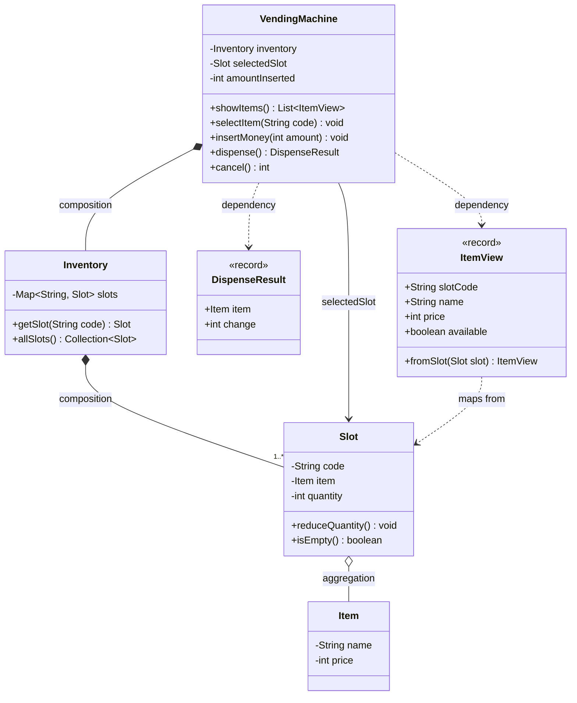
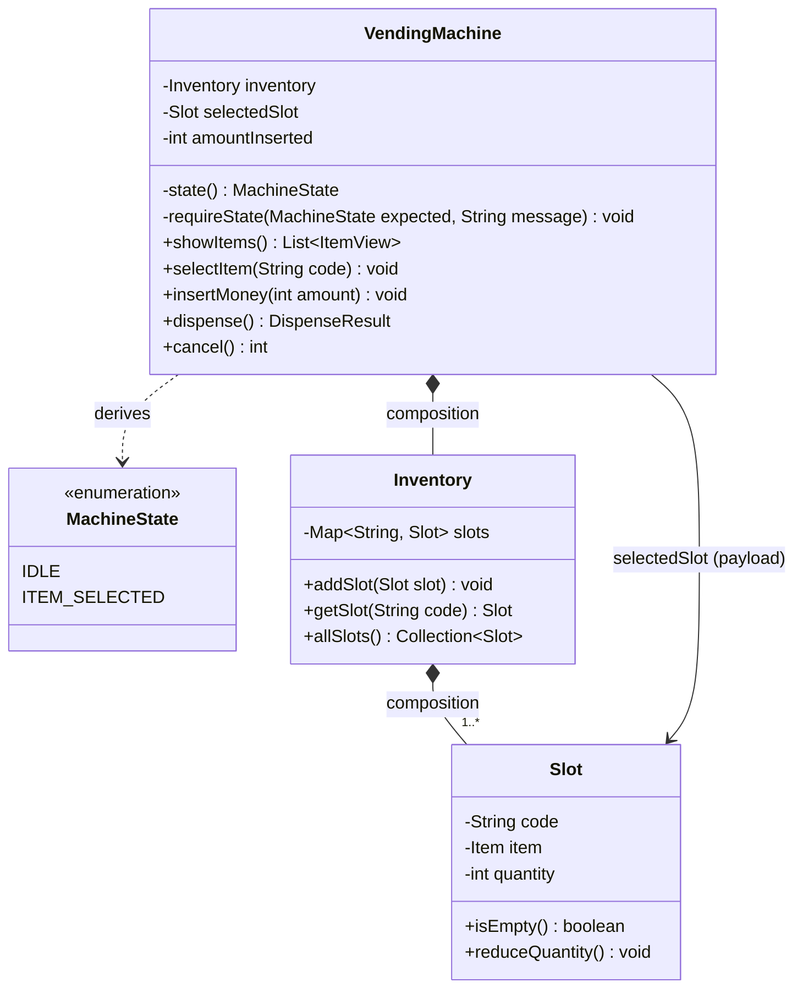

# Vending Machine — Low Level Design

Built evolutionarily: V1 → V5. Each version solves a real problem created by the
previous one. No pattern is introduced before the pain that justifies it.

---

## Behaviour space (full menu, before scoping)

**User:** view items and prices · select by code · insert money (coins / notes /
card) · receive item · receive change · cancel and get refund

**Machine:** track inventory per slot · validate selection and stock · validate
amount · compute change · verify change is physically possible · enforce state
transitions · reject invalid transitions

**Operator:** restock · reprice · collect cash · refill change float · sales reports

**Production:** concurrent users · payment failure after money taken · refunds ·
idempotency · dispense jams · logging and metrics

The two genuinely hard parts of this problem are the **state machine** and
**change-making** (which can legitimately fail even when the user paid enough).

---

## V1 — Basic Design

### Scope

| Behaviour | In V1 |
|---|---|
| Show items | yes — code, name, price, quantity |
| Select item | yes — must exist, must be in stock |
| Insert money | yes — as a plain amount, not denominations |
| Dispense | yes — item out, plus change as an amount |
| Change can fail | **no** |

**Deliberately excluded:** denomination handling, coin float, cancel/refund,
restock, card payment, reports, concurrency.

**Stated assumption:** the coin float is infinite, so change is always possible.
V1 returns change as a number, not as physical coins. Say this out loud in an
interview — it converts a hole into a declared boundary.

**Deleted on purpose:** a `Payment` class. With money as a single integer, it
would hold nothing an `int amountInserted` field does not already hold. It comes
back in V3, when card payments make "how you paid" a real variation.

### Classes

| Class | Responsibility |
|---|---|
| `VendingMachine` | Entry point; holds the in-progress transaction (`selectedSlot`, `amountInserted`) and runs the four operations |
| `Inventory` | Owns all slots; looks up a slot by code |
| `Slot` | A physical position (`A1`) holding one item type and a quantity |
| `Item` | A product definition: name and price |
| `DispenseResult` | The outcome of a purchase: which item, how much change |
| `ItemView` | Read-only display row: slot code, name, price, availability |

`Item` and `Slot` are deliberately separate. `Coke` is a product with a name and
a price; `A1` is a location holding *some number of* Cokes. Collapsing them
breaks as soon as two slots stock the same product.

### Class diagram



Relationship choices worth defending: `Inventory` **composes** its slots (they
do not outlive the machine), while a `Slot` only **aggregates** its `Item` (the
product definition exists independently of any slot).

### Flow

```
showItems()        -> A1 Coke  25  (qty 3)
                      A2 Chips 20  (qty 0)
selectItem("A1")   -> selectedSlot = A1
insertMoney(50)    -> amountInserted = 50
dispense()         -> 50 >= 25 ok -> qty 3 -> 2, change = 25
                   -> selectedSlot = null, amountInserted = 0
```

### Problems with V1

**The disease: no state validation.** V1 accepts illegal call sequences and
produces nonsense:

| Sequence | What V1 does | What it should do |
|---|---|---|
| `insertMoney(50)` then `dispense()` | dispenses nothing meaningful — nothing was selected | reject: no selection |
| `selectItem("A1")` then `dispense()` | dispenses an unpaid item | reject: no payment |
| `selectItem("A1")`, `insertMoney(10)`, `dispense()` | takes 10 for a 25 item | reject: insufficient amount |

**Where the fix is forced to live:** `VendingMachine`, because nothing else
knows the transaction. Every operation grows a guard clause at the top that
infers the current state from two fields — `selectedSlot == null` and
`amountInserted >= price`.

**Tight coupling.** The transition rules are welded into the bodies of the four
operations. There is no object you can point at and say "this is the rule".

**Hard to extend.** Adding `cancel()` is not just a new method — it forces a
re-reading of the guards inside every existing method ("can I cancel from idle?
can I insert money after cancelling?"). Each answer is another `if` in another
place. Guard logic grows with states x operations.

**SOLID violations.**
- **OCP** — every new state or operation requires editing `VendingMachine` and
  re-reasoning guards that already worked.
- **SRP** — `VendingMachine` both orchestrates a purchase *and* is the sole
  authority on legal transitions. Two reasons to change in one class.

**Implicit state is the root cause.** The state is not represented anywhere; it
is *inferred* from field values. Three states can be faked this way. More cannot
— `DISPENSING` and `OUT_OF_SERVICE` cannot be expressed by those two fields at
all, and field combinations start producing states that should be impossible.

**Design note surfaced here:** decrement quantity at **dispense**, not at
selection. If selection decremented, `cancel()` would have to restore stock —
extra state to unwind for no gain.

---

## V2a — Explicit state, derived (enum)

### Problem

V1 is correct but its state is **implicit**: no object or field says where the
machine is. Every operation re-derives the answer inline from
`selectedSlot == null` and `amountInserted`, so seven state checks sit scattered
across four method bodies, each coupled to the field layout.

### First, a modelling decision

The states are `IDLE` and `ITEM_SELECTED`. **Not** `PAID` — "the user has paid
enough" is a *condition*, not a state:

> A state you have to compute is not a state.

To know whether it was in `PAID`, the machine would have to compare
`amountInserted` against the price, and would have to reassign the state on
every `insertMoney` call. Anything derived on demand is a predicate, and a
stored predicate is a cache waiting to go stale. So "paid enough" stays an `if`
inside `dispense()`, deliberately separate from the state guard.

### Why the obvious version of this is a trap

The textbook move is `private MachineState state = IDLE;` beside
`private Slot selectedSlot;`. But those two fields encode the *same fact*:

```
state == IDLE          <->  selectedSlot == null
state == ITEM_SELECTED <->  selectedSlot != null
```

Two sources of truth that can disagree. Forget one assignment and the machine
believes it is idle while holding a selection. Worse, the enum has not removed a
single check — `if (selectedSlot == null)` simply becomes
`if (state != ITEM_SELECTED)`. Still seven. **The enum renames the branches; it
does not remove them.**

### Solution — derive the state, never store it

```
private MachineState state() {
    return selectedSlot == null ? IDLE : ITEM_SELECTED;
}
```

Nothing is ever assigned, so the two cannot disagree: the bug class is
structurally impossible rather than avoided by discipline. `selectedSlot` is
demoted to **payload** — data meaningful only while
`state() == ITEM_SELECTED`.

Every guard then goes through one helper:

```
private void requireState(MachineState expected, String message)
```

The `message` parameter is not decoration. A single generic
"Expected ITEM_SELECTED, Actual IDLE" is better for a stack trace and worse for
the person standing at the machine; passing the message per call site keeps
V1's user-readable errors while the comparison itself lives in one place.

Every method that cares about state must go through `state()` — including
`cancel()`. A method that still reads the field directly is the one that will
not notice when `state()` stops being derived.

### What the enum actually buys

Not fewer branches. Two other things:

1. **A vocabulary.** `ITEM_SELECTED` is a name usable in diagrams, logs and
   messages. `selectedSlot != null` is a fact that must be decoded.
2. **A seam.** Today `state()` derives. When `OUT_OF_SERVICE` arrives — a state
   nothing about `selectedSlot` can express — only `state()` changes, and not
   one guard that calls it. V1 had no such seam.

The price: derived state can only express what the data already implies, so
`OUT_OF_SERVICE` will force a hybrid (stored field plus derivation). V2a is the
right *next* step, not the end state.

### Class diagram



`VendingMachine ..> MachineState` is a **dependency**, not an association —
there is no field of that type. That missing field is the whole point of V2a.

### Flow

```
state() == IDLE
selectItem("A1")   -> requireState(IDLE, "An item is already selected.") ok
                   -> selectedSlot = A1        [state() now ITEM_SELECTED]
insertMoney(10)    -> requireState(ITEM_SELECTED, "No item selected.") ok
                   -> amountInserted = 10
dispense()         -> requireState(ITEM_SELECTED) ok    <- state guard
                   -> 10 < 25 -> "Insufficient funds"    <- condition, separate
cancel()           -> state() != IDLE -> refund 10      [state() now IDLE]
cancel()           -> state() == IDLE -> 0              (no-op, not an error)
```

`cancel()` is the one operation that *branches* on state rather than
*requiring* one — cancelling an idle machine is a no-op, not a user error.

### What changed, and why

| | V1 | V2a |
|---|---|---|
| State | inferred inline, per method | one `state()` method |
| Source of truth | the fields, read everywhere | derived, single definition |
| State comparison | 4 hand-rolled null checks | 1 place (`requireState`) |
| Vocabulary | none | `IDLE`, `ITEM_SELECTED` |
| A new non-derivable state | touches every guard | touches `state()` only |
| User-facing messages | per call site | per call site (preserved) |

Behaviour is unchanged — the demo output is identical to V1's. This version
bought structure, not features.

### Problems with V2a

**The rules are still invisible.** Ask "what operations are legal in
`ITEM_SELECTED`?" and there is no single place to look. The answer is spread
across four method bodies, as the first line of each. The machine's transition
table exists only in the reader's head, after reading all of them.

**Adding a state still edits every method.** `OUT_OF_SERVICE` means revisiting
each guard to decide what it does there. OCP is still violated, just more
tidily.

**`requireState` expresses only one legal state per operation.** As soon as an
operation is legal in two states, it needs a set, and the signature strains.

**Nothing prevents a forgotten guard.** A new sixth operation with no
`requireState` line compiles and runs happily. The guard is a convention, not a
structure.

---
