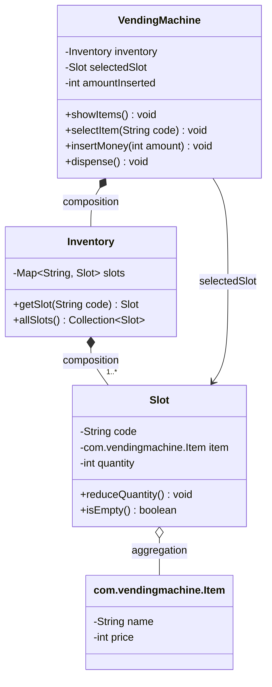

# Vending Machine — Low Level Design

Built evolutionarily: V1 → V5. Each version solves a real problem created by the
previous one. No pattern is introduced before the pain that justifies it.

---

## Behaviour space (full menu, before scoping)

**User:** view items and prices · select by code · insert money (coins / notes /
card) · receive item · receive change · cancel and get refund

**Machine:** track inventory per slot · validate selection and stock · validate
amount · compute change · verify change is physically possible · enforce state
transitions · reject invalid transitions

**Operator:** restock · reprice · collect cash · refill change float · sales reports

**Production:** concurrent users · payment failure after money taken · refunds ·
idempotency · dispense jams · logging and metrics

The two genuinely hard parts of this problem are the **state machine** and
**change-making** (which can legitimately fail even when the user paid enough).

---

## V1 — Basic Design

### Scope

| Behaviour | In V1 |
|---|---|
| Show items | yes — code, name, price, quantity |
| Select item | yes — must exist, must be in stock |
| Insert money | yes — as a plain amount, not denominations |
| Dispense | yes — item out, plus change as an amount |
| Change can fail | **no** |

**Deliberately excluded:** denomination handling, coin float, cancel/refund,
restock, card payment, reports, concurrency.

**Stated assumption:** the coin float is infinite, so change is always possible.
V1 returns change as a number, not as physical coins. Say this out loud in an
interview — it converts a hole into a declared boundary.

**Deleted on purpose:** a `Payment` class. With money as a single integer, it
would hold nothing an `int amountInserted` field does not already hold. It comes
back in V3, when card payments make "how you paid" a real variation.

### Classes

| Class | Responsibility |
|---|---|
| `VendingMachine` | Entry point; holds the in-progress transaction (`selectedSlot`, `amountInserted`) and runs the four operations |
| `Inventory` | Owns all slots; looks up a slot by code |
| `Slot` | A physical position (`A1`) holding one item type and a quantity |
| `com.vendingmachine.Item` | A product definition: name and price |

`com.vendingmachine.Item` and `Slot` are deliberately separate. `Coke` is a product with a name and
a price; `A1` is a location holding *some number of* Cokes. Collapsing them
breaks as soon as two slots stock the same product.

### Class diagram



Relationship choices worth defending: `Inventory` **composes** its slots (they
do not outlive the machine), while a `Slot` only **aggregates** its `com.vendingmachine.Item` (the
product definition exists independently of any slot).

### Flow

```
showItems()        -> A1 Coke  25  (qty 3)
                      A2 Chips 20  (qty 0)
selectItem("A1")   -> selectedSlot = A1
insertMoney(50)    -> amountInserted = 50
dispense()         -> 50 >= 25 ok -> qty 3 -> 2, change = 25
                   -> selectedSlot = null, amountInserted = 0
```

### Problems with V1

**The disease: no state validation.** V1 accepts illegal call sequences and
produces nonsense:

| Sequence | What V1 does | What it should do |
|---|---|---|
| `insertMoney(50)` then `dispense()` | dispenses nothing meaningful — nothing was selected | reject: no selection |
| `selectItem("A1")` then `dispense()` | dispenses an unpaid item | reject: no payment |
| `selectItem("A1")`, `insertMoney(10)`, `dispense()` | takes 10 for a 25 item | reject: insufficient amount |

**Where the fix is forced to live:** `VendingMachine`, because nothing else
knows the transaction. Every operation grows a guard clause at the top that
infers the current state from two fields — `selectedSlot == null` and
`amountInserted >= price`.

**Tight coupling.** The transition rules are welded into the bodies of the four
operations. There is no object you can point at and say "this is the rule".

**Hard to extend.** Adding `cancel()` is not just a new method — it forces a
re-reading of the guards inside every existing method ("can I cancel from idle?
can I insert money after cancelling?"). Each answer is another `if` in another
place. Guard logic grows with states x operations.

**SOLID violations.**
- **OCP** — every new state or operation requires editing `VendingMachine` and
  re-reasoning guards that already worked.
- **SRP** — `VendingMachine` both orchestrates a purchase *and* is the sole
  authority on legal transitions. Two reasons to change in one class.

**Implicit state is the root cause.** The state is not represented anywhere; it
is *inferred* from field values. Three states can be faked this way. More cannot
— `DISPENSING` and `OUT_OF_SERVICE` cannot be expressed by those two fields at
all, and field combinations start producing states that should be impossible.

**Design note surfaced here:** decrement quantity at **dispense**, not at
selection. If selection decremented, `cancel()` would have to restore stock —
extra state to unwind for no gain.

---
